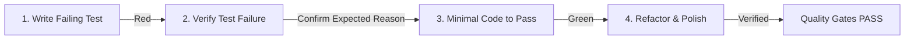

# TDD Orchestrator (Test-Driven Development)

> **Iron Law of TDD**:
> **NO PRODUCTION CODE WITHOUT A FAILING TEST FIRST.**
> If you haven't seen the test fail for the expected reason, you are not writing verified code.

---

## 🔄 The 4-Phase Red-Green-Refactor Loop



---

## 🛠️ Step-by-Step Protocol

### Step 1: Write Single Focused Failing Test (RED)
- **Backend (Python / pytest)**:
  - Path: `backend/tests/test_<feature>.py`
  - Pattern: Arrange-Act-Assert. Use `pytest-mock` or FastAPI `TestClient`.
- **Frontend (TypeScript / Vitest)**:
  - Path: `frontend/__tests__/<feature>.test.tsx` or `frontend/tests/<feature>.test.ts`
  - Pattern: Test user-visible behavior and accessibility, not internal implementation details.

### Step 2: Execute Test & Prove Failure
- Run the single test file:
  ```powershell
  # Backend
  pytest backend/tests/test_<feature>.py -v
  # Frontend
  cd frontend; npx vitest run tests/<feature>.test.ts; cd ..
  ```
- **Constraint**: You MUST observe the test fail.
  - Fail due to missing function / attribute / return value mismatch = **VALID RED**.
  - Fail due to import syntax error or bad fixture = **INVALID RED** (Fix test first).

### Step 3: Implement Minimal Viable Code (GREEN)
- Write the *minimal amount of production code* required to turn the failing test green.
- **Rule**: Do not add extra un-tested methods or speculative abstractions.
- Re-run test command and confirm **100% GREEN**.

### Step 4: Refactor Under Green Protection
- Clean up duplication, improve variable naming, and optimize performance.
- Re-run the full test suite to guarantee zero regression:
  ```powershell
  pytest backend/tests/
  cd frontend; npx tsc --noEmit; cd ..
  ```

---

## 🚨 Anti-Patterns & Red Flags (STOP if detected)
- ❌ Writing production code and test in the same edit.
- ❌ Testing implementation details (private methods) instead of contracts.
- ❌ Skipping the "Verify Test Failure" step.
- ❌ Leaving `@pytest.mark.skip` without an explicit technical debt record.

---

## 🧠 Neural Linkage
Execute telemetry signal:
```bash
python backend/scripts/telemetry.py --source "TDD Orchestrator" --message "TDD Cycle completed: {featureName}" --level "INFO"
```
