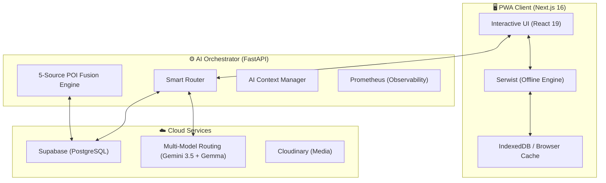

<p align="center">
  
  
  
  
  
</p>

<h1 align="center">Tabidachi 旅立ち</h1>

<p align="center">
  <strong>Next-Generation Generative AI Travel Orchestrator</strong><br/>
  <strong>新一代生成式 AI 旅遊編排助手</strong>
</p>

<p align="center">
  <i>"Beyond Planning. Intelligent Journey Orchestration."</i><br/>
  <i>「超越規劃，開啟智慧旅程編排新境界。」</i>
</p>

<p align="center">
  
  
  
  
  
  
  
  
  
</p>

<p align="center">
  <a href="https://travel-pwa-five.vercel.app/">🌐 Live Demo</a> •
  <a href="#-getting-started--快速開始">🚀 Getting Started</a> •
  <a href="#-features--功能特色">✨ Features</a> •
  <a href="#-tech-stack--技術棧">🏗️ Tech Stack</a> •
  <a href="#-judging-guide--評審導覽">🏆 Judging Guide</a>
</p>

---

| 🚀 創新亮點 | 💡 技術實作 | 🏆 評審價值 |
| :--- | :--- | :--- |
| **Agentic Deep Linking** | 全鏈路推播深層調度 + Virtuoso 穿透重置 + 3.5s 光暈尋址 | **零迷航落地**：推播點擊精準直達特定記帳項目或總覽儀表板，打破傳統 Web Push 跳轉首頁的痛點。 |
| **3D Cinematic Tour Engine** | 60° 俯衝大圓航線低空巡航 + 360° 盤旋 + VisionOS 晶透面板 | **身臨其境導覽**：以無人機視角飛掠跨日景點，搭配 Mapillary 全球 360 度真實街景無縫預覽。 |
| **Generative Intelligence** | Gemini 3.7 Flash 思考推論 + 批次景點推薦 + 原生時鐘選取器 | **極致操作感**：告別純文字 Chatbot，對話直接驅動原生 UI 元件、批次加入與行程變更。 |
| **Offline-First & PWA** | 本地 IndexedDB 雙層存儲 + Serwist 離線秒開 + 背景樂觀同步 | **全天候可用**：零網路/飛航模式依然秒開瀏覽行程與記帳，連網後自動無衝突向雲端閉環。 |
| **Zero-Regression Rigor** | 雙重核驗 404 靜默自癒 + 191 項全維度測試自動守門 | **高可用架構**：網路波動絕不誤判白屏，單一事實來源狀態機確保代碼與型別零退化。 |

---

## ✨ Features / 功能特色

### 🤖 AI Travel Assistant / AI 旅遊助手
- **Neural-Link Extraction Pipeline** — 100% 格式對齊的精準資料提取，Agentic 能力的核心 / 結構化抽取引擎
- **Batch POI Recommendations** — 批次景點勾選推薦卡片 (`BatchPOIPreviewCard`)，一次將多個景點加入行程
- **Interactive UI Pickers** — 原生時鐘日曆選取器與對話流 Markdown 格式化渲染 / 豐富對話卡片
- **Multi-tier AI Routing** — Gemini 3.7 Flash 思考推論 + Gemma 4/3 多層級救援路由 / 多模型動態切換
- **Hyper-Contextual Injection** — 即時機票報價與 Sliding Window Context 脈絡注入 / 滑動視窗上下文管理
- **Itinerary Health Check** — AI reviews your daily plan and suggests improvements / AI 行程健檢
- **Smart Itinerary Editing** — 在對話中透過 Function Calling 智慧刪除或調整景點
- **Memory Engine** — Auto-summarizes long conversations to maintain context / 記憶壓縮引擎
- **BYOK (Bring Your Own Key)** — Your API key, your privacy / 自帶金鑰，隱私至上

### 🗺️ Interactive Maps / 互動地圖
- **3D Cinematic Tour Engine & VisionOS HUD** — 60° 俯衝大圓航線低空巡航導覽、景點 360° 自動盤旋與 Apple VisionOS 曜黑晶透懸浮面板
- **Mapillary Global Street View** — 整合式 360 度真實街景沉浸式探索，隨時預覽實體地標外觀
- **MapLibre GL & CSP Pipeline** — Web Worker 同源靜態管線，符合最嚴格 CSP 安全防護標準
- **3D Buildings & Satellite View** — 支援 3D 建築視圖、Esri 高清衛星空拍圖與 OpenFreeMap 向量街道切換
- **Multi-mode Routing** — Walking, driving, transit with real distance & duration / 步行、開車、大眾運輸路線即時切換
- **L1 Local Instant Search** — Offline-capable MiniSearch for stations & landmarks / 本地即時搜尋（離線可用）
- **L2 5-Source POI Fusion Engine** — OSM, OpenTripMap, WikiVoyage, Wikipedia, Wikidata 聚合 / 五源 POI 聚合引擎
- **Global Language Matrix** — CJK (中日韓) 語系變體擴充與 10x 地理感知搜尋 / 多語系智慧地名擴充
- **Fullscreen Map** with cross-platform long-press and red-pin precision / 全螢幕地圖與長按選址互動

### 📅 Trip & Booking Management / 行程與訂房管理
- **Trip Master Overview (Day 0)** — 全景行程總覽封面卡片、關鍵天數概覽與統計儀表板
- **DailyWeatherStrip (5-Day Weather)** — 橫向動態氣象預報帶，即時監控氣溫與晴雨降水機率
- **Smart Currency & Country Inference** — 依目的地名稱智慧推算國碼與預設法定貨幣（如日本 ➔ JPY）
- **Continuous Multi-Month Calendar** — iOS Swift 風格連續縱向多月份雙向滾動日曆區間選擇器
- **Affiliate Booking Center** — 內建 21+ 旅遊平台 (Agoda 等) 註冊與智慧推薦 / 全域導購中心
- **Drag & Drop Reorder** — Powered by dnd-kit / 拖拉排序
- **Multi-segment Flight Tracking** — 支援多航段與獨立去回程新增 / 智能航班管理
- **Multi-trip Switcher** — Manage multiple trips with real-time collaboration / 多行程切換 + 即時協作
- **Daily Checklist & AI Tips** — Pack lists, tickets, and curated destination guides / 每日清單與智慧旅遊指南
- **ISR Public Sharing** — Share itineraries via link (no login required) / 公開分享（免登入）

### 💰 Expense Tracker & Deep Linking / 記帳工具與深層連結
- **Agentic Deep Linking Engine** — 點擊推播直達指定記帳項目，虛擬列表穿透尋址與 3.5 秒翠綠發光定位
- **110+ Official Sovereign Fiat Currencies** — 支援全球 110+ 種官方 ISO 4217 法定貨幣白名單，純淨過濾加密貨幣
- **Real-time Exchange Rates** — Auto-convert to your home currency / 即時匯率換算
- **Category Analytics** — Interactive pie charts and daily/total views / 分類統計與圓餅圖表
- **Receipt Photo Upload & AI Parse** — Cloudinary 整合收據存證與 AI 圖片自動拆分 (Subtotal, Tax, Tip)
- **Shared & Private Ledgers** — Split expenses with travel buddies / 公帳私帳分離

### 🔐 Privacy & Security / 隱私安全
- **BYOK Model** — AI keys stored locally, never on server / 金鑰僅存本地
- **GDPR Compliance** — Data export & deletion via API / GDPR 資料匯出/刪除
- **Anonymous Recovery Keys** — No email or phone required / 匿名恢復金鑰
- **Rate Limiting** — SlowAPI protection / 速率限制保護

### 📱 PWA & UX
- **Installable PWA** — Works on iOS, Android, and Desktop / 可安裝到主畫面
- **Real-time Push Notifications** — 實時推播、倒數提醒與共同編輯廣播 / PWA 推播引擎
- **Offline-First Instant Boot** — 本地 L1 快取 + L2 IndexedDB 存儲與 Serwist 離線引擎，無網路依然秒開並自動背景樂觀同步
- **Integrated Navigation Hub** — 懸浮藥丸式 (Floating pill) 底部導覽列與雙擊刷新 / 整合式導航中樞
- **Dark Mode** — System-aware theme switching / 深色模式
- **Bilingual** — Traditional Chinese & English / 繁體中文 + 英文
- **Haptic Feedback** — Native-like touch responses / 全系統觸覺回饋
- **PDF Export** — Generate printable itinerary PDFs / PDF 匯出

### 🛡️ Architecture & DevOps / 架構與維運
- **Double-Checked 404 Self-Healing** — 雙重核驗死行程自癒防線，網路抖動不誤判、幽靈快取 300ms 內秒級靜默自癒
- **191 Full-Dimension Automated Tests** — Vitest 單元與整合測試 100% 守護，杜絕狀態死鎖與迴歸
- **Autonomous Agent Ecosystem** — `.agents` L0-L3 工作流與多角色 (@dev, @qa, @security) 自動化治理
- **Enterprise-grade Security** — MapLibre CSP Worker Pipeline、Anti-SSRF 與嚴格 CORS 策略
- **Observability** — Prometheus Metrics 與 Supabase 連線池深度健康檢查 / 系統可觀測性監控

---

## 🏗️ Tech Stack / 技術棧

### Frontend

| Technology | Version | Purpose |
|-----------|---------|---------|
| Next.js | 16.3 | Framework (App Router, ISR, Turbopack) |
| React | 19.2 | UI with React Compiler |
| TypeScript | 5.9 | Type safety |
| MapLibre GL | 6.9 | Maps (3D, satellite, static CSP worker) |
| Zustand | 5.0 | State management (Single source of truth) |
| SWR | 2.3 | Data fetching & caching |
| Framer Motion | 12.x | Animations |
| dnd-kit | 6.3 | Drag and drop |
| Tailwind CSS | 4.1 | Modern styling tokens |
| Radix UI | Latest | Accessible primitives |

### Backend

| Technology | Version | Purpose |
|-----------|---------|---------|
| FastAPI | Latest | REST API framework |
| Supabase | Latest | PostgreSQL database + Realtime |
| Gemini 3.7 & Gemma | Latest | Multi-model routing, POI enrichment, itinerary synthesis |
| Prometheus Client | Latest | System observability and metrics |
| HTTPX | Latest | Async HTTP client (with Anti-SSRF) |
| SlowAPI | 0.1.9+ | Rate limiting |
| RapidFuzz | 3.6+ | Fuzzy string matching |

### Infrastructure

| Service | Purpose |
|---------|---------|
| Vercel | Frontend hosting (Edge, ISR) |
| Google Cloud Run | Backend hosting (Docker) |
| Supabase | Database + Auth + Realtime |
| Cloudinary | Image hosting (receipts, avatars) |

---

## 📐 Technical Architecture / 系統架構圖



---

## 🚀 Getting Started / 快速開始

### Prerequisites / 前置需求

- **Node.js** 18+
- **Python** 3.11+
- **Supabase** account (free tier works / 免費方案即可)
- **Gemini API Key** ([Get one free / 免費取得](https://aistudio.google.com/apikey))

### Backend Setup / 後端設定

```bash
# 1. Navigate to backend / 進入後端目錄
cd backend

# 2. Create virtual environment / 建立虛擬環境
python -m venv .venv
.venv\Scripts\activate    # Windows
# source .venv/bin/activate  # macOS/Linux

# 3. Install dependencies / 安裝依賴
pip install -r requirements.txt

# 4. Configure environment / 設定環境變數
cp .env.example .env
# Edit .env with your values (see table below)
# 編輯 .env 填入你的設定值（見下方表格）

# 5. Start server / 啟動伺服器
uvicorn main:app --reload --port 8000
```

### Frontend Setup / 前端設定

```bash
# 1. Navigate to frontend / 進入前端目錄
cd frontend

# 2. Install dependencies / 安裝依賴
npm install

# 3. Configure environment / 設定環境變數
cp .env.local.example .env.local
# Edit .env.local with your values
# 編輯 .env.local 填入你的設定值

# 4. Start dev server / 啟動開發伺服器
npm run dev
```

Open [http://localhost:3000](http://localhost:3000) 🎉

### Testing / 測試 (Frontend)

本專案配置了完整的自動化測試守護流程（由 `@qa` Agent 監控）。

```bash
# 1. 執行 Vitest 單元測試
npm run test

# 2. 執行 Playwright E2E 迴歸測試
npx playwright test
```

---

## 🔑 Environment Variables / 環境變數

### Backend `.env`

| Variable | Required | Description |
|----------|----------|-------------|
| `SUPABASE_URL` | ✅ | Supabase project URL |
| `SUPABASE_ANON_KEY` | ✅ | Supabase anonymous key |
| `ARCGIS_API_KEY` | Optional | ArcGIS geocoding (fallback to Nominatim) |
| `TP_API_TOKEN` | Optional | Travelpayouts affiliate booking integration |

### Frontend `.env.local`

| Variable | Required | Description |
|----------|----------|-------------|
| `NEXT_PUBLIC_API_URL` | ✅ | Backend API URL (e.g., `http://localhost:8000`) |
| `NEXT_PUBLIC_SUPABASE_URL` | ✅ | Supabase project URL |
| `NEXT_PUBLIC_SUPABASE_ANON_KEY` | ✅ | Supabase anonymous key |
| `NEXT_PUBLIC_CLOUDINARY_CLOUD_NAME` | Optional | Cloudinary cloud name (for image uploads) |

> [!NOTE]
> **Gemini API Key** is configured by each user in the app's Profile page (BYOK model).
> No server-side AI key is needed.
>
> **Gemini API Key** 由使用者在 App 的 Profile 頁面自行設定（BYOK 模式），伺服器端不需要 AI 金鑰。

---

## 🗄️ Database / 資料庫

This project uses **Supabase** (PostgreSQL) with 20+ migration files for schema management.

本專案使用 **Supabase** (PostgreSQL)，含 20+ 個 migration 檔管理資料庫結構。

```bash
# Apply migrations / 套用 migration
cd backend/migrations
# Run SQL files in order against your Supabase project
# 依序在 Supabase 專案中執行 SQL 檔案
```

---

## 🚢 Deployment / 部署

### Frontend → Vercel

```bash
# Connect your GitHub repo to Vercel
# Set environment variables in Vercel dashboard
# Automatic deployments on push to main
```

### Backend → Google Cloud Run

```bash
# Build and push Docker image / 建置並推送 Docker 映像
docker build -f Dockerfile.prod -t gcr.io/PROJECT_ID/tabidachi-backend .
docker push gcr.io/PROJECT_ID/tabidachi-backend

# Deploy / 部署
gcloud run deploy tabidachi-backend \
  --image gcr.io/PROJECT_ID/tabidachi-backend \
  --platform managed \
  --region us-central1 \
  --allow-unauthenticated
```

---

## 📱 PWA Installation / PWA 安裝

| Platform | How to Install |
|----------|---------------|
| **iOS Safari** | Tap Share → "Add to Home Screen" / 分享 → 加入主畫面 |
| **Android Chrome** | Tap "Install App" banner or Menu → "Install" / 點擊安裝橫幅 |
| **Desktop Chrome** | Click install icon in address bar / 點擊網址列安裝圖示 |

---

## 📄 License

This project is licensed under the [MIT License](LICENSE).

```
MIT License

Copyright (c) 2026 Ryan Su

Permission is hereby granted, free of charge, to any person obtaining a copy
of this software and associated documentation files (the "Software"), to deal
in the Software without restriction, including without limitation the rights
to use, copy, modify, merge, publish, distribute, sublicense, and/or sell
copies of the Software, and to permit persons to whom the Software is
furnished to do so, subject to the following conditions:

The above copyright notice and this permission notice shall be included in all
copies or substantial portions of the Software.

THE SOFTWARE IS PROVIDED "AS IS", WITHOUT WARRANTY OF ANY KIND, EXPRESS OR
IMPLIED, INCLUDING BUT NOT LIMITED TO THE WARRANTIES OF MERCHANTABILITY,
FITNESS FOR A PARTICULAR PURPOSE AND NONINFRINGEMENT. IN NO EVENT SHALL THE
AUTHORS OR COPYRIGHT HOLDERS BE LIABLE FOR ANY CLAIM, DAMAGES OR OTHER
LIABILITY, WHETHER IN AN ACTION OF CONTRACT, TORT OR OTHERWISE, ARISING FROM,
OUT OF OR IN CONNECTION WITH THE SOFTWARE OR THE USE OR OTHER DEALINGS IN THE
SOFTWARE.
```

---

<p align="center">
  Made with ❤️ by Ryan Su
</p>

---

## 🏆 Judging Guide / 評審導覽

如果您是競賽評審或技術審查者，我們建議您重點關注以下最能展現專案技術深度、架構韌性與創新落地的核心環節：

1. **AI 批次推薦與原生互動選取器 (Batch POI & Interactive UI)**：在 AI 對話中請求景點推薦，體驗 `BatchPOIPreviewCard` 勾選批次加入，以及調整時間時的原生手感日曆時鐘選取器，告別純文字 Chatbot，對話直接驅動原生 UI。
2. **全景行程總覽與 5 日動態氣象帶 (Trip Master Overview & Weather Strip)**：點擊行程頂部「ALL / 總覽」，檢視完整行程封面卡片、橫向 5 日氣溫晴雨預報帶，以及緊湊優雅的「詳情 →」跳轉按鈕，體驗多維度的資訊編排層次。
3. **全鏈路推播與深層尋址定位 (Agentic Deep Linking & Glow Highlight)**：體驗網址直接帶有深層參數（如 `?tab=tools&expense_id=...`），系統自動完成分頁切換、穿透重置長清單篩選器、調用 Virtuoso 虛擬滾動平滑定位，並附帶 3.5 秒翠綠發光定位動畫。
4. **離線地圖與同源 CSP 安全管線 (Offline Maps & CSP Pipeline)**：體驗 MapLibre GL 經由 Build-time 靜態化注入同源 Web Worker，符合嚴格企業級 CSP 標頭（拒絕 unsafe-eval / blob:），出國斷網依然秒開圖資與行程。
5. **155 項全維度測試與雙重核驗自癒 (Zero-Regression & Self-Healing)**：專案具備 155 項全量通過的自動化測試守護，以及 SWR 404 雙重核驗靜默自癒機制，保證偶發網路抖動不誤判白屏，展現工程落地的極致自癒能力。

---
