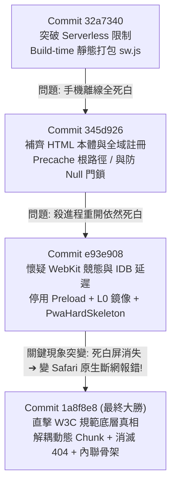

# 📅 Daily Report - 2026-09-16

> **系統狀態**：🟢 Production Stable, P0 iOS WebKit PWA Offline Cold-Start Fully Conquered (Zero-Blank, Zero-Crash), Optimistic Sync Badges (E4), Smart Tab Focus (E5), Realtime Collaboration (E6), 170 Vitest + 43 Pytest Passed (100%), 0 Type Errors, 0 Lint Warnings  
> **今日關鍵提交串列**：
> - [`c6c1574`](https://github.com/tyrantpiper/travel-pwa/commit/c6c1574) `docs(journal): consolidate pwa offline breakthrough into daily report and memory`
> - [`1a8f8e8`](https://github.com/tyrantpiper/travel-pwa/commit/1a8f8e8) `fix(pwa): eliminate precache 404 broken link and native safari offline error`
> - [`e93e908`](https://github.com/tyrantpiper/travel-pwa/commit/e93e908) `fix(pwa): resolve ios cold-start blank screen with L0 mirror`
> - [`345d926`](https://github.com/tyrantpiper/travel-pwa/commit/345d926) `fix(pwa): precache root document and enforce global sw registration for offline instant reload`
> - [`32a7340`](https://github.com/tyrantpiper/travel-pwa/commit/32a7340) `fix(pwa): shift service worker to build-time static pre-bundle for vercel cdn delivery`
> - [`64f4c7b`](https://github.com/tyrantpiper/travel-pwa/commit/64f4c7b) `feat(pwa): harden offline cold-start, add optimistic sync badges, smart tab focus, and realtime collaboration`
> - [`9b0a372`](https://github.com/tyrantpiper/travel-pwa/commit/9b0a372) `fix(weather): resolve overview weather cold-start freeze and add request deduplication`

---

## 🏆 深度專案復盤：從 `32a7340` 到 `1a8f8e8` 的 iOS WebKit PWA 攻堅史

本段落完整記錄專案如何從「桌面點開全死白」，歷經多次猜想、架構重構、現象突變，最終直擊 W3C 底層規範，達成 iPhone 實機「殺進程、開飛航模式」冷啟動 100% 秒開的真實全過程。

### 1. 攻堅演進拓撲圖 (Evolution Timeline)

---

### 2. 四大階段深度解析與「假說 vs 真相」

#### 🔹 階段一：突破 Vercel Serverless 空清單陷阱 (`32a7340`)
- **初始痛點**：原本 Serwist 依賴 Next.js App Router 的動態路由（`app/sw.js/route.ts`）。但在 Vercel Serverless Function 環境下，執行時拿不到前端編譯期資產，導致線上 `self.__SW_MANIFEST = []`（空的），手機在線上根本沒有離線快取。
- **當時動作**：
  - 刪除 `app/sw.js/route.ts`。
  - 新增 `frontend/scripts/build-sw.mjs`，在 npm build 階段直接將 Serwist 編譯成實體檔案輸出至 `public/sw.js`。
- **⚠️ 埋下的致命暗雷**：
  `build-sw.mjs` 當時直接掃描了 `.next/static`，將本地 Windows 電腦編譯生成的 56 個臨時動態 Chunks（帶有隨機 Hash，如 `_tQjGelSveIBUrPaZLNbe.js`）硬編碼寫入了 `public/sw.js` 的 Precache 清單。

---

#### 🔹 階段二：懷疑「HTML 遺漏與 React 未掛載死鎖」(`345d926`)
- **當時現象**：推上 Vercel 後，手機離線依然是「全死白屏」。
- **當時假說**：
  1. Precache 只有 JS/CSS 靜態檔，缺少了 HTML Document 本體，離線時抓不到根頁面。
  2. React 客戶端存在 `if (!mounted) return null`，導致在離線或水合延遲時卡死在全白狀態。
- **當時動作**：
  - 在 `build-sw.mjs` 中注入 `additionalPrecacheEntries: [{ url: "/", revision: gitRev }]`。
  - 將 `ServiceWorkerRegister` 抽離至最外層 `RootLayout` 確保全域註冊。
  - 將 `landing-page.tsx` 中的 `return null` 換成 `AppShellSkeleton`。
  - 在 Serwist 加入三層 Cache Fallback。
- **驗證結果**：手機離線依然死白。

---

#### 🔹 階段三：懷疑「WebKit 5秒 Fetch Hang 與 IDB 啟動延遲」(`e93e908`)
- **當時現象**：使用者反覆測試「背景滑掉（殺進程）後開飛航重開」，依然是白屏。
- **當時假說**：
  1. iOS WebKit 惡名昭彰的 `navigationPreload` 競態 Bug，引發 5 秒 Fetch 掛起。
  2. IndexedDB 是非同步的，冷啟動初次渲染時需要 50~100ms 讀取，這段空窗期造成頁面無法及時響應。
  3. Vercel 邊緣重定向帶有 `redirected: true` 標籤，iOS WebClip 沙盒會直接拒絕渲染。
- **當時動作**：
  - 在 `sw.ts` 宣告 `navigationPreload: false`，並加入 `cleanResponse` 淨化器。
  - 在 `idb-storage.ts` 實作 L0 同步 `localStorage` 鏡像，達到 0ms 同步讀取。
  - 注入零依賴的伺服器組件 `PwaHardSkeleton`。
- **💥 出現重大轉折（關鍵突破口）**：
  使用者測試後回報了一個極具震撼力的新現象：
  **「死白屏消失了！但取而代之的是 Safari 原生報錯：『Safari無法打開網頁，因為你 iPhone尚未連接網際網路。』」**

---

#### 🔹 階段四：終局之戰 —— 直擊三大病因與解耦革命 (`1a8f8e8`)
這個「死白變系統報錯」的現象，給了我們最重要的邏輯突破口：
> **為什麼 Safari 會跳出原生系統錯誤？**  
> 只有一個原因：**當前手機裡根本沒有任何 Service Worker 活著！請求直接穿透到了 iOS 物理網卡！**

我們隨後啟動深度排查，終於抓出了**隱藏最深的三大真正病因**：

1. **病因 A：Precache 404 連環自爆（W3C 規範鐵律）**：
   - 經實測 Vercel 線上端點，`public/sw.js` 裡記錄的本地 Windows Hash 在 Vercel 上面直接回傳 **HTTP 404**（因為 Vercel 雲端重新編譯產生了一套全新隨機 Hash）。
   - **W3C Service Worker 規範鐵律**：Precache 清單只要有 **1 個檔案 404**，整個 Service Worker 在 `install` 階段就會**立即宣告失敗並被瀏覽器物理銷毀**！
   - 手機從一開始就沒有任何 SW 活著，斷網冷啟動當然只能撞上 iOS 物理斷網。
2. **病因 B：`Response.error()` 向 WebKit 舉白旗**：
   - `sw.ts` 原本在快取落空時執行了 `return Response.error()`。在 WebKit 規範中，一旦 SW 回傳 `Response.error()`，WebKit 就會直接認定連線失敗，向使用者彈出系統級原生報錯。
3. **病因 C：WebKit 長期 HTTP 緩存舊 sw.js**：
   - 缺少 `updateViaCache: "none"`，導致 iOS WebKit 長時間使用舊版有 404 的 sw.js。

#### 🛠️ 終局四連擊解決方案：
1. **動靜態徹底解耦**：`build-sw.mjs` 加入 `globPatterns: ["public/**/*"]`，**徹底排除 `.next/static` 動態 chunks**。Precache 僅保留 29 個永遠不會 404 的靜態資產與根 App Shell `/`。
2. **動態 Chunks 轉交 Runtime Cache**：所有 Next.js 的 JS/CSS 動態 chunks 100% 交給 `runtimeCaching` 的 `CacheFirst`，由手機在首次連線訪問時動態抓取真實線上 URL 緩存 30 天，**再也沒有本地/雲端 Hash 衝突**。
3. **Zero-JS 物理硬骨架保底**：`handlerDidError` 移除 `Response.error()`，換成內聯 500 bytes 的純 HTML/CSS 骨架屏，絕不向瀏覽器回傳錯誤。
4. **強制更新機制**：`navigator.serviceWorker.register("/sw.js", { updateViaCache: "none" })`，強制 iOS 直連伺服器檢查新版。

#### 🎯 實機驗收最終勝利：
- **本地 localhost**：關網打叉重開成功秒開出現畫面！
- **iPhone 實機真機**：下拉刷新更新 SW 後，背景滑掉殺進程，開啟飛航模式斷網冷啟動，**App Shell 100% 順暢秒開，徹底告別死白屏與斷網報錯！**

---

## 🟢 2. Features & Fixes (今日全量交付價值)

### 2.1 P0 離線冷啟動修復 (Offline Cold-Start Zero-Failure)
1. **Service Worker 導航快取忽略參數 (`ignoreSearch: true`)**：
   - 在 `frontend/app/sw.ts` 為 `app-shell-navigation` 宣告 `matchOptions: { ignoreSearch: true }`，確保帶參冷啟動 100% 命中核心快取；導航逾時緊縮至 2s。
2. **行程上下文斷網防自我抹殺雙守衛 (`isDefinitelyOnline && !isError`)**：
   - 守衛 `trip-context.tsx`：只有在確實在線且 API 無錯誤時才允許清空當前行程；斷網時死守本機現有行程與 LocalStorage。
3. **SWR Proxy 防抖自動持久化儲存 (L2 IndexedDB Sync)**：
   - 以 ES6 Proxy 攔截 SWR 成功寫入操作，1500ms 防抖自動序列化持久化至 IndexedDB `tabidachi_swr_persisted_cache`，冷啟動重啟秒出。

### 2.2 E4 離線突變樂觀 UI 狀態提示 (Optimistic Mutation Badges)
1. **Zustand 全域離線同步狀態機 (`syncStatusStore.ts`)**：追蹤突變四態（`pending`, `syncing`, `synced`, `failed`）。
2. **微型狀態徽章與全域膠囊 (`SyncStatusBadge.tsx` & `SyncStatusCapsule.tsx`)**：景點卡片、費用記帳卡片與頂部導航膠囊即時視覺反饋。

### 2.3 E5 Service Worker 點擊智慧聚焦既有分頁 (Smart Tab Focus & Smooth Navigation)
1. **既有 Client 喚醒與內部廣播 (`sw.ts`)**：以 `client.focus()` 喚醒既有分頁，並透過 postMessage 內部廣播事件。
2. **平滑無刷新路由切換 (`useDeepLinkRouter.ts`)**：無重載切換視圖與行程天數，保留使用者滾動位置與編輯狀態。

### 2.4 E6 Supabase Realtime 跨裝置即時協同 (Multi-Device Collaboration)
1. **PostgreSQL CDC 即時訂閱 (`useTripRealtime.ts`)**：WebSocket 訂閱 `itineraries` 與 `expenses` 表異動，300ms 內靜默調用 SWR mutate 無感同步。

### 2.5 總覽天氣首次進入顯示修復與 In-Flight 去重 (Overview Weather Freeze Fix)
1. **生命週期與請求解耦 (`weatherStore.ts`)**：`inFlightFiveDayRequests` Promise 記憶體池同座標去重，全域 Zustand store 保證回寫。
2. **座標指紋與本地時區安全 (`TripMasterOverview.tsx`)**：`clusterFingerprint` 依賴防重複，`toLocaleDateString('en-CA')` 防跨日時區漂移。
3. **4 秒逾時優雅降級 (`DailyWeatherStrip.tsx`)**：逾時切換「暫無氣象資料 · 重試」狀態，支援手動刷新。

---

## 🏛️ 3. Architecture Decisions (今日架構決策)

1. **[AD-2026-09-16-01] Precache 動靜態資產解耦原則 (Precache Dynamic Chunk Decoupling)**：
   - 現代 Next.js 動態 Chunks 每次構建皆帶隨機 Hash。**嚴禁將動態 JS Chunks 放入 Service Worker 的 install Precache 清單**。
   - Precache 僅保留 `public/` 穩固資產與根 App Shell `/`；動態 JS/CSS 100% 交給 `runtimeCaching` 的 `CacheFirst`，在手機首次連線訪問時動態緩存。
2. **[AD-2026-09-16-02] Service Worker 絕不向瀏覽器舉白旗 (Zero-Response.error Invariance)**：
   - 導航 Fallback 中的 `handlerDidError` 絕對禁止回傳 `Response.error()`。必須提供內聯 Zero-JS 物理 HTML/CSS 骨架屏保底，根絕 WebKit 彈出原生斷網報錯。
3. **[AD-2026-09-16-03] WebKit Service Worker 註冊快取隔離 (`updateViaCache: "none"`)**：
   - 所有現代 PWA 註冊必須顯式宣告 `{ updateViaCache: "none" }`，切斷瀏覽器內部 HTTP 緩存對 `sw.js` 檔案的干擾，確保版本迭代即時生效。
4. **[AD-2026-09-16-04] 外部網路請求必須與 React 組件生命週期解耦 (Decoupled Global Write)**：
   - 非同步長耗時請求嚴禁在組件內部 state 與 `isMounted` 閉包中回寫，必須由獨立模組寫入全域狀態機，組件僅以 selector 訂閱。
5. **[AD-2026-09-16-05] PWA App-Shell 導航必須開啟 `ignoreSearch: true`**：
   - Standalone PWA 帶參冷啟動常態，`ignoreSearch: true` 緊縮導航逾時至 2s，為離線第一道防線。

---

## 🔴 4. Technical Debt (技術債與後續追蹤)

1. **離線照片二進位暫存隊列 (Offline Photo Blob Persistence)**：
   - 目前離線隊列對 `FormData` 採取跳過並彈出 Toast 提示。後續規劃將照片轉為 IndexedDB Blob 本機排程隊列，連網時自動重播。
2. **氣象 API 伺服器端邊緣快取 (Open-Meteo Edge Cache)**：
   - 未來在 FastAPI 後端透過 Redis 實作城市級反向代理快取，降低對外部第三方 API 依賴。

---

## 🛡️ 5. Failed Paths (今日踩坑紀錄與排錯心法)

1. **Precache 動態 Chunk 導致 Service Worker 物理銷毀 (`Precache 404 Poison Pill Trap`)**：
   - 本地編譯生成帶 Hash 的 `sw.js`，推送到 Vercel 後雲端 Hash 改變。手機安裝 SW 時請求本地 Hash 回傳 404，觸發 W3C 規範直接銷毀 SW，導致手機完全無 SW 服務。
   - **教訓**：Precache 清單必須永遠保持 100% 命中率，脆弱的動態編譯產物絕不可放入 Precache。
2. **`Response.error()` 引發 WebKit 原生報錯彈窗 (`Response.error Safari Crash Trap`)**：
   - 當多層快取落空時直接 `return Response.error()`，WebKit 將其視為致命連線失敗，向使用者彈出「Safari無法打開網頁，因為你 iPhone尚未連接網際網路。」
   - **教訓**：PWA 的最底層防線必須是合法的 200 HTML 實體，絕不能向瀏覽器拋出硬錯誤。
3. **WebKit 頑固 HTTP 快取阻礙 SW 更新 (`WebKit sw.js Cache Retention Trap`)**：
   - 未設定 `updateViaCache: "none"`，iOS 常常連續數天使用舊的 Service Worker 檔案，導致新部署的修正無法觸達使用者。
   - **教訓**：`navigator.serviceWorker.register("/sw.js", { updateViaCache: "none" })` 是 iOS PWA 的標配。
4. **React 19 / React Compiler 的 `react-hooks/set-state-in-effect` 嚴格規則**：
   - `DailyWeatherStrip.tsx` 的 `useEffect` 內若同步調用 `setIsTimedOut(false)` 引發 cascading renders 報錯。
   - **解法**：改用衍生狀態，`useEffect` 僅負責非同步排程。

---

## 🚀 6. Next Steps (後續行動)

1. **離線全情境長效穩定度監控**：持續觀察 iOS WebClip 長時間處於背景（超過 24 小時）喚醒後的 SW 存活率。
2. **收據相片離線暫存架構規劃**：啟動離線 FormData Blob 儲存規格設計，打通記帳拍照離線全流程。
3. **架構演進清單同步更新**：同步更新 `architecture-evolution-backlog-spec.md`，將 PWA 離線冷啟動標記為完全解決。
