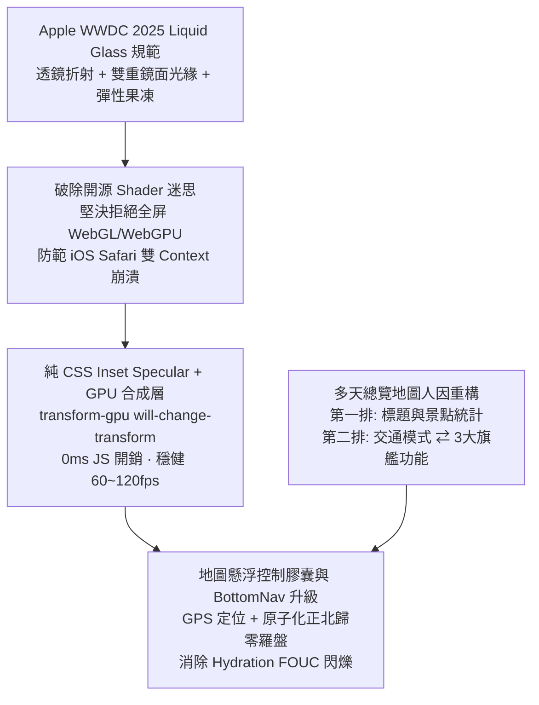

# 📅 Daily Report - 2026-09-17

> **系統狀態**：🟢 Production Stable, Apple WWDC 2025 Liquid Glass Web Pipeline Successfully Ported, 3D Cinematic Tour Engine & Progressive Route Mesh Integrated, Multi-Day Ergonomic Redesign, 178 Vitest + 43 Pytest Passed (100%), 0 TypeScript Errors, 0 ESLint Warnings  
> **今日關鍵提交串列**：
> - [`8002f06`](https://github.com/tyrantpiper/travel-pwa/commit/8002f06) `feat(ui): implement apple liquid glass material and layout ergonomics`
> - [`f5cc93f`](https://github.com/tyrantpiper/travel-pwa/commit/f5cc93f) `fix(pwa): auto-reload on controller change and prebuild sw.js`
> - [`650cd7b`](https://github.com/tyrantpiper/travel-pwa/commit/650cd7b) `feat(map): add travel mode switch, gps locate, and street view coverage to multi-day map`
> - [`e41ba1d`](https://github.com/tyrantpiper/travel-pwa/commit/e41ba1d) `feat(map): integrate 3d cinematic tour engine and progressive route mesh`

---

## 🏆 深度專案復盤：次世代 Liquid Glass 物理晶透材質與多天全景地圖人因工學攻堅

今日工作聚焦於兩大硬核維度：**「次世代人機互動材質落地 (Apple Liquid Glass)」** 與 **「多天行程全景地圖極致人因工學重構 (Ergonomic Map Architecture)」**。團隊破除了社群中關於前端開源 UI 工具的行話迷思，直擊現代瀏覽器圖形管線與 W3C 標準底層，交付了頂級大廠質感的沉浸式體驗。

### 1. 核心技術突破拓撲 (Architecture Breakthroughs)

---

## 🟢 1. Features & Fixes (今日全量交付價值)

### 1. 次世代 Apple Liquid Glass 物理晶透材質落地
- **物理光學擬真**：引入高飽和透光（`saturate-180` / `saturate-190`）、多重次表面高斯模糊（`backdrop-blur-xl` / `backdrop-blur-2xl`）、雙重鏡面光緣反射（`shadow-[inset_0_1.5px_1px_0_rgba(255,255,255,0.85),inset_0_-1px_1px_0_rgba(0,0,0,0.05),0_12px_36px_rgba(0,0,0,0.12)]`）與邊框半透明雕琢。
- **應用場景與邊界守護**：精準套用於導覽與控制層（底部導航膠囊 `bottom-nav.tsx`、地圖懸浮控制膠囊 `MultiDayMasterMap.tsx`），嚴格守護官方「禁止套用於大量卡片與長清單內容層」的電池與對比度規範。
- **消除 Hydration FOUC 閃爍**：徹底移除 `bottom-nav.tsx` 指示器對 React `isDark` state 的延遲依賴，改由 Tailwind CSS 原生 `dark:` 變體即時解析，杜絕深色模式冷啟動時微秒級白色指示器跳爍。

### 2. 多天總覽地圖人因工學雙排佈局重構
- **頂部操作列雙排分流**：
  - **Row 1**：標題「全行程多天軌跡」、景點總計 Badge（`{count} 個景點`）與副標說明，確立視圖錨點。
  - **Row 2**：左側「步行 / 開車 / 大眾運輸」三段式交通模式膠囊 ⇄ 右側「✈️ 3D 巡航導覽、👁️ Mapillary 街景覆蓋、🛰️ 衛星/向量底圖切換」旗艦功能組，支援 `overflow-x-auto scrollbar-none` 防止窄螢幕破版。
- **地圖畫布內右上角懸浮控制膠囊**：
  - 整合「📍 GPS 當前位置定位到我」與「🧭 羅盤智能視角聚焦」。
  - 獨立 GPU 合成層（`transform-gpu will-change-transform`）物理隔離，避免拖曳地圖時觸發 DOM 重排掉幀。
  - 全方位事件阻斷（`stopPropagation`），消弭點擊膠囊時地圖被誤觸發雙擊縮放的問題。

### 3. 3D Cinematic Tour Engine & 漸進式全行程路網
- **3D 巡航導覽引擎**：串接 MapLibre 動態相機軌跡與動態俯仰角（pitch: 50~60°），實現多站景點自動巡航、360° 環繞盤旋（Orbiting）與暫停/繼續控制。
- **相機排程原子化**：點擊羅盤時將 `bearing: 0` 與 `pitch: 0` 顯式注入 `fitBounds` options，使相機邊界縮放與角度歸零在底層單一矩陣運算中原子化完成，根治動畫截斷問題。
- **TourHudCapsule 安全區避讓**：行動端頂部導覽 HUD 宣告 `right-16`，為右上角懸浮控制膠囊預留安全操作邊界。

### 4. Service Worker 熱更新與構建路徑韌性
- **控制器變更自動重載**：在 `ServiceWorkerRegister` 監聽 `controllerchange` 事件，實現免手動重新整理的無縫熱升級。
- **跨環境路徑確定性**：`build-sw.mjs` 明確指定 `globDirectory: frontendDir`，解決從專案根目錄執行構建時 `public/` 路徑找不到導致預快取清單清空的隱患。

---

## 🏛️ 2. Architecture Decisions (今日架構級決策)

### 1. Liquid Glass 物理材質純 CSS + GPU 合成層準則 (CSS Inset Specular over Heavy WebGL Shader)
- **決策背景**：社群中流行使用全屏 WebGL/WebGPU Shader（如 liquidGL）為按鈕製作液態玻璃折射效果。
- **架構決策**：在已包含 MapLibre WebGL Canvas 的 PWA 應用中，堅決禁止引入第二個 WebGL Context。iOS Safari 對 Canvas Context 數量有硬限制，雙 Context 會誘發 Context Loss 致命崩潰。規範一律使用純 CSS `backdrop-blur`、`saturate`、`shadow-[inset_...]` 搭配 `transform-gpu will-change-transform`，0ms JS 執行緒開銷，穩健交付 60~120fps。

### 2. MapLibre 相機排程原子化原則 (Atomic Camera Transition Invariance)
- **決策背景**：連續呼叫 `easeTo` 與 `fitBounds` 會引發相機動畫排程競爭，後者會直接掐斷前者。
- **架構決策**：需要同時縮放邊界與歸零旋轉視角時，嚴禁分開調度；必須在 `fitBounds` 選項中一併傳入 `bearing: 0, pitch: 0`，確保視角平滑過渡且方位完全校正。

### 3. 導覽列原生 CSS 暗黑適配優先於 React State (Native CSS Dark Token over Runtime Hydration)
- **決策背景**：常駐型底部導航列若在 inline `style` 中使用 `isDark ? darkVal : lightVal`，在 Next.js App Router 首幀尚未掛載完成前，`isDark` 必為 `false`，會產生瞬時白色底塊閃爍。
- **架構決策**：靜態設計系統的暗黑模式樣式一律交給 Tailwind 原生 `dark:` class 解析，由瀏覽器 CSS 引擎在 DOM 注入的第一微秒即刻生效，徹底消除狀態延遲帶來的視覺跳動。

### 4. 工具構建路徑絕對化標準 (Hermetic Build-Time Path Resolution)
- **決策背景**：`build-sw.mjs` 使用相對於 `cwd` 的路徑掃描 `public/`，在跨目錄調用時產生未預期的相對路徑錯位。
- **架構決策**：腳本內部資產解析一律以模組 `import.meta.url` 為基準構建絕對路徑（`path.resolve(__dirname, "..")`），確保無論由根目錄或子模組呼叫皆具備相同的輸出一致性。

---

## 🔴 3. Technical Debt (技術債與追蹤事項)

| 序號 | 項目描述 | 影響範圍 | 預計解決方案 |
| :---: | :--- | :--- | :--- |
| **TD-1** | GitHub Dependabot #83 安全警報（1 moderate vulnerability） | 前端相依套件安全性 | 規劃執行 `/security-audit` 工作流，透過 npm overrides 鎖定安全修補版本 |
| **TD-2** | 極窄螢幕（< 340px）地圖第二排按鈕橫向排版邊界 | 320px 舊型手機顯示體驗 | 已掛載 `overflow-x-auto scrollbar-none` 保底，後續結合行動端遙測數據優化最小寬度邊距 |

---

## 🛡️ 4. Failed Paths (今日踩坑與避雷教訓)

### 1. MapLibre 動畫排程競爭陷阱 (`Camera Animation Preemption Trap`)
- **踩坑現象**：在羅盤點擊處理器中先調用 `targetMap.easeTo({ bearing: 0, pitch: 0, duration: 400 })`，接著同步調用 `targetMap.fitBounds(...)`。使用者在旋轉地圖後點擊羅盤，地圖僅縮放了邊界，相機角度依然保持歪斜。
- **根本原因**：MapLibre 的相機運動是單一狀態機排程。後發起的 `fitBounds` 動畫立即覆蓋並終止了先發起的 `easeTo` 動畫，且 `fitBounds` 預設保持當前相機旋轉角。
- **防禦教訓**：涉及相機角度與邊界的複合位移，必須在 `fitBounds` 的 options 中一併傳入 `bearing: 0, pitch: 0`，以單一調度完成原子操作。

### 2. 雙 WebGL 上下文引發 Safari 崩潰 (`Dual WebGL Context Safari Crash Trap`)
- **踩坑現象**：探討使用 WebGL 片段著色器為 UI 按鈕繪製次表面折射效果，但在 iOS 測試機上偶發白屏，終端出現 `WebGL: CONTEXT_LOST_WEBGL` 警告。
- **根本原因**：頁面中已運行大型 MapLibre WebGL 地圖畫布，在 DOM 上額外掛載小型 WebGL Context 容易突破 iOS Safari 嚴格的 GPU 記憶體與 Context 總數配額。
- **防禦教訓**：PWA 的 UI 控制項嚴禁使用額外 WebGL Context，一律採用純 CSS 濾鏡與 Inset 陰影模擬光學折射。

### 3. React State 延遲導致 Hydration FOUC 閃爍 (`Hydration Dark Mode FOUC Trap`)
- **踩坑現象**：在 `bottom-nav.tsx` 的指示器使用 `style={{ backgroundColor: isDark ? "rgba(...)" : "rgba(...)" }}`，深色模式重新整理頁面時，指示器在第 1 幀短暫顯示為淺色底塊。
- **根本原因**：`ThemeContext` 初始 state 為 `isDark = false`，需待客戶端掛載後透過 `useEffect` 讀取 `localStorage`。此時 HTML 標籤早已由 SSR 帶有 `class="dark"`，但 inline style 的 React state 尚未更新。
- **防禦教訓**：常駐型核心元件的暗黑適配必須由 CSS `dark:` 變體承擔，堅決不讓未就緒的 React state 決定首屏關鍵樣式。

---

## 🎯 5. Next Steps (明日展望與待辦事項)

1. **安全漏洞修補 (`/security-audit`)**：
   - 針對 GitHub Dependabot #83 警報執行依賴項審查，以最小侵入性 overrides 消除弱點。
2. **行動端 PWA 實機體驗走查**：
   - 於真實 iPhone 與 Android 裝置上測試 3D 導覽、街景覆蓋與右上角懸浮羅盤的流暢度與電池消耗。
3. **記憶沉澱與神經網路更新**：
   - 萃取本日「Liquid Glass 物理規範」與「MapLibre 相機排程原子化」沉澱至 `.agents/memory.md`。
