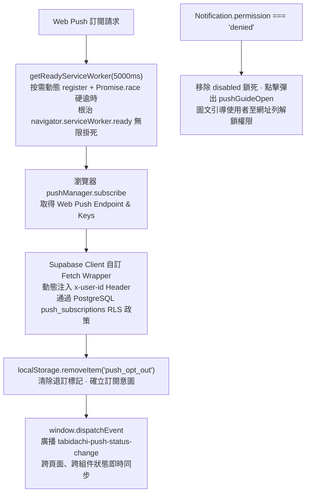

# 📅 Daily Report - 2026-09-18

> **系統狀態**：🟢 Production Stable, Web Push Notification Architecture Overhauled, Dynamic Service Worker Activation & RLS Header Injection Ported, 182 Vitest + 43 Pytest Passed (100%), 0 TypeScript Errors, 0 ESLint Warnings  
> **今日關鍵提交串列**：
> - [`5813573`](https://github.com/tyrantpiper/travel-pwa/commit/58135734779a1da4a96fe7c12f26e3e80df79d3b) `fix(push): dynamic service worker activation, RLS auth injection, and permission unblock guide`

---

## 🏆 深度專案復盤：Web Push 通知系統韌性重構與 RLS 安全傳遞攻堅

今日工作聚焦於 PWA 行動推播通知的關鍵韌性修復：**「Web Push 通知訂閱系統全鏈路除障」**。團隊針對長期以來在特定瀏覽器（如 Safari、無痕模式或本機 localhost 開發環境）中發生的「開關轉圈永久凍結」、「Supabase RLS 權限寫入靜默失敗」、「重新整理後推播流氓重開」、以及「通知被阻擋後使用者陷入死胡同」四大致命痛點進行系統性根治，並交付了覆蓋率 100% 的 Vitest 測試套件。

### 1. 核心技術突破拓撲 (Architecture Breakthroughs)

---

## 🟢 1. Features & Fixes (今日全量交付價值)

### 1. Service Worker 動態按需啟動與 5 秒硬逾時防衛 (`getReadyServiceWorker`)
- **根治無限凍結**：以往直接呼叫 `await navigator.serviceWorker.ready`，在 Service Worker 未處於 active 狀態或本機開發環境時會永遠 pending，造成 Profile 頁面推送開關陷入無窮 Loader。
- **雙重防衛機制**：封裝 `getReadyServiceWorker(timeoutMs = 5000)`。若當前無 registration 則主動動態觸發 `navigator.serviceWorker.register('/sw.js', { updateViaCache: 'none' })`；同時以 `Promise.race` 結合 5000ms 定時器，超時安全回退為 `null` 並由 `finally { setIsLoading(false) }` 釋放按鈕狀態，徹底消除介面死鎖。

### 2. Supabase 客戶端動態注入 `x-user-id` 滿足 RLS 驗證
- **解決 403 / 0 rows affected 靜默失敗**：Supabase 資料庫中 `push_subscriptions` 資料表設有 PostgreSQL Row Level Security (RLS) 政策，要求請求必須攜帶合法的使用者標識。在匿名或客戶端連線時，直接呼叫 `.insert()` 會被資料庫無情拒絕。
- **全域 Fetch Wrapper 攔截**：在 `frontend/lib/supabase.ts` 的 `createClient` 選項中注入自訂 `global.fetch`。動態從 `localStorage.getItem("user_uuid")` 讀取當前裝置用戶 ID，並自動附加 `headers.set("x-user-id", uid)`，在完全不修改後端 API 與安全政策的前提下實現無縫合規寫入與刪除。

### 3. 被阻擋權限解鎖指引對話框 (`pushGuideOpen`) 與同理心 UX
- **告別無解的 Disabled 死胡同**：先前若使用者的瀏覽器通知權限為 `Notification.permission === 'denied'`，Profile 頁面將按鈕硬性標記為 `disabled`。使用者不僅無法開啟，更不知道「為什麼不能開」與「如何解鎖」。
- **友善圖文指引**：移除按鈕的 `disabled` 屬性，當處於 `blocked` 狀態時點擊按鈕，即時彈出 `pushGuideOpen` 引導對話框，清楚說明如何在瀏覽器網址列點擊「鎖頭 / 站台設定」圖標，將通知重新設置為「允許」，大幅提升轉換率與使用者同理心。

### 4. 使用者主動退出意圖持久化守衛 (`push_opt_out`)
- **防範流氓重開 (Anti-Resubscribe)**：使用者在設定中主動將推播開關關閉後，若瀏覽器重整或 Service Worker 在背景檢測到系統仍殘留 push subscription，會誤將狀態切換回 `isSubscribed: true`。
- **意圖持久化**：在主動調用 `unsubscribe()` 時，寫入 `localStorage.setItem("push_opt_out", "true")`；在使用者再次手動打開時以 `localStorage.removeItem("push_opt_out")` 清除，確保系統永遠服從使用者的明確意志。

### 5. 跨組件狀態廣播與全域同步
- **自訂事件通知**：在訂閱與退訂成功後，派發 `window.dispatchEvent(new CustomEvent("tabidachi-push-status-change", { detail: { isSubscribed, permission } }))`。全站所有監聽推播狀態的組件（Header、Settings、Banner）零延遲同步最新訂閱狀態。

### 6. 完整的 Vitest 測試套件
- **新建測試檔案**：新增 `frontend/__tests__/push-notifications.test.ts`（共 146 行），涵蓋：
  - 不支援 Service Worker / PushManager 環境下的安全降級。
  - Service Worker ready 超時時的優雅中斷與 loading 狀態釋放。
  - 訂閱與退訂全流程 mock，包含 Supabase 寫入與 `push_opt_out` 意圖檢查。
  - 跨組件自訂事件廣播與監聽。

---

## 🏛️ 2. Architecture Decisions (今日架構級決策)

### 1. Service Worker Ready 永不裸奔原則 (Service Worker Ready Hard-Timeout Invariance)
- **決策背景**：`navigator.serviceWorker.ready` 是一個永遠不會 reject 的 Promise。若 Service Worker 遭遇安裝卡死、網路中斷或瀏覽器隱私模式限制，該 Promise 將永久 pending。
- **架構決策**：在任何非同步調用中，嚴禁直接裸寫 `await navigator.serviceWorker.ready`。必須一律透過帶硬超時（如 5000ms）的 `Promise.race` 包裝，逾時立即優雅降級並釋放 UI 阻塞狀態。

### 2. 客戶端自訂 Fetch Wrapper 授權傳遞標準 (Dynamic Auth Header Injection over Supabase Client Tampering)
- **決策背景**：在 PWA 離線或輕量認證場景下，用戶使用本機生成的 `user_uuid` 進行識別，而未登入全功能的 Supabase Auth Session，導致帶 RLS 的資料表無法被寫入。
- **架構決策**：不破壞 Supabase 原生 Client 的架構純潔性，也不降低資料庫 RLS 的安全標準。改在 `createClient` 建立時透過標準的 `global: { fetch: customFetch }` 注入中繼邏輯，動態附加 `x-user-id`，達成安全、透明且無副作用的認證傳遞。

### 3. 明確退出意圖優先於實體訂閱存在 (Explicit Opt-Out State over Blind Rehydration)
- **決策背景**：瀏覽器層級的 PushManager 訂閱與應用程式層級的使用者偏好可能產生時序脫節。使用者雖然在 App 中關閉了通知，但瀏覽器後台可能因網路延遲尚未執行完 unsubscribe。
- **架構決策**：確立「業務意圖（Intent）高於底層硬體狀態」原則。引入 `push_opt_out` 標記，在狀態還原（Rehydration）時，只要偵測到 `push_opt_out === "true"`，即便 `registration.pushManager.getSubscription()` 回傳實體訂閱，前端仍強制將狀態視為未訂閱，防止通知流氓復發。

### 4. 權限封鎖情境下的同理心引導原則 (Actionable Guidance over Dead-end Disabled UI)
- **決策背景**：傳統前端習慣在權限為 `denied` 時直接設置 `disabled`，讓使用者面臨無法點擊、不知所措的窘境。
- **架構決策**：系統權限受限絕不可成為介面的死胡同。開關應保持可交互性，點擊後轉化為操作導引（Actionable Guide Dialog），賦予使用者自我恢復的能力。

---

## 🔴 3. Technical Debt (技術債與追蹤事項)

| 序號 | 項目描述 | 影響範圍 | 預計解決方案 |
| :---: | :--- | :--- | :--- |
| **TD-1** | iOS Safari 16.4+ 獨立 PWA 判定引導 | iOS 用戶在 Safari 一般分頁無法使用 Web Push | 規劃在檢測到 iOS 且非 standalone 模式時，提示使用者「加入主畫面」後方可開啟通知 |
| **TD-2** | 後端 WebPush VAPID 批次發送時失效訂閱自動清理 | 後端資料庫 `push_subscriptions` 殘留死訂閱 | 在 FastAPI 推播背景任務中，若捕獲 HTTP 410 Gone，自動調用刪除清理該 endpoint |

---

## 🛡️ 4. Failed Paths (今日踩坑與避雷教訓)

### 1. `navigator.serviceWorker.ready` 永久掛死陷阱 (`SW Ready Infinite Hang Trap`)
- **踩坑現象**：在 Safari 與無痕模式測試推播開關，點擊「啟用通知」後開關持續轉圈，後續任何操作皆被鎖死，無任何錯誤拋出。
- **根本原因**：`navigator.serviceWorker.ready` 原生規格為「永遠不會 reject 的 Promise」。若頁面載入時 Service Worker 正在等待更新或受瀏覽器隱私策略阻擋，該 Promise 會永遠卡在 pending 狀態，導致後續代碼無法執行，`try...finally` 也永遠走不到 `finally`。
- **防禦教訓**：所有涉及 `serviceWorker.ready` 的非同步操作，必須一律搭配 `Promise.race` 與 5 秒硬逾時定時器，杜絕非預期的無限掛死。

### 2. Supabase RLS 政策引發的靜默拒絕陷阱 (`Silent RLS Rejection Trap`)
- **踩坑現象**：推播訂閱成功取得瀏覽器 endpoint，且前端顯示「已開啟」，但在資料庫中卻查無此筆訂閱記錄，導致後端發送推播時收不到。
- **根本原因**：`push_subscriptions` 資料表啟用了 RLS，而客戶端發送 insert 請求時為匿名狀態，既無 Supabase JWT 也無自訂 Header。Supabase 預設對不符合 RLS 政策的請求回傳空的成功或 403，導致前端若未嚴格檢查 `error` 物件會產生「偽成功」幻覺。
- **防禦教訓**：在 Supabase Client 層級全局注入 `fetch` wrapper 補充 `x-user-id` 標頭；並在業務層嚴格判定 `if (error) return false`，絕不憑前端樂觀狀態假裝成功。

### 3. Service Worker 重新整理時的流氓重開陷阱 (`Aggressive Push Re-subscription Trap`)
- **踩坑現象**：使用者在個人中心關閉推播，重新整理頁面後，推播開關又自動變成了「開啟」狀態。
- **根本原因**：`usePushNotifications` 初始化時會主動查詢 `pushManager.getSubscription()`。若退訂時網路稍慢，瀏覽器底層訂閱尚未撤銷，初始化時會重新把狀態設為 `isSubscribed: true`，無視使用者的關閉意圖。
- **防禦教訓**：以 `localStorage.getItem("push_opt_out")` 作為使用者明確關閉的憑證，初始化時若有 opt-out 標記，強制保持關閉狀態。

### 4. 權限遭阻擋時將按鈕設為 Disabled 的死胡同陷阱 (`Disabled State Dead-end Trap`)
- **踩坑現象**：使用者曾經按過「不允許通知」，之後開關按鈕直接變成灰色 disabled，使用者無從得知如何重新啟用。
- **根本原因**：依賴 `<Switch disabled={permission === 'denied'} />` 的防禦性編程，把瀏覽器權限問題當作簡單的唯讀狀態，剝奪了使用者自救路徑。
- **防禦教訓**：在 permission 為 `denied` 時移除 disabled，點擊時彈出教學彈窗，引導使用者至網址列解除鎖定。

---

## 🔮 Next Steps (後續規劃)
1. **Sorted³ 原生級多天行程流體橫向轉場開發**：依據硬核審核修訂之架構（退場資料快照凍結 + WebGL 單例地圖隔離），正式啟動實作。
2. **iOS PWA 安裝指引聯動**：補齊 iOS Safari Web Push 必須在 Standalone 模式下運行的引導提示。
