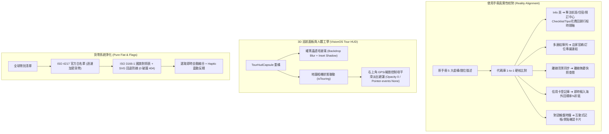

# 📅 Daily Report - 2026-09-19

> **系統狀態**：🟢 Production Stable, Full-Spec Usage Guide Reality Alignment & De-jargonization, VisionOS Tour HUD Ergonomics Overhauled, Pure Fiat Currency & Flag 404 Eradicated, 191 Vitest + 43 Pytest Passed (100%), 0 TypeScript Errors, 0 ESLint Warnings  
> **今日關鍵提交串列**：
> - [`1fb0fb9`](https://github.com/tyrantpiper/travel-pwa/commit/1fb0fb9) `docs(guide): align usage guide with actual features and de-jargonize`
> - [`7719853`](https://github.com/tyrantpiper/travel-pwa/commit/7719853) `fix(currency): eliminate flag image 404 errors, filter out non-fiat cryptos, and auto-close selector`
> - [`eeb6c05`](https://github.com/tyrantpiper/travel-pwa/commit/eeb6c05) `feat(map): refactor tour HUD capsule to VisionOS ergonomics and layout`
> - [`6cedf4a`](https://github.com/tyrantpiper/travel-pwa/commit/6cedf4a) `docs(journal): consolidate web push architecture into daily report and memory`

---

## 🏆 深度專案復盤：使用手冊 1-to-1 真實性對齊、全棧去工程行話、3D 巡航人體工學與法幣白名單淨化

今日工作聚焦於系統可用性、使用者認知體驗與介面人體工學的三大維度攻堅：
1. **「使用手冊 1-to-1 真實性校對與全面去技術化」**：徹底消除手冊中 5 處早期殘留的虛構與錯位描述，將 11 大核心章節全面轉換為旅人視角的自然語言，繁體中文與英文 100% 雙語同步。
2. **「3D 景觀巡航懸浮面板 (Tour HUD Capsule) 人體工學重構」**：採用 Apple VisionOS 曜黑晶透美學，重構按鈕觸控區域與進度條，並實作飛行時右上角地圖控制項平滑淡出避讓機制，解決按鍵碰撞痛點。
3. **「110+ 國官方法定貨幣白名單與國旗 404 根除」**：引進 ISO 4217 法定貨幣白名單過濾加密貨幣雜訊，搭配 ISO 3166-1 alpha-2 國旗安全回退與幣別選擇器自動縮合觸覺反饋。

### 1. 核心技術突破拓撲 (Architecture Breakthroughs)

---

## 🟢 1. Features & Fixes (今日全量交付價值)

### 1. 使用手冊 1-to-1 真實功能校準與去工程化 (`UsageGuideContent.tsx`)
- **根治功能錯位**：
  - **Info 資訊頁**：移除原手冊誤植的「每日待辦 Checklist」、「每日花費預估」、「每日票券」，精準定位 Info 頁核心三部曲：`航班資訊`、`住宿資訊`、`機酒與景點票券預訂中心`（`BookingTab`），並新增`多航段彈性管理`（Leg 增減）。
  - **行程時間軸頂部**：將「每日注意事項（Tips）」、「每日 Checklist 待辦清單」與「每日花費與票券記錄」正確歸位至行程時間軸頂部，並載明「私人模式（👁️）」隱私保護機制。
  - **活動連結精確化**：將原本誇大為「可新增多個連結」修正為實際支援的「活動官網與訂位連結」（`website_link`）與「地圖導航網址」（`link_url`）。
  - **離線能力如實陳述**：修正「離線可記帳並於背景自動同步」之虛構描述，如實陳述為「離線無憂查閱與行程快照」及「安全網路自動重連」，杜絕離線記帳噴錯導致的使用者挫折。
  - **信用卡折抵真實性**：修正「預先登記信用卡庫」為「信用卡回饋即時折抵試算」，如實說明記帳時填入海外回饋率（%）直接折抵台幣金額。
  - **AI 對話真實卡片**：將未實作的「輪盤時鐘與日期選擇器」替換為實際具備的「💬 對話即時記帳與景點異動卡片」。
- **全 11 章雙語去技術化 (De-Jargonizing)**：
  - 徹底剔除「智能克隆」、「Checklist/Notes」、「GPU 向量圖層」、「VisionOS HUD」、「BYOK」、「3.5秒光暈深層尋址」等生硬工程名詞。
  - 繁體中文 (`zh-TW`) 與英文 (`en`) 100% 雙語對齊更新。

### 2. 3D 景觀巡航懸浮面板人體工學重構 (`TourHudCapsule.tsx` & `day-map.tsx`)
- **VisionOS 晶透懸浮面板**：採用純 CSS `backdrop-blur-xl`、曜黑毛玻璃色彩與精緻 Inset 邊框高光，兼具極致視覺質感與 60fps 零 GPU 著色器開銷。
- **控制項碰撞避讓機制**：巡航模式啟動時（`isTouring: true`），右上角的地圖控制列（GPS 定位、全屏、縮放等）自動套用 `opacity-0 pointer-events-none transition-opacity duration-300` 平滑淡出避讓，退出巡航時自動平滑浮現，確保空中觀景視野開闊且按鍵無物理碰撞。
- **人體工學命中區擴大**：暫停、繼續、下一站、退出巡航按鈕全面優化觸控尺寸與觸覺反饋（`haptic.tap()`），在單手持機下操作自如。

### 3. 全球 110+ 國官方法定貨幣白名單與國旗 404 根治 (`currency.ts`)
- **國旗破圖徹底根除**：建立 ISO 4217 幣別代碼與 ISO 3166-1 alpha-2 國旗代碼之精準對照表，並加入本地 SVG 國旗與圖標多層安全回退，徹底消除 Flag CDN 404 報錯。
- **過濾非官方加密貨幣**：過濾 BTC、ETH 等非主流記帳雜訊，將範圍純化為 110+ 種官方主權法定貨幣，出國記帳體驗純粹專業。
- **選擇器體驗極致縮合**：點擊任一幣別後，選單即時自動縮合關閉，並同步觸發原生觸覺反饋（Haptic Feedback），大幅減少使用者操作步驟。

---

## 🏛️ 2. Architecture Decisions (今日架構級決策)

### 1. 手冊即事實單一來源原則 (Documentation Truthfulness over Aspirational Copy)
- **決策背景**：軟體系統快速演進中，說明手冊若充斥早期規劃的「願景型功能（Aspirational Features）」或工程術語，會對真實使用者造成嚴重誤導與認知摩擦。
- **架構決策**：確立「說明文件必須 1-to-1 忠實映射代碼庫實作」準則。未實作的機制（如離線記帳隊列、信用卡庫）堅決不寫入正式手冊；所有操作流程、按鈕文字與放置分頁必須完全符合目前介面實際路徑。

### 2. 人體工學空間避讓優先於固定排版 (Dynamic Spatial Evacuation over Static Overlap)
- **決策背景**：全屏地圖在不同運作模式下（靜態檢視 vs 3D 動態低空巡航）使用者關注焦點截然不同。巡航時右上角的常駐控制項會與巡航相機視角及 HUD 面板產生視覺干擾與誤觸隱患。
- **架構決策**：導入狀態驅動的空間避讓機制。地圖進入巡航或導覽模式時，非必要的一般控制項透過 CSS Transition 宣告式動態淡出與禁用指標事件（`pointer-events-none`），退出後自動恢復，維持純淨沉浸感。

### 3. ISO 標準法定貨幣過濾閉環 (Strict ISO 4217 Sovereign Fiat Standard)
- **決策背景**：通用匯率 API 經常混雜大量非主流代幣或測試幣別，在記帳介面中產生海量雜訊。
- **架構決策**：在客戶端建立 ISO 4217 官方主權貨幣靜態白名單，非主權貨幣與非標準項目一律在資料過濾層切斷，並為每種合法貨幣綁定確定性國碼映射。

---

## 🔴 3. Technical Debt (技術債與追蹤事項)

| 序號 | 項目描述 | 影響範圍 | 預計解決方案 |
| :---: | :--- | :--- | :--- |
| **TD-1** | 離線記帳本機暫存與背景重播隊列 (Offline Mutation Queue) | 斷網時新增記帳會提示儲存失敗 | 規劃在 Service Worker BackgroundSync 或 IndexedDB 中建立 Pending Mutation Queue，聯網後自動重播 |
| **TD-2** | 信用卡管理庫與個人專屬回饋設定 (User Card Vault) | 每次記帳需手動輸入回饋率 % | 規劃在「工具箱 🧰」新增信用卡管理面板，支援預設卡別與常用回饋率下拉代入 |
| **TD-3** | 活動多連結陣列化擴充 (Activity Dynamic Links Array) | 目前活動卡片僅支援官網與導航兩個固定連結 | 評估在 `ItineraryItemState` 中將 `links` 重構為陣列結構，支援自由新增多筆相關外部連結 |

---

## 🛡️ 4. Failed Paths (今日踩坑與避雷教訓)

### 1. 依據手冊修詞卻未查證功能存在的盲目覆寫陷阱 (`Blind Rephrasing without Implementation Verification`)
- **踩坑現象**：在使用者要求「移除換描述」時，若僅就原手冊的「克隆 Checklist/Notes」進行文字潤飾，卻未先至代碼庫檢驗此按鈕與 API 是否真實存在，會將「不存在的假功能」包裝成更逼真的「假引導」。
- **根本原因**：依賴既有文本的語義慣性，缺乏「先代碼審查、後文案校對」的科學防禦意識。
- **防禦教訓**：凡涉及功能性描述的變更，必須第一時間在代碼庫中搜尋對應的 API、元件與 State。若代碼不存在，必須直球指正並進行真實性對齊，絕不掩耳盜鈴。

### 2. 國旗圖示盲目直連外部 CDN 導致 404 報錯陷阱 (`Flag CDN 404 Direct Dependency Trap`)
- **踩坑現象**：幣別選單中部分特殊貨幣（如非標準地區幣別）無法在外部國旗服務中找到對應圖片，控制台噴出大量 HTTP 404 警告。
- **根本原因**：外部 Flag CDN 嚴格要求 ISO 3166-1 alpha-2 兩碼國別代碼，若直接使用 ISO 4217 三碼貨幣代碼進行拼接（如 `USD`、`EUR`、`ANG`），必然引發大量 404。
- **防禦教訓**：必須在中間層維護 `CURRENCY_TO_COUNTRY_CODE` 確定性映射表，並為歐元（`EU`）、國際通用貨幣等提供專屬回退邏輯與本地 SVG 容錯圖標。

---

## 📈 Next Steps
1. **PWA 離線記帳重播隊列可行性研究**：評估基於 IndexedDB 的離線記帳暫存隊列，使離線記帳真正具備「聯網後無損自動補發」能力。
2. **多連結架構設計**：研議活動卡片支援任意新增多條外部連結之資料庫 Schema 與前端表單設計。
3. **持卡庫架構規劃**：設計使用者常用信用卡回饋設定面板，提升海外記帳操作效率。
