# 📅 Daily Report - 2026-09-21

> **系統狀態**：🟢 Production Stable, Multi-Day Overview Map POI Interaction & Long-Press Pickup, Unified MapControlCapsule Component Extraction, Ryan AI Aligned isIdle Breathing Dimming (25% Ghost ✕ Touch/Move Wake), Discrete Camera Lifecycle Scheduling, 235 Vitest + 43 Pytest Passed (100%), 0 TypeScript Errors, 0 ESLint Warnings  
> **今日關鍵提交串列**：
> - [`4ec2741`](https://github.com/tyrantpiper/travel-pwa/commit/4ec2741) `feat(map): integrate POI selection, gesture pickup, and liquid glass controls on overview map`
> - [`a901dd7`](https://github.com/tyrantpiper/travel-pwa/commit/a901dd7) `feat(map): extract unified MapControlCapsule with Ryan AI idle dimming mechanism`

---

## 🏆 深度專案復盤：多日總覽底圖 POI 互聯、跨設備長按取點、Liquid Glass 控制膠囊抽取與 Ryan AI 呼吸降敏一體化

今日工作聚焦於地圖交互體驗的重大升級與架構收斂，將行程總覽地圖（MultiDayMasterMap）的交互能力拉齊至每日地圖水準，並重構了全域地圖控制膠囊：
1. **「行程總覽底圖 POI 點擊查詢與跨設備長按取點」**：
   - 運用 MapLibre `queryRenderedFeatures` 實現多日總覽底圖向量標籤（Symbol）的點擊查詢與紅針彈出。
   - 實作 500ms / 5px 跨設備防手震長按取點手勢機（支援 iOS/Android 觸控與桌面滑鼠右鍵），並修復移動平移時的基準座標殘留漏洞（`touchStartPosRef.current = null`）。
2. **「總覽跨天數加入行程彈窗 (Radix UI Portal 隔離)」**：
   - 解決總覽模式（Day 0）下景點加入行程的天數未定問題；自動偵測當前選中天數，若處於全部（ALL）狀態則彈出 Day Picker 視窗。
   - 彈窗採用 Radix UI Dialog 透過 Portal 掛載至 `document.body`，杜絕地圖容器外層 `overflow-hidden isolate` 的裁切問題；按鈕內建 `isAddingActivity` 物理防連點。
3. **「前後端全鏈路資料安全守衛」**：
   - 前端 `handleAddPOI` 部署 `destinationDay = (typeof targetDay === 'number' && targetDay > 0) ? targetDay : (day > 0 ? day : 1)` 雙重防禦守衛，根除 Day 0 傳入後端引發的資料庫外鍵/條件崩潰。
4. **「統一控制膠囊抽取 (MapControlCapsule) ✕ Ryan AI 呼吸降敏一體化」**：
   - 消除散落於 `day-map.tsx` 與 `MultiDayMasterMap.tsx` 的 143 行重複按鈕與樣式代碼，收斂至單一真理元件 [`MapControlCapsule.tsx`](file:///d:/Project/Tabidachi/travel-pwa/frontend/components/MapControlCapsule.tsx)。
   - 完美繼承 Ryan AI 聊天機器人的 `isIdle` 呼吸降敏機制：靜止 3 秒無操作自動降低亮度至 25% 晶透幽靈態，不阻擋景點視野；地圖拖曳、觸碰膠囊或游標 Hover 瞬間點亮至 100% 飽和高亮態。
   - 採用離散事件排程（`onMoveStart` / `onMoveEnd`），避開 60fps 每幀高頻渲染風暴，零掉幀、零卡頓。
   - 引入 `e.pointerType === "mouse"` 嚴格防禦行動端 iOS Safari / Android Chrome 的 Sticky Hover 偽類黏滯陷阱。

---

### 1. 核心技術突破拓撲 (Architecture Breakthroughs)

```mermaid
graph TD
    subgraph "地圖手勢與控制膠囊生命週期拓撲 (MapControlCapsule Architecture)"
        IdleState["幽靈降敏態 (Ghost Mode: 25% Opacity)"] --> EventTrigger{"喚醒事件觸發?"}
        
        EventTrigger -- "地圖平移開始 (onMoveStart)" --> Awake["高亮態 (Awake Mode: 100% Opacity)"]
        EventTrigger -- "手指觸碰膠囊 (onTouchStart)" --> Awake
        EventTrigger -- "滑鼠游標懸停 (onPointerEnter: mouse)" --> PinnedAwake["鎖定高亮態 (Pinned Awake)"]
        
        Awake --> MoveEnd{"地圖平移停止 (onMoveEnd) 且非 Hover?"}
        MoveEnd -- 是 --> TimerStart["啟動 3000ms 降敏計時器 (idleTimer)"]
        TimerStart --> TimerDone{"無任何操作滿 3 秒?"}
        TimerDone -- 是 --> IdleState
        TimerDone -- 否 (再次觸碰/移動) --> Awake
        
        PinnedAwake --> Leave{"滑鼠移出膠囊 (onPointerLeave)?"}
        Leave -- 是 --> TimerStart
    end

    subgraph "總覽地圖 POI 採集與多日分流拓撲 (Multi-Day POI Flow)"
        MapInteraction["地圖點擊 / 500ms 長按"] --> DrawerOpen["展開 POIDetailDrawer (96% 晶透磨砂)"]
        DrawerOpen --> AddClick["使用者點擊『加入行程』"]
        AddClick --> CheckDay{"當前 activeDay !== 0 ?"}
        CheckDay -- 是 (已選定天數) --> DirectAdd["直接加入 activeDay"]
        CheckDay -- 否 (處於 ALL 全景) --> PortalPicker["Radix Portal 喚醒 DaySelectDialog"]
        PortalPicker --> UserSelect["使用者挑選目標天數 (如 Day 2)"]
        UserSelect --> ItineraryView["ItineraryView: handleAddPOI"]
        DirectAdd --> ItineraryView
        ItineraryView --> DayGuard["雙重守衛: targetDay > 0 ? targetDay : (day > 0 ? day : 1)"]
        DayGuard --> ItemsAPI["itemsApi.create ➔ Supabase DB ➔ SWR mutateTrip()"]
    end
```

---

## 🟢 1. Features & Fixes (今日全量交付價值)

### 1. 統一地圖控制膠囊與呼吸降敏 (`MapControlCapsule.tsx`)
- **元件封裝與 DRY 消除**：將 3 顆核心功能鍵（3D 地球儀切換、GPS 定位、羅盤正北歸零）與雙重鏡面內光緣樣式封裝為單一元件，消除 143 行冗餘代碼。
- **Ryan AI 同款呼吸降敏**：
  - 靜態時以 `opacity-25 scale-95` 晶透幽靈態融入底圖背景，不阻擋東北方景點標記。
  - 地圖滑動、游標 Hover 或手指點擊時，以 300ms 平滑過渡至 `opacity-100 scale-100` 飽和態。
  - 支援 `idleTimeoutMs` 自訂緩衝時長（預設 3000ms）。
- **Touch-Safe 偽類防禦**：透過 `e.pointerType === "mouse"` 隔離，解決行動裝置點擊後 CSS `:hover` 黏滯導致無法退回幽靈態的長年痛點。
- **React Compiler 純淨渲染**：杜絕 `useEffect` 內部同步 `setState` 引發的 cascading render，改採派生計算與非同步巨任務排程。

### 2. 多日總覽地圖底圖 POI 互聯與跨設備長按取點 (`MultiDayMasterMap.tsx`)
- **`queryRenderedFeatures` 向量底圖查詢**：支援點擊底圖任意 POI 標籤，讀取經緯度、中英文名稱與分類，自動生成大頭針標記並喚起底抽屜。
- **500ms / 5px 跨設備長按防手震手勢機**：單指觸控 500ms 觸發取點；位移超過 5px 自動判定為平移並銷毀計時器。
- **手勢基準點清理**：在 `handleMapMoveStart` 中補齊 `touchStartPosRef.current = null`，徹底消除跨手勢或邊界脫離後的舊座標污染。
- **跳動大頭針標記**：自定義 CSS keyframe 紅色 Pin（三連跳動回饋），精準錨定選中位置。

### 3. 總覽模式加入天數彈窗與全鏈路守衛 (`TripMasterOverview.tsx` & `itinerary-view.tsx`)
- **Radix UI Portal 彈窗**：在全景 ALL 模式下點擊加入行程，喚醒 `DaySelectDialog`，透過 Portal 直接掛載至 `document.body`，杜絕外層容器裁切。
- **天數安全雙重保底**：`destinationDay = (typeof targetDay === 'number' && targetDay > 0) ? targetDay : (day > 0 ? day : 1)`，徹底封殺 Day 0 傳入後端導致的資料庫例外。

### 4. 景點詳情抽屜純 CSS 拋光 (`POIDetailDrawer.tsx`)
- 升級為 96% 磨砂晶透底色（`bg-white/96 dark:bg-slate-900/96 backdrop-blur-xl saturate-180`）。
- 注入雙重鏡面內光緣高光陰影（`shadow-[inset_0_1.5px_1px_0_rgba(255,255,255,0.8),0_-8px_32px_rgba(0,0,0,0.12)]`），保留所有事件監聽與 Cluster 互動，0ms 主執行緒負擔。

### 5. 全面單元測試與品質守衛 (`__tests__/map-control-capsule.test.tsx`)
- 新增 7 組單元測試，全面覆蓋：
  1. 三顆按鈕正常渲染與 a11y 標籤。
  2. 初次掛載 100% 高亮並於 3 秒後自動降敏至 25% 幽靈態。
  3. `isMapMoving` 平移手勢瞬間喚醒。
  4. 滑鼠 Hover 續命凍結計時與 Leave 後重新計時。
  5. 手指觸控立即喚醒。
  6. `isTouring` 3D 航線巡航時強制隱藏（`opacity-0 pointer-events-none`）。
  7. 按鈕回呼函式（Callbacks）100% 正確觸發。
- 全棧測試推進至 **29 套件、235 項測試 100% 全綠**（Vitest 3.46s）。

---

## 🏛️ 2. Architecture Decisions (今日架構級決策)

### 1. 地圖控制膠囊單一真理與呼吸降敏架構 (MapControlCapsule Single Source of Truth & Idle Dimming)
- **決策背景**：`day-map.tsx` 與 `MultiDayMasterMap.tsx` 存在重複的右上角控制鈕 DOM 與樣式代碼，且常駐右上角會遮擋地圖東北方的景點視野；但若直接隱藏，使用者又會失去功能認知（Affordance）。
- **架構決策**：
  1. 抽取獨立共用元件 `MapControlCapsule.tsx` 作為地圖控制項的單一真實來源。
  2. 繼承 Tabidachi 核心設計 DNA——對齊 Ryan AI 聊天懸浮球的 `isIdle` 呼吸降敏機制。平時保持 25% 晶透幽靈態，互動時瞬間點亮至 100% 飽和高亮態，3 秒後平滑漸隱，完美兼顧視覺沉浸感與操作可發現性。

### 2. 離散手勢排程優於每幀高頻監聽原則 (Discrete Lifecycle over 60fps Frame Thrashing)
- **決策背景**：若為了偵測地圖是否在動而監聽 MapLibre 的 `onMove` 事件，在手指拖曳時每秒會觸發 60~120 次更新。若直接更新 React State，會造成整張地圖與周邊組件高頻 Re-render，使 WebGL 掉幀卡頓。
- **架構決策**：嚴禁將 `onMove` 與 React 狀態綁定。架構上一律使用離散生命週期事件——`onMoveStart` 進入平移態、`onMoveEnd` 結束平移態。拖曳過程中 React 觸發次數降為 0，實現完全無負擔的流暢滑動。

### 3. 多日總覽 2D 平面 Mercator 預設守則 (Overview Map 2D Planar Default Invariance)
- **決策背景**：多日行程總覽涵蓋大尺度跨城際或跨國邊界，若預設啟用 3D Globe，視角在大尺度拖曳時會產生球面弧線旋轉（Spherical Rotation），導致視角傾斜、手勢不協調。
- **架構決策**：多日總覽預設投影嚴格鎖定為 2D 平面 Mercator（`isGlobe = false`）；3D 地球儀作為可選增強功能，僅在使用者點擊 🌐 按鈕時透過指令式 API（`setProjection`）按需切換，零破壞性。

---

## 🔴 3. Technical Debt (技術債與待辦事項)

- **無阻斷性技術債**：
  - 現階段代碼 100% 通過 TypeScript 與 ESLint 零警告標準，單元測試覆蓋齊全。
- **後續擴充待辦**：
  - [ ] **膠囊按鈕 Slot 擴充性**：未來若地圖需引進「即時路況圖層」或「等高線圖層」，可在 `MapControlCapsule` 設計 children 插槽或動態 items 配置，保持膠囊可插拔彈性。

---

## 🛡️ 4. Failed Paths (今日踩坑與反脆弱沉澱)

### 1. React Compiler `react-hooks/set-state-in-effect` 串聯渲染報警
- **陷阱現象**：在 `useEffect` 中直接執行 `resetIdleTimer(3000)`，因內部同步調用了 `setIsIdle(false)`，觸發了 React Compiler 針對 Effect 內部同步 setState 導致 cascading renders 的嚴格錯誤攔截。
- **解決方案**：
  - 狀態初始化時 `isIdle` 本身即為 `false`，無須在 mount effect 內重複同步重置。
  - 將地圖移動與 Hover 的喚醒排程改為派生計算（`isVisibleAwake = !isIdle || isMapMoving || isHovered`），搭配非同步微任務（`setTimeout(..., 0)`）與計時器回呼，徹底符合 React 19 與 React Compiler 的效能準則。

### 2. 行動端 Safari/Chrome Sticky Hover 黏滯陷阱
- **陷阱現象**：在觸控螢幕上直接套用 Tailwind `hover:opacity-100`，手指點擊按鈕後，行動瀏覽器會將該元素強制維持在 `:hover` 狀態，導致即使倒數計時結束，膠囊依然被 CSS 偽類強迫維持在 100% 亮度，無法回到 25% 幽靈態。
- **解決方案**：在指針事件 `handlePointerEnter` / `handlePointerLeave` 中嚴格校驗 `if (e.pointerType === "mouse")`，使 Hover 續命邏輯僅對桌面真實滑鼠指針生效，行動裝置則純粹由 Touch 與 Map Move 狀態機確定性接管。

---

## 🚀 Next Steps

1. **實機瀏覽體驗確認**：在手機 Standalone PWA 模式下測試多日總覽取點與控制膠囊呼吸降敏的視覺手感。
2. **記憶大腦寫入**：透過 `auto_dream.py` 將今日架構決策（呼吸降敏架構、離散手勢排程、2D Mercator 守則）永久凝練至神經記憶庫。
