# 📅 Daily Report - 2026-09-21

> **系統狀態**：🟢 Production Stable, Multi-Day Overview Map POI Interaction & Long-Press Pickup, Unified MapControlCapsule Component Extraction, Ryan AI Aligned isIdle Breathing Dimming (25% Ghost ✕ Touch/Move Wake), Discrete Camera Lifecycle Scheduling, De-stigmatized Dynamic Font Scaling & Zero-FOUC A11y Stepper, Action-Gated 6-Step Spotlight Tour Architecture (Velocity-Settled RAF Engine ✕ Destructive Button Isolation ✕ Double RAF Scroll Restoration), 249 Vitest + 43 Pytest Passed (100%), 0 TypeScript Errors, 0 ESLint Warnings  
> **今日關鍵提交與發布串列**：
> - [`4ec2741`](https://github.com/tyrantpiper/travel-pwa/commit/4ec2741) `feat(map): integrate POI selection, gesture pickup, and liquid glass controls on overview map`
> - [`a901dd7`](https://github.com/tyrantpiper/travel-pwa/commit/a901dd7) `feat(map): extract unified MapControlCapsule with Ryan AI idle dimming mechanism`
> - [`5d0fcc5`](https://github.com/tyrantpiper/travel-pwa/commit/5d0fcc5) `feat(theme): add de-stigmatized dynamic font scaling and a11y stepper`
> - `[Pending Commit]` `feat(onboarding): replace legacy TaskCard with action-gated SpotlightTour and robust scroll restoration`

---

## 🏆 深度專案復盤：地圖 POI 互聯、控制膠囊呼吸降敏、無障礙字體縮放與聚光燈新手導引全棧重構

本日為 Tabidachi 核心使用者體驗與互動架構的全面躍升之日。我們針對地圖、佈局主題、新用戶上手門檻與長頁面瀏覽體驗發動了四大攻堅戰役：

1. **戰役一：多日總覽底圖 POI 互聯、跨設備長按取點與天數彈窗隔離**：
   - 運用 MapLibre `queryRenderedFeatures` 實現多日總覽底圖向量標籤（Symbol）的點擊查詢與紅針彈出。
   - 實作 500ms / 5px 跨設備防手震長按取點手勢機（支援 iOS/Android 觸控與桌面滑鼠右鍵），並修復移動平移時的基準座標殘留漏洞（`touchStartPosRef.current = null`）。
   - 總覽模式（Day 0）下加入行程採用 Radix UI Dialog 透過 Portal 掛載至 `document.body`，杜絕地圖容器外層 `overflow-hidden isolate` 的裁切問題；天數採用 `destinationDay = (typeof targetDay === 'number' && targetDay > 0) ? targetDay : (day > 0 ? day : 1)` 雙重防禦守衛，根除傳入 Day 0 引發的後端資料庫崩潰。
2. **戰役二：統一地圖控制膠囊抽取 (`MapControlCapsule`) ✕ 繼承 Ryan AI 呼吸降敏一體化**：
   - 消除散落於 `day-map.tsx` 與 `MultiDayMasterMap.tsx` 的 143 行重複按鈕與樣式代碼，收斂至單一真理元件 [`MapControlCapsule.tsx`](file:///d:/Project/Tabidachi/travel-pwa/frontend/components/MapControlCapsule.tsx)。
   - 完美繼承 Ryan AI 聊天機器人的 `isIdle` 呼吸降敏機制：靜止 3 秒無操作自動降低亮度至 25% 晶透幽靈態，不阻擋景點視野；地圖拖曳、觸碰膠囊或游標 Hover 瞬間點亮至 100% 飽和高亮態。
   - 採用離散事件排程（`onMoveStart` / `onMoveEnd`），避開 60fps 每幀高頻渲染風暴，零掉幀、零卡頓；引入 `e.pointerType === "mouse"` 嚴格防禦行動端 iOS Safari / Android Chrome 的 Sticky Hover 偽類黏滯陷阱。
3. **戰役三：去污名化動態字體縮放系統與 Zero-FOUC 無障礙分段控制**：
   - 設計 4 階非線性文字排版縮放體系（100% 標準、110% 舒適、120% 清晰、130% 放大），全面替換硬編碼的年長者標籤，落實尊嚴與通用設計（Universal Design）。
   - 在 `RootLayout <head>` 注入原生微型同步腳本，首幀從 `localStorage` 讀取並直接設定 `:root { --font-scale: ... }`，徹底達成 **Zero-FOUC (零無樣式內容閃爍)**。
   - 打造 iOS Settings 原生質感的分段滑塊（`font-scale-stepper`），配備動態膠囊填充比率、觸覺回饋（`haptic.selection()`）與跨分頁 `storage` 雙向同步。
4. **戰役四：動作感應式互動聚光燈新手導引系統 (`SpotlightTour`) ✕ 雙重 RAF 捲動記憶保存**：
   - 徹底物理汰除舊版 Profile 內靜態被動打勾清單（`TaskCard`），全面升級為全域根節點懸掛的動作感應式聚光燈系統（[`SpotlightTour.tsx`](file:///d:/Project/Tabidachi/travel-pwa/frontend/components/onboarding/SpotlightTour.tsx)）。
   - **速度收斂穩定追蹤引擎 (Velocity-Settled RAF Engine)**：針對 Framer Motion 進場動畫（如列表滑入 `x: -20% -> 0`），設計 180ms 最小觀察窗 + 連續 4 幀位移差 `< 0.5px` 的速度收斂判定，徹底消除瞬態採樣導致的 42px 偏位外框殘影；並設 600ms 算力熔斷，避免 GPU 耗電。
   - **原生動作穿透轉發與破壞性按鈕隔離 (Destructive Action Defense)**：提升 `id="tour-sample-trip"` 至卡片容器的同時，在主要橫幅注入 `data-tour-action="primary"`，且在穿透點擊中強制排除 `.bg-red-500` / `variant='destructive'` 按鈕，100% 杜絕新手點擊卡片誤刪行程的災難性風險。
   - **幾何剛性邊界動態翻轉**：卡片邊緣保留 `PADDING = 12` 剛性約束，動態計算剩餘可用高度並 clamp，徹底解決引導氣泡遮蔽 AI 助理懸浮球的幾何死鎖。
   - **雙重 requestAnimationFrame 捲動狀態還原 (Double RAF Scroll Restoration)**：在 `ProfileView` 進入使用說明或帳號設定後返回時，利用雙重 RAF 排程跨越 Framer Motion `mode="wait"` 的退出動畫與主視圖 DOM 重排（Reflow），精確平滑還原使用者的捲動高度 `scrollTop`。

---

### 1. 核心技術突破拓撲 (Architecture Breakthroughs)

```mermaid
graph TD
    subgraph "地圖手勢與控制膠囊生命週期拓撲 (MapControlCapsule)"
        IdleState["幽靈降敏態 (Ghost: 25% Opacity)"] --> EventTrigger{"喚醒事件觸發?"}
        
        EventTrigger -- "地圖平移開始 (onMoveStart)" --> Awake["高亮態 (Awake: 100% Opacity)"]
        EventTrigger -- "手指觸碰膠囊 (onTouchStart)" --> Awake
        EventTrigger -- "滑鼠游標懸停 (onPointerEnter: mouse)" --> PinnedAwake["鎖定高亮態 (Pinned Awake)"]
        
        Awake --> MoveEnd{"地圖平移停止 (onMoveEnd) 且非 Hover?"}
        MoveEnd -- 是 --> TimerStart["啟動 3000ms 降敏計時器 (idleTimer)"]
        TimerStart --> TimerDone{"無任何操作滿 3 秒?"}
        TimerDone -- 是 --> IdleState
        TimerDone -- 否 (再次觸碰/移動) --> Awake
        
        PinnedAwake --> Leave{"滑鼠移出膠囊 (onPointerLeave)?"}
        Leave -- 是 --> TimerStart
    end

    subgraph "聚光燈導引速度收斂與穿透轉發拓撲 (SpotlightTour)"
        StepChange["步驟切換 / DOM 目標尋址"] --> Polling["啟動 RAF 追蹤輪詢 (requestAnimationFrame)"]
        Polling --> CheckMoving{"位移速度計算: dx, dy < 0.5px 且 elapsed > 180ms?"}
        CheckMoving -- 否 (仍在進場動畫中) --> Polling
        CheckMoving -- 是 (連續 4 幀穩定) --> LockTarget["鎖定目標精確座標 Rect & 提取 CSS 圓角"]
        LockTarget --> RenderCutout["SVG 遮罩挖孔 + 光圈聚焦"]
        
        UserTapTarget["使用者點擊高亮聚焦孔洞"] --> NativeDispatch["觸發 triggerNativeAction"]
        NativeDispatch --> CheckPrimary{"存在 [data-tour-action='primary']?"}
        CheckPrimary -- 是 --> ClickPrimary["點擊安全主要動作按鈕 (進入行程)"]
        CheckPrimary -- 否 --> FilterDestructive["過濾排除 .bg-red-500 / destructive 按鈕"]
        FilterDestructive --> ClickSafe["安全觸發原生動作，杜絕誤刪"]
    end

    subgraph "子視圖切換與雙重 RAF 捲動記憶拓撲 (Double RAF Scroll Restoration)"
        SubViewNav["navigateToSubView('guide')"] --> SaveScroll["記錄 mainScrollPosRef = container.scrollTop"]
        SaveScroll --> MountSubView["子視圖掛載，即刻 scrollTo(0) 置頂"]
        ReturnMain["返回主設定視圖 (subView = 'main')"] --> Frame1["Frame 1: 等待 AnimatePresence 退出過渡"]
        Frame1 --> Frame2["Frame 2: 瀏覽器完成 Layout / Reflow 重排"]
        Frame2 --> RestoreScroll["container.scrollTo(mainScrollPosRef, instant) 精確還原"]
    end
```

---

## 🟢 1. Features & Fixes (今日全量交付價值)

### 1. 動作感應式互動聚光燈導引系統 (`SpotlightTour.tsx` & 全域整合)
- **全新 6 步互動導引**：
  1. 啟用 AI 旅伴（高亮左上角 AI 設定按鈕）。
  2. Ryan AI 隨行助理（右下角懸浮按鈕高亮，防遮擋智慧動態翻轉）。
  3. 建立專屬旅程（高亮「＋ 建立行程」虛線卡片）。
  4. 進入範例行程探索（完整框選首張卡片，自動點擊穿透進入檢視）。
  5. 旅行工具箱（底部導覽列「工具」分頁高亮，監聽 tab 切換自動推進）。
  6. 探索完成啟航（全屏慶祝卡片，可隨時從使用說明重啟）。
- **速度收斂穩定追蹤**：180ms 最小採樣窗 + 連續 4 幀位移差 `< 0.5px` + 600ms 算力熔斷，消除 CSS / Framer Motion 動畫中途截獲錯誤座標的偏位問題。
- **真實 CSS 圓角動態提取**：調用 `window.getComputedStyle` 解析目標元素 `borderRadius`，使圓形按鈕（`rounded-full`）與圓角卡片（`rounded-2xl`）的孔洞弧度完美同心。
- **破壞性點擊安全白名單**：在 `TripList.tsx` 的主要業務橫幅按鈕綁定 `data-tour-action="primary"`，點擊穿透引擎強制排除帶有 `.bg-red-500` 或 `variant="destructive"` 的按鈕，徹底消滅誤刪行程災難。
- **使用說明重啟入口**：在 `UsageGuideContent.tsx` 首位注入漸層導引卡片，廣播 `tabidachi-restart-tour` 實現隨時回看。
- **單元測試守門**：新增 `__tests__/spotlight-tour.test.ts`（7 組測試），全量測試覆蓋 store 狀態流轉、跳過、推進與邊界重置。

### 2. 去污名化動態字體縮放與 Zero-FOUC Stepper (`ThemeContext.tsx` & `profile-view.tsx`)
- **4 階字體階梯**：支援 100% (標準)、110% (舒適)、120% (清晰)、130% (放大)，以純 CSS 變數 `--font-scale` 作用於根結點。
- **Zero-FOUC 注入**：`layout.tsx` 的 `<head>` 內嵌零相依原生同步腳本，首幀解析前同步設定屬性，杜絕 React Hydration 之前的文字跳動。
- **iOS 原生分段控制器**：刻劃標籤、動態背景膠囊指示器、觸覺回饋與鍵盤無障礙支援。
- **測試覆蓋**：新增 `__tests__/theme-font-scale.test.tsx`（7 組單元測試），包含多標籤頁 `storage` 事件同步與例外防禦。

### 3. 統一地圖控制膠囊與呼吸降敏 (`MapControlCapsule.tsx`)
- **元件封裝與 DRY 消除**：將 3D 地球儀切換、GPS 定位、羅盤正北歸零與雙重鏡面內光緣樣式收斂為單一元件，消除 143 行冗餘代碼。
- **Ryan AI 同款呼吸降敏**：靜止 3 秒無操作自動以 300ms 平滑過渡至 `opacity-25 scale-95` 晶透幽靈態；地圖平移、Hover 或觸控瞬間點亮至 100% 飽和高亮態。
- **Touch-Safe 防偽類黏滯**：`e.pointerType === "mouse"` 隔離，解決行動裝置點擊後 CSS `:hover` 黏滯無法退回幽靈態的痛點。

### 4. 多日總覽地圖底圖 POI 互聯與跨設備長按取點 (`MultiDayMasterMap.tsx`)
- **`queryRenderedFeatures` 向量底圖查詢**：支援點擊底圖任意 POI 標籤彈出大頭針並展開抽屜。
- **500ms / 5px 跨設備長按防手震**：支援單指長按取點，位移超過 5px 自動判定為平移並銷毀計時器；修復 `touchStartPosRef.current = null` 座標殘留漏洞。
- **天數安全雙重保底**：`destinationDay = (typeof targetDay === 'number' && targetDay > 0) ? targetDay : (day > 0 ? day : 1)`，徹底封殺 Day 0 傳入後端導致的資料庫例外。

### 5. 視圖切換雙重 RAF 捲動記憶保存 (`profile-view.tsx`)
- 透過 `mainScrollPosRef` 快照與雙重 `requestAnimationFrame` 排程，跨越 Framer Motion 的 `AnimatePresence mode="wait"` 卸載重排週期，完美保存並還原長清單滾動座標。

---

## 🏛️ 2. Architecture Decisions (今日架構級決策)

### 1. 速度收斂穩定追蹤優於瞬態採樣原則 (Velocity-Settled Convergence over Premature Snapshot)
- **決策背景**：現代前端大量採用 Framer Motion 或 CSS Transition。當路由或視圖切換時，目標元素往往伴隨位移動畫（如 `x: -20% -> 0` 或淡入縮放）。若在切換瞬間僅執行一次 `getBoundingClientRect()`，會捕捉到位移途中的座標，導致聚光燈孔洞偏位（例如偏左 42px）。
- **架構決策**：引導定位嚴禁單次採樣。必須啟用 RAF 速度收斂演算法：設定 180ms 最小觀察窗，且必須連續 4 幀在 X 與 Y 軸的位移差均小於 0.5px，才判定目標已完全靜止並鎖定座標；同時設置 600ms 算力熔斷計時器，防止無限循環耗電。

### 2. 破壞性動作隔離與專屬動作白名單原則 (Destructive Action Defense & Tour White-listing)
- **決策背景**：為完整框選卡片（包含封面圖與底部資訊），將導引 ID 提升至卡片容器層。但卡片通常包含刪除按鈕等高危操作。若聚光燈點擊穿透僅執行粗暴的 `container.querySelector("button")`，將直接點擊右上角的刪除按鈕。
- **架構決策**：在業務組件的主要操作按鈕上顯式宣告 `data-tour-action="primary"` 作為最高優先級目標；穿透點擊轉發引擎嚴格過濾排除帶有 `.bg-red-500`、`variant="destructive"` 或特定關鍵字之元素，建構雙向防誤刪安全網。

### 3. 視圖切換雙重 RAF 佈局重排等待原則 (Double-RAF Layout Reflow Invariance)
- **決策背景**：在具有過渡動畫的容器（`AnimatePresence mode="wait"`）中返回上一層視圖時，第 1 幀 DOM 剛被掛載，瀏覽器尚未完成 CSS 計算與佈局重排（Layout/Reflow），此時容器 `scrollHeight` 尚未展開，立即調用 `scrollTo` 會被截斷至 0。
- **架構決策**：採用雙重 `requestAnimationFrame`：第 1 幀等待舊視圖卸載與新節點掛載，第 2 幀等待瀏覽器重排完畢後再執行 `scrollTo({ top: targetPos, behavior: 'instant' })`，並搭配 `active` 旗標與清理函式消除競態條件。

### 4. Zero-FOUC 前置同步腳本原則 (Zero-FOUC Pre-Hydration Scripting)
- **決策背景**：主題、字體等全域外觀偏好若完全依賴 React 的 `useEffect` 在客戶端讀取 `localStorage`，使用者在開啟頁面的前數百毫秒必然會看到標準字體瞬間放大或跳動（Flash of Unstyled Content）。
- **架構決策**：全域無障礙樣式偏好必須在 HTML `<head>` 注入原生微型同步腳本，阻斷首次渲染前的樣式漂移，保障行動端原生應用級別的視覺平穩度。

### 5. 動作感應式聚光燈取代被動打勾清單原則 (Action-Gated Walkthrough over Passive Checklist)
- **決策背景**：被動打勾卡片（`TaskCard`）佔用 Profile 空間且點擊率極低；使用者缺乏上下文認知，無法理解 AI 旅伴、3D 地圖與旅行工具的真正聯動價值。
- **架構決策**：徹底廢棄靜態 TaskCard，改為全域掛載、點擊可穿透、能帶領使用者走完真實業務流程（開 AI 設定 ➔ 點 Ryan 助理 ➔ 建行程 ➔ 開範例行程 ➔ 切工具箱）的沈浸式聚光燈導引。

---

## 🔴 3. Technical Debt (技術債與待辦事項)

- **現階段狀態**：所有變更代碼 100% 通過 TypeScript 與 ESLint 零警告標準，單元測試覆蓋齊全（31 套件、249 項測試全綠）。
- **後續擴充待辦**：
  - [ ] **Spotlight Tour 橫屏/平板適配**：目前以手機垂直螢幕為主要最佳化對象；在寬螢幕平板（iPad）或桌面模式下，氣泡可進一步支援左右側浮動（`side="left" | "right"`）。
  - [ ] **導引分析埋點（Analytics Telemetry）**：未來可考慮串接無侵入式事件統計，追蹤使用者在各步驟的停留與跳過比率。

---

## 🛡️ 4. Failed Paths (今日踩坑與反脆弱沉澱)

### 1. CSS 動畫進場位移導致的聚光燈 42px 偏位殘影
- **陷阱現象**：點擊進入步驟 3 時，行程列表伴隨 Framer Motion 的滑入過渡。聚光燈因過早讀取 `getBoundingClientRect()`，鎖定在移動中的暫態座標，導致高亮框相對於卡片永久向左偏移 42px。
- **解決方案**：放棄單次採樣與固定延遲 `setTimeout`，實作 180ms 最小時間窗 + 連續 4 幀位移 `< 0.5px` 的速度收斂引擎，只有當座標連續 4 幀完全不變時才解鎖高亮框。

### 2. 提升容器 ID 誘發的刪除按鈕誤觸陷阱
- **陷阱現象**：為使步驟 4 完整框選卡片，將 ID 綁至 `<Card>`。使用者點擊高亮孔洞時，原生穿透轉發預設點擊第一個 `button`，直接觸發了卡片右上角的紅色垃圾桶刪除按鈕。
- **解決方案**：在橫幅按鈕新增 `data-tour-action="primary"`，並在穿透邏輯中硬性過濾排除包含 `.bg-red-500` / `variant='destructive'` 的元素。

### 3. 子視圖返回時單次 scrollTo 被截斷歸零陷阱
- **陷阱現象**：從使用說明返回 Profile 主頁面時，若直接在 `useEffect` 或單次 RAF 中執行 `container.scrollTo({ top: pos })`，由於 DOM 容器的內部高度尚未完成重排，瀏覽器自動將捲動值截斷為 0，造成每次返回都跳回頁首。
- **解決方案**：升級為雙重 RAF 排程，確保在瀏覽器 Reflow 完全結束後的下一幀才執行捲動定位。

### 4. 殘留重複代碼引起的 TypeScript 語法中斷
- **陷阱現象**：在 `SpotlightTour.tsx` 合併重構時，在 `holeHeight` 後方遺留了未清理的舊版 return 片段與重複的組件進入點，導致 `tsc` 出現 TS1124 / TS1005 報警。
- **解決方案**：執行代碼審查並進行微創修復，將常數統一抽取至檔案頂層（`TARGET_PADDING`），消除所有 Magic Numbers，立即恢復 `tsc --noEmit` 0 錯誤。

---

## 🚀 Next Steps

1. **版本提交與驗收**：對當前 15 個變動檔案執行 Conventional Commit（`feat(onboarding): replace legacy TaskCard with action-gated SpotlightTour and robust scroll restoration`）並推送至遠端。
2. **神經記憶持久化**：透過 `auto_dream.py` 將本日所有突破（速度收斂穩定追蹤原則、破壞性動作隔離原則、雙重 RAF 捲動排程、Zero-FOUC 前置腳本）壓縮鞏固至 `.agents/memory.md`。
