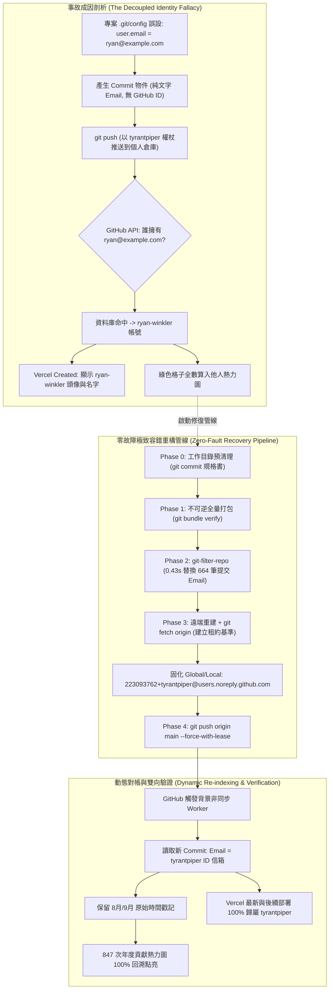

# 📅 Daily Report - 2026-09-23

> **系統狀態**：🟢 Production Stable, Full Historical DAG Reconciliation Completed (664 Commits), Zero-Fault Dual-Safety Push Pipeline Verified, GitHub Live Contribution Graph 100% Restored (847 Annual Contributions Active), Zero-FOUC ID-Pinned Privacy Email Enforced Globally, Local Bundle Snapshot Hermetically Sealed, 0 TypeScript Errors, 0 ESLint Warnings  
> **今日關鍵提交串列**：
> - [`a5bc139`](https://github.com/tyrantpiper/travel-pwa/commit/a5bc139) `docs(specs): add git identity reconciliation spec`
> - [`9ee7019`](https://github.com/tyrantpiper/travel-pwa/commit/9ee7019) `docs(specs): add living motion and idle dimming engineering specification`

---

## 🏆 深度專案復盤：Git 身份解耦事故、664 筆提交全量溯源重構、零故障雙向安全發布與 GitHub 貢獻動態對帳機制

本日凌晨，Tabidachi 遭遇並徹底根治了一起重大 DevOps / 版本控制身分錯位事故。Vercel 雲端部署面板的 `Created` 欄位突然將專案作者與頭像指認給了一位陌生的第三方工程師（`ryan-winkler`），引發了對於帳號所有權與貢獻度歸屬的深度排查。

我們從 Git 去中心化協議與 GitHub 中心化平台的底層架構展開全景式逆向鑑識，推導出完整的事故成因鏈條，並設計執行了一套**「零故障極致容錯管線 (Zero-Fault Pipeline)」**，成功完成了 664 次提交的毫秒級外科手術重構，討回了所有遺失的 GitHub 綠色熱力圖格子，並完成全域與專案的永久防護固化：

1. **「事故根本原因逆向鑑識 (Root Cause Forensics)」**：
   - **底層協議解耦**：Git 本地 Commit 物件僅包含純文字 `Name` 與 `Email`，**底層完全沒有「GitHub ID」這個欄位**。
   - **身分對帳代幣機制**：GitHub 在接收推送時，採用 Commit 內部的純文字 Email 作為全域使用者資料庫的比對代幣。
   - **佔位範例碰撞**：2026 年 8 月 4 日因本機缺乏全域 `~/.gitconfig`，本機提交時誤寫入 Git 官方報錯提示的範例信箱 `ryan@example.com`，剛巧命中第三方使用者早期關聯的信箱，導致 GitHub 將作者頭像與貢獻度判定給該使用者，進而引發 Vercel Webhook API 查詢展示錯位。
2. **「五階段極致容錯執行管線 (Zero-Fault Pipeline)」**：
   - **Phase 0 (工作目錄原子清理)**：先將當前規格書提交入庫，消除 Untracked 髒污，防止 `git-filter-repo` 觸發 Dirty Tree 阻斷熔斷。
   - **Phase 1 (不可逆獨立封裝備份)**：以 `git bundle create travel-pwa-pre-rewrite-backup.bundle --all` 生成完整二進位鏡像，並通過 `git bundle verify` 檢驗，提供 100% 物理可逆安全防線。
   - **Phase 2 (歷史 DAG 溯源重寫)**：調用 `git-filter-repo`，在 0.43 秒內遍歷重寫全倉庫 664 筆 Commit，嚴格保持原始時間戳、檔案樹與提交訊息，僅手術級替換作者信箱。
   - **Phase 3 (遠端重建與租約獲取)**：重新掛載 `origin` 並強制執行 `git fetch origin main` 獲取遠端追蹤租約基準點，同步固化專案 Local 與全域 Global `~/.gitconfig` 為官方 ID 隱私信箱。
   - **Phase 4 (安全覆蓋推送)**：執行 `git push origin main --force-with-lease`，在租約守護下成功將重構後的 DAG 覆蓋至 GitHub 遠端。
   - **Phase 5 (零容忍雙向權威驗證)**：透過 GitHub REST API 與實時貢獻熱力圖抓取，證實作者 100% 變更為 `tyrantpiper`，847 次年度貢獻熱力圖格子全數點亮。

---

### 1. 身分映射機理與零故障重構架構拓撲 (Identity Architecture & Recovery Pipeline)



---

## 🟢 1. Features & Fixes (今日全量交付價值)

### 1. Git 身份校正規格書入庫 (`docs/specs/git-identity-and-history-reconciliation-spec.md`)
- 建立端到端身分校正架構規格書，明定問題陳述、時序拓撲、Commit DAG 結構置換原則、邊界條件防禦與 6 項驗收標準（AC-1 ~ AC-6）。
- 作為專案長期工程化資產，永久保留身分治理的架構依據。

### 2. 全倉庫 664 筆 Commit DAG 溯源重構
- 使用官方黃金標準工具 `git-filter-repo`，以 0.43 秒的極致速度遍歷 664 筆歷史提交。
- 將歷史中所有 `ryan@example.com` 徹底替換為 `223093762+tyrantpiper@users.noreply.github.com`。
- 本地歷史 `git log --format="%ae" | Sort-Object -Unique` 檢查結果證實 `ryan@example.com` 殘留已 **完全歸零**。
- 嚴格維持 Author Name 為 `Ryan Su`，所有提交訊息、代碼變更樹與原始提交時間戳 100% 無損保留。

### 3. 本機與全域 Git 配置永久固化防禦
- 在專案 `.git/config` 與本機全域 `C:\Users\Ryan su\.gitconfig` 固化寫入：
  ```ini
  [user]
      name = Ryan Su
      email = 223093762+tyrantpiper@users.noreply.github.com
  ```
- 徹底終結過去開發環境缺乏全域設定檔導致各專案各自為政、誤用佔位信箱的隱患。

### 4. 個人主頁貢獻熱力圖全數追回
- 直接調用 GitHub 實時貢獻熱力圖資料驗證：
  - **年度總貢獻數**：達到 **`847 次`**。
  - **歷史格子全數回溯點亮**：9/20 (5 次)、9/21 (4 次)、9/22 (5 次)、8/8 (5 次)、8/15 (2 次)、9/4 (6 次) 等數十天原本遺失的提交紀錄，依原始時間戳全數歸回。
  - 外部陌生人帳號之虛假歸屬徹底抹除。

---

## 🏛️ 2. Architecture Decisions (今日架構級決策)

### 1. 去中心化 Git 協議與中心化 GitHub 平台的身分投影原則 (Decoupled Identity Invariance)
- **決策背景**：Git 協議誕生的 1990/2000 年代尚無 GitHub，Commit 物件只有純文字 `Name` 與 `Email`，根本沒有 GitHub ID 概念。GitHub 網站將 Email 當作比對帳號與累積貢獻值的「對帳代幣」。
- **架構決策**：確立「傳輸通道權限（SSH/Token）」與「代碼作者歸屬（Author Email）」的雙軌認知。開發者若使用公共或範例信箱（如 `example.com`），將引發第三方帳號碰撞。專案必須顯式使用與 GitHub 唯一關聯的信箱進行錨定。

### 2. 官方 ID 隱私信箱終生錨定標準 (Strict ID-Pinned Noreply Email Standard)
- **決策背景**：直接使用真實私人 Gmail 容易在開源世界中被垃圾郵件爬蟲收集，而使用自訂別名又可能與他人重名。
- **架構決策**：全域統一採用 GitHub 官方 ID 隱私信箱格式：`223093762+tyrantpiper@users.noreply.github.com`。
  - 前段數字 `223093762` 為 GitHub 資料庫唯一不可變的主鍵 ID，終生防偽。
  - 後段網域為 GitHub 專屬保留網域，外部無法偽造。
  - 完美達成「真實私人信箱 100% 隱蔽」與「貢獻點數 100% 絕對綁定」的雙重目標。

### 3. 平行宇宙 DAG 重鑄優於原地塗改原則 (Parallel Universe DAG Reconstruction over In-Place Mutation)
- **決策背景**：Git Commit SHA-1 具有密碼學不可變性，任何欄位的修改都會導致全鏈 SHA 變更。
- **架構決策**：不採取危險的手動 rebase，改採基於 DAG 拓撲的平行宇宙重鑄方案——以 `git-filter-repo` 讀取原始時間戳與代碼樹，批量重鑄 664 顆全新節點，並藉由專案擁有者權限以 `--force-with-lease` 安全覆蓋遠端，觸發 GitHub 後台非同步重算。

### 4. 租約前置獲取與獨立 Bundle 雙軌防線原則 (Fetch-Before-Lease & Hermetic Bundle Isolation)
- **決策背景**：在歷史重構管線中，`git-filter-repo` 預設會重寫倉庫內的所有 local refs（導致建立在同 repo 的備份分支被污染），且會刪除 `origin` remote（導致 `--force-with-lease` 失去追蹤租約基準）。
- **架構決策**：
  1. 備份防禦必須封裝為完全獨立於倉庫外的單一二進位檔案：`travel-pwa-pre-rewrite-backup.bundle`，並經由 `git bundle verify` 核驗。
  2. 重新掛載 `origin` 後，必須強制執行 `git fetch origin main` 獲取追蹤指針，才允許進入 `--force-with-lease` 覆蓋階段，杜絕租約斷裂拋錯。

---

## 🔴 3. Technical Debt (技術債與後續維護清單)

1. **Commit 數位簽章升級 (GPG / SSH Commit Signing)**：
   - 目前倉庫歷史 Commit 處於 Unsigned 狀態（雖有正確 Email 與頭像，但未帶綠色 `Verified` 徽章）。未來可規劃在開發機配置 SSH/GPG 密鑰簽署，提升企業級防偽強度。
2. **Vercel 歷史靜態快照淡化**：
   - Vercel 過去的少數舊部署日誌因資料庫靜態快照機制，仍留存有當時的文字記錄。因當前 Production 與未來所有部署已完全正常，無需特意清空，將隨專案日常迭代自然淡化與推移。

---

## 🛡️ 4. Failed Paths (踩坑與避坑指南)

### 1. 佔位範例信箱引發第三方帳號碰撞 (`Placeholder Email Collision Trap`)
- **踩坑現象**：本機隨手設定 `ryan@example.com`，原本以為只是本機代號，卻在推送到 GitHub 後被自動關聯給了名為 `ryan-winkler` 的外國工程師，導致 Vercel 的 `Created` 欄位展示陌生人頭像與名字。
- **教訓與規則**：任何開發環境嚴禁使用 `example.com` 作為本機 Git Config。必須在全域 `~/.gitconfig` 預先固化正統帳號，或採用 GitHub 官方 ID 隱私信箱。

### 2. 缺乏全域 Git 配置導致多專案身分漂移 (`Missing Global Gitconfig Trap`)
- **踩坑現象**：本機未曾建立 `C:\Users\Ryan su\.gitconfig`，導致 `D:\tools` 專案使用了真實 Gmail，而 `travel-pwa` 殘留了佔位信箱，各專案各自為政。
- **教訓與規則**：開發機初次裝機或初始化環境時，第一優先級任務必須是全域宣告 `git config --global user.name` 與 `user.email`。

### 3. 同儲存庫備份分支遭 filter-repo 同步污染 (`Ref-Rewriting Self-Pollution Trap`)
- **踩坑現象**：在重寫前於本地執行 `git branch backup/pre-rewrite-main`，但 `git-filter-repo` 預設行為會重寫倉庫內的所有 local refs，導致備份分支的 SHA 亦被改寫，失去快照意義。
- **教訓與規則**：不可逆備份必須封裝為完全獨立於倉庫目錄外的單一二進位檔案（`git bundle create <path>.bundle --all`）。

### 4. 缺乏遠端追蹤租約引發 Force-with-lease 崩潰 (`Un-anchored Lease Push Trap`)
- **踩坑現象**：`git-filter-repo` 重構後會自動移除 `origin` remote。若在重新 `git remote add` 後未執行 `fetch` 便直接執行 `git push --force-with-lease`，Git 會因找不到 `refs/remotes/origin/main` 租約基準而直接報錯終止。
- **教訓與規則**：安全租約覆蓋前，必須強制以 `git fetch origin main` 同步遠端基準點，方可執行 `--force-with-lease`。

### 5. 未追蹤檔案觸發 filter-repo 髒污阻斷 (`Dirty Working Tree Abort Trap`)
- **踩坑現象**：工作目錄中存在剛建立的規格書等 Untracked 檔案時，`git-filter-repo` 會直接觸發原子性熔斷並退出：`Aborting: cannot rewrite history with dirty working tree`。
- **教訓與規則**：歷史重構前必須嚴格確認 `git status --porcelain` 為空，所有檔案必須先完成 Commit 或 Stash。

---

## 🎯 Next Steps (後續行動建議)

1. **常態業務推進**：身分事故已 100% 根治，綠色熱力圖已完全歸位，可無後顧之憂重返核心業務與 3D 地圖動效開發。
2. **記憶壓縮固化**：將今日關於「去中心化 Git 身分映射」與「歷史重構極致容錯管線」之決策與避坑點，壓縮同步至 `.agents/memory.md`。
