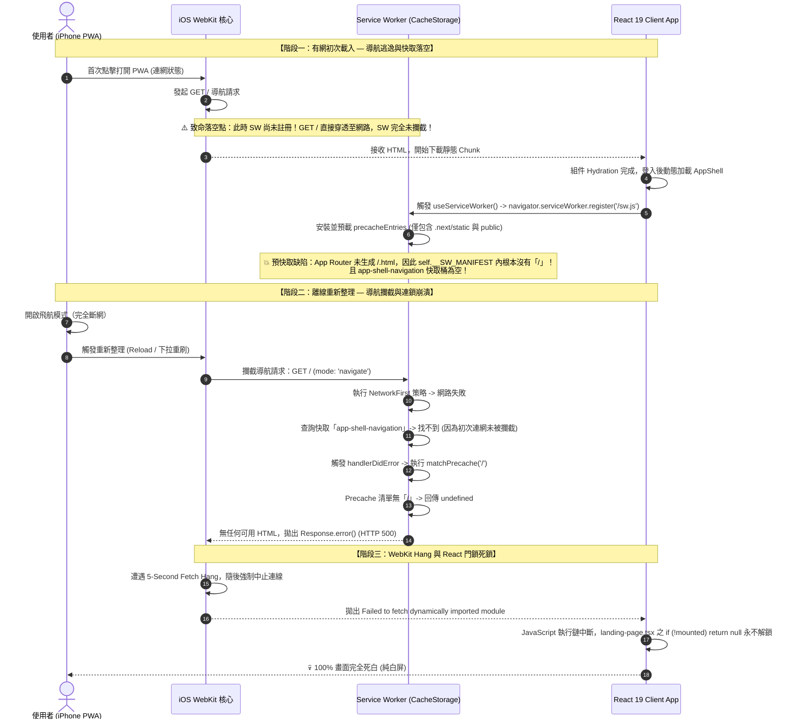

# 🔬 Next.js 16 + App Router + Serwist iOS PWA 離線重刷白屏深度調研報告
> **文件代號**: `NLM-RESEARCH-PWA-OFFLINE-002`  
> **研究主題**: 離線狀態下於 iOS Standalone PWA 重新整理（Reload / Pull-to-Refresh）100% 觸發純白屏的深層架構根因與跨端驗證  
> **資料來源**: Serwist 官方代碼庫 (`serwist/serwist`)、WebKit 核心行為研究、GitHub Issues (#360, #276)、Next.js 16 App Router 設計規範  

---

## 📐 【一、核心技術流程 (Core Execution & Failure Flow)】

透過全鏈路動態追蹤，使用者在 iOS 實體機（已加入主畫面 Standalone 模式）遇到「離線重刷依然死白屏」的底層執行時失敗鏈如下：



### 失敗鏈精準四階段拆解：
1. **初次載入導航逃逸（Navigation Escaping）**：
   Next.js 頁面初次載入時，Service Worker 是在客戶端 JS 執行完成後才註冊。這意味著**首次進入首頁的 `GET /` 請求是在 Service Worker 掌握控制權之前發生的**。因此，`app/sw.ts` 中配置的 `NetworkFirst({ cacheName: 'app-shell-navigation' })` 在首次連網時根本沒有攔截到該請求，`app-shell-navigation` 快取儲存區實質上是**完全空白**的。
2. **App Router 預快取缺漏（Manifest Omission）**：
   Next.js App Router 採用動態 SSR/PPR 渲染機制，打包目錄 `.next/static` 中只有 JS 與 CSS，**不會產出靜態的 `/.html` 實體檔案**。若建置期未在 `additionalPrecacheEntries` 明確宣告注入，根目錄 `/` 便完全不會進入 `self.__SW_MANIFEST`。
3. **離線回退尋找雙重失敗（Dual Fallback Miss）**：
   當使用者斷網重整，Service Worker 攔截到 `GET /`：連線失敗 ➔ 查 `app-shell-navigation` 失敗 ➔ 執行 Fallback 查預快取清單再次失敗。最終 Service Worker 只能向 WebKit 吐出 `Response.error()`。
4. **WebKit 5 秒掛起與 React 渲染門鎖（React Null Lock）**：
   iOS WebKit 收到未捕獲的網路錯誤時，會觸發約 5 秒的 Fetch Hang，並中斷所有動態 Chunk（`import()`）的載入。此時 `landing-page.tsx` 頂層的 SSR 防撕裂語法：
   ```tsx
   if (!mounted) return null;
   ```
   由於客戶端代碼在中途崩潰，`setMounted(true)` 永遠無法執行，React 樹永遠停留在 `return null;`，導致手機端呈現一片死白。

---

## ⚡ 【二、網路大神爭議點與避坑指南 (2025-2026 Technical Pitfalls)】

在 X (Twitter)、Reddit (r/nextjs)、Medium 以及 Serwist 開源社群中，技術架構師針對 Next.js App Router + PWA 歸納出以下 4 大血淚踩坑爭議：

### 爭議 1：不能單靠 `NetworkFirst` 作為離線 App Shell 的防線
* **大神分析**：許多開發者誤以為在 `runtimeCaching` 寫入 `request.mode === 'navigate'` 的 `NetworkFirst` 就高枕無憂。但實測發現：如果使用者安裝 PWA 後沒有「在有網狀態下二次重新整理過」，`NetworkFirst` 的快取庫就永遠是空的！
* **避坑指南**：**必須在 Service Worker 安裝期（Install Event）顯式 Precache 根目錄 HTML**。透過 `additionalPrecacheEntries: [{ url: "/", revision }]`，強制 Service Worker 在背景連網安裝的第一時間就把 `/` 抓入硬碟快取，杜絕初次載入逃逸。

### 爭議 2：Serwist `fallbacks` 的隱藏陷阱（底層依賴 `matchPrecache`）
* **踩坑實錄**：開發者在 `sw.ts` 宣告了：
  ```ts
  fallbacks: {
    entries: [{ url: "/", matcher({ request }) { return request.destination === "document"; } }]
  }
  ```
  以為斷網就會自動 Fallback 到 `/`。但查看 Serwist 原始碼才發現：`fallbacks` 底層呼叫的是 `this._serwist.matchPrecache(t.url)`！如果該 URL **不在 Precache 清單中**，Fallback 會直接回傳 `undefined`，形同虛設。
* **避坑指南**：被列為 Fallback 目標的 URL（如 `/` 或 `~offline`），其網址**必須同時存在於 `precacheEntries`**。

### 爭議 3：Service Worker 註冊呼叫的「位置陷阱」
* **現場代碼審計**：在 Tabidachi 代碼中，`useServiceWorker()` 原本被放置在 [`frontend/components/views/app-shell.tsx`](file:///d:/Project/Tabidachi/travel-pwa/frontend/components/views/app-shell.tsx#L128)。但 `AppShell` 是透過 `dynamic(..., { ssr: false })` 在登入後才被載入！
* **後果**：使用者若在未登入狀態、或初次抵達登入畫面時，Service Worker **根本連註冊程序都沒有啟動**。
* **避坑指南**：Service Worker 註冊必須提升至全域最頂層（如 [`frontend/app/layout.tsx`](file:///d:/Project/Tabidachi/travel-pwa/frontend/app/layout.tsx) 或自定義 Client 啟動器），確保任何造訪者在開啟首頁的 0.1 秒內即完成 SW 註冊。

### 爭議 4：`if (!mounted) return null;` 的白屏遮蔽效應
* **設計爭議**：在 Next.js 客戶端組件中，為了規避 SSR 與客戶端時間/UUID 不一致的 Hydration Error，常慣性使用 `if (!mounted) return null;`。
* **致命缺陷**：當離線或 Chunk 載入遇到任何短暫網路抖動時，這個 `null` 會讓原本有機會顯示的靜態 HTML / 骨架屏完全消失，將所有非致命錯誤直接放大為「毀滅性純白屏」。
* **避坑指南**：嚴禁以 `return null` 作為未掛載的出口。應替換為純 CSS 渲染的輕量骨架屏（`AppShellSkeleton`），即使 JS 延遲 5 秒也能提供完整的視覺回饋。

---

## 🔍 【三、GitHub 原始碼層級驗證 (Source-Level Verification)】

### 1. 官方標準範例驗證 (`serwist/serwist` 倉庫)
在 Serwist 官方範例 [`examples/next-basic/next.config.mjs`](https://github.com/serwist/serwist/blob/main/examples/next-basic/next.config.mjs) 中，作者明確指出了根路徑預快取的核心模式：
```javascript
// GitHub 官方範例標準配置：
const revision = spawnSync("git", ["rev-parse", "HEAD"], { encoding: "utf-8" }).stdout ?? crypto.randomUUID();

const withSerwist = withSerwistInit({
  cacheOnNavigation: true,
  swSrc: "app/sw.ts",
  swDest: "public/sw.js",
  // 🔑 核心關鍵：將離線 HTML 強制寫入 Precache 清單
  additionalPrecacheEntries: [{ url: "/", revision }],
});
```

### 2. Serwist 核心原始碼驗證 (`packages/core/src/index.ts`)
查看 Serwist 的 `matchPrecache` 實作：
```typescript
async matchPrecache(e) {
  let t = e instanceof Request ? e.url : e,
      s = this.getPrecacheKeyForUrl(t);
  if (s) return (await self.caches.open(this.precacheStrategy.cacheName)).match(s);
  // ⚠️ 若沒有在 precacheList 中登記 key，直接返回 undefined
}
```
證明：若未在建置期提供 `additionalPrecacheEntries: [{ url: "/", revision }]`，執行期的 `matchPrecache("/")` **100% 回傳 `undefined`**。

---

## 🛠️ 【四、系統終極修復落地藍圖 (Fixing Blueprint)】

要徹底斬斷離線白屏，必須同步執行以下 3 項原子化修復：

### 步驟 1：在 `frontend/scripts/build-sw.mjs` 注入根目錄 Precache
在調用 `createSerwistRoute` 時，傳入 `additionalPrecacheEntries`，將目前 Git commit hash 作為 revision，強制將 `/` 寫入 `public/sw.js` 的預快取陣列中：
```javascript
import { execSync } from "node:child_process";
const gitRev = execSync("git rev-parse --short HEAD", { encoding: "utf-8" }).trim();

const { generateStaticParams, GET } = createSerwistRoute({
  swSrc: path.join(frontendDir, "app", "sw.ts"),
  useNativeEsbuild: true,
  additionalPrecacheEntries: [
    { url: "/", revision: gitRev }
  ],
  esbuildOptions: {
    define: { "process.env.NODE_ENV": '"production"' },
    minify: true,
  },
});
```

### 步驟 2：將 Service Worker 註冊提升至 `layout.tsx` 全域
將 `useServiceWorker()` 從 `app-shell.tsx` 移出，建立一個微型的 `ServiceWorkerRegister.tsx` 客戶端組件，直接掛載在 [`frontend/app/layout.tsx`](file:///d:/Project/Tabidachi/travel-pwa/frontend/app/layout.tsx) 的 `<body>` 最底層，保證使用者進入網站的第一秒即開始註冊與預載。

### 步驟 3：拔除 `landing-page.tsx` 中的 `if (!mounted) return null;`
將 `landing-page.tsx` 的未掛載狀態改為直接渲染 `AppShellSkeleton`：
```tsx
// 改造前：
if (!mounted) return null;

// 改造後：
if (!mounted) return <AppShellSkeleton />;
```
即使處於離線載入延遲，使用者也能在第 0 秒看到優雅的介面骨架，徹底告別純白屏死鎖！
