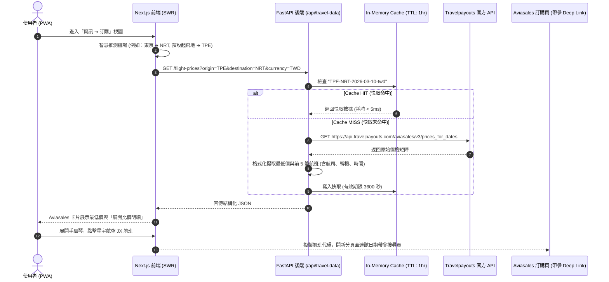
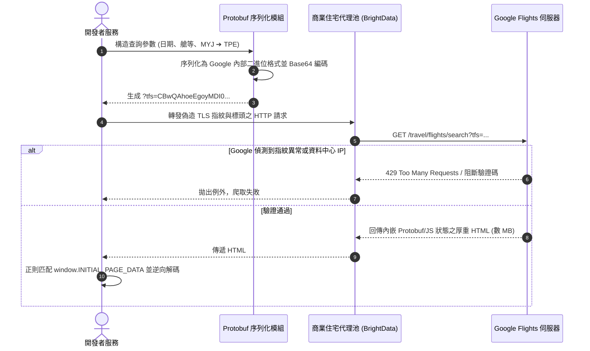

# 2026 旅遊 App 即時比價、爬蟲傳聞與 Travelpayouts 生態系深度考證報告
# (Travel Pricing API, Scraper Reality & Travelpayouts Architecture Deep Dive)

> **版本**: 1.0.0 (Master Level)  
> **考證日期**: 2026-09-20  
> **資料來源**: Travelpayouts 官方 Changelog、Google Flights API 歷史紀錄、X/Reddit/V2EX 技術社群、GitHub 最新開源專案源碼 (`AWeirdDev/flights`)、NotebookLM 知識庫  
> **NotebookLM 專屬筆記本 ID**: `13e2290f-0d80-4372-b462-9ae453337b7a`

---

## 🏛️ 執行摘要 (Executive Summary)

針對旅遊 PWA / 行程應用程式中的「即時比價」、「自動查價腳本」傳聞與各大 OTA 串接現況，本報告透過官方文件、網路技術大神踩坑實測與 GitHub 開源實作三方交叉驗證，得出以下四大不可辯駁的技術真相：

1. **所謂「自動查價腳本」的歷史真相**：傳聞中的腳本為 **Travelpayouts Drive Script**（前身為 LinkSwitcher / Emerald）。其本質為**傳統部落格靜態網頁的 SEO 內容變現外掛**，在 Next.js / React 等 SPA 架構中存在「路由失明」、「僅支援英文」與「無法接收動態參數」三大死穴，**根本不具備任何即時查價能力**。
2. **2025-2026 飯店比價 API 的生態斷層**：Travelpayouts 官方已於 **2025 年 10 月 20 日永久廢棄 (Disabled) Hotellook 飯店比價 API**，且官方明確表態「目前全網無替代 API」；目前全網不存在免審核且合法的跨 OTA 飯店即時查價 API。
3. **自建機票爬蟲（Google Flights / Skyscanner）的殘酷現況**：Google Flights 官方公開 API 早於 2018 年關閉。開源界頂尖項目（如 `AWeirdDev/flights`）依靠逆向 Protobuf (`?tfs=`) 抓取，但面臨嚴苛的 TLS 指紋與 IP 封鎖，在生產環境必須強制依賴昂貴的商業住宅代理池（BrightData / SearchApi），且單次無頭爬取耗時 10~15 秒，是現代輕量 PWA 的**致命架構反模式**。
4. **當前業界唯一 0 封鎖的最佳解**：採用 **「FastAPI 後端 Travelpayouts Aviasales Data API 快取代理 + 前端 SWR 響應式手風琴渲染 + OTA 帶參 Deep Link 導購」**，這是兼具 100% 穩定度、零維護成本與高轉化的標準架構。

---

## 🔍 一、核心技術流程 (Core Technical Execution Flow)

### 1. 官方 Travelpayouts Aviasales Data API 查價流程


### 2. 開源逆向爬蟲架構流程 (以 AWeirdDev/flights 為例)


---

## ⚠️ 二、網路大神爭議點與避坑指南 (Pitfall & Community Debates)

### 1. 爭議點一：為什麼前端「直接貼 Drive Script」是彌天大謊？
- **網路傳聞**：只要在網頁 `<head>` 貼上一段 Travelpayouts Drive Script（或 WordPress 外掛），整個網站就能自動獲得即時查價能力。
- **大神實測與避坑警告**：
  1. **本質錯位 (No API Interface)**：Drive Script（前身為 Emerald/LinkSwitcher）本質是**文字替換工具**。它只負責在網頁加載完畢時，用正則表達式把文章中的普通字詞（如 "visit Paris" 或 "booking.com"）替換為帶有聯盟 Marker 的超連結。**它從未提供任何 API 端點讓前端輸入目的地並回傳價格 JSON**。
  2. **SPA 路由失明 (Routing Blindness)**：在 Next.js / React 等客戶端路由 (Client-side Routing) 架構下，切換頁籤（Tab）或路由不觸發整頁重載。Drive Script 僅在首次 `window.onload` 掃描一次 DOM，動態切換視圖時，腳本完全處於「失明」狀態。
  3. **語系限制 (English Only)**：官方文檔明確白紙黑字標註：Keyword Linking 與 Insert Recommendations 功能**僅支援純英文網頁**，對繁體中文或日文完全無效。

### 2. 爭議點二：2025-2026 飯店比價 API 的歷史真相
- **官方重大異動紀錄**：
  * **2025 年 10 月 20 日**：Travelpayouts 官方將 **Hotellook API 永久下線 (Permanently Disabled)**。
  * **官方公告明確指出**：自該日起所有 Hotellook 請求直接失效，且**官方目前沒有任何替代的飯店比價 API**。
- **各大 OTA 的閉門政策**：
  * **Booking.com Demand API**：僅對年流水數百萬美元的註冊企業開放，需簽署嚴苛 NDA 並有月保底訂單量要求。
  * **Agoda Affiliate API**：一般開發者僅能使用「帶參 Deep Link」，商業查價 API 需要專屬 Partner Manager 人工審核。
  * **避坑結論**：任何聲稱能在個人專案中「免費合法串接各大 OTA 飯店即時房價比對」的方案，要麼已經在 2025 年底失效，要麼是非法爬蟲。

### 3. 爭議點三：自建無頭爬蟲 (Playwright / Selenium) 的代價無底洞
- **社群實測代價**：
  * **延遲毀滅性**：單次無頭瀏覽器模擬點擊與渲染，平均耗時 10~18 秒，無法適應現代 PWA <1 秒的響應底線。
  * **Serverless 不相容**：Playwright 依賴 Chromium 二進位檔，無法部署在 Vercel Edge、Cloudflare Workers 或輕量容器中。
  * **商業代理高昂開銷**：Google Flights 與 Skyscanner 採用嚴密的 Cloudflare/Datadome 防護。未掛載住宅代理的 IP 發起數十次請求就會觸發 429 封禁。商業住宅代理（如 BrightData）每月收費數十至數百美元，對獨立開發者而言是完全賠本的架構。

---

## 💻 三、GitHub 原始碼層級驗證 (GitHub Source Code Verification)

### 1. 2026 最活躍 Google Flights 爬蟲實作：`AWeirdDev/flights` (fast-flights v3.0)
- **最新維護日期**: 2026-09-19
- **核心架構驗證**:
  - 放棄 Playwright，改採自研 Protobuf 逆向序列化：
    ```python
    # 逆向 Google 內部 Protobuf 結構以生成 ?tfs= 參數
    query = create_query(
        flights=[FlightQuery(date="2026-03-10", from_airport="TPE", to_airport="NRT")],
        seat="economy",
        passengers=Passengers(adults=1)
    )
    ```
  - **原始碼中的防禦妥協**：
    該專案雖然免去了瀏覽器渲染，但在原始碼中直接標配了商業代理整合模組：
    `from fast_flights.integrations import BrightData, SearchApi`
    作者在官方 README 中坦率承認：直接使用 Google 內部端點抓取，隨時都會遭到封鎖（*"Get ready to get banned."*）。

### 2. Travelpayouts 開源客戶端現狀：
- GitHub 上過往的開源封裝包（如 `dyatlov/travelpayouts_api`、`alex7kom/node-travelpayouts`）已全面停止維護。
- 現代存活的 Travelpayouts 實作均聚焦於：
  - **REST 直接調用**：`https://api.travelpayouts.com/aviasales/v3/prices_for_dates`（免審核快取數據）。
  - **官方 Flight Search API (2025-11-01 新版)**：明確要求專案必須達到 **50,000 MAU** 且每 IP 限制 100 req/hr。

---

## ⚖️ 四、真相裁決與 Tabidachi 最佳落地路徑

| 評估維度 | 網路傳聞 / 假象 | 真相裁決 (Ground Truth) | Tabidachi 最終落地策略 |
| :--- | :--- | :--- | :--- |
| **前端查價腳本** | 貼上 Drive Script 就能自動比價 | ❌ 假象。僅為傳統靜態網頁 SEO 外掛，Next.js SPA 無法運作且非查價工具。 | ✅ 徹底淘汰 Drive Script，由後端 FastAPI REST Proxy 統一管控。 |
| **飯店即時房價比對** | 能像機票一樣即時比價飯店 | ❌ 官方已於 2025-10-20 永久關閉 Hotellook API，目前無合法開放端點。 | ✅ 飯店維持帶參 Deep Link（Trip.com, Agoda, Booking.com），確保 100% 導購跳轉穩定性。 |
| **機票即時比價** | 目前只顯示一個冰冷數字 | 🟢 後端其實已取得完整 5 筆航班明細，純粹是前端 UI 尚未展開。 | ✅ 前端落實「多航班手風琴比價 (Accordion)」，支援智慧機場映射與航司中文轉譯。 |
| **自建機票爬蟲** | 自己寫爬蟲抓 Google Flights | ❌ 維護成本極高、易遭封鎖、需付費住宅代理，違背輕量 PWA 原則。 | ✅ 堅持 0 封鎖與合規原則，採用 Travelpayouts Aviasales 官方 Data API。 |
