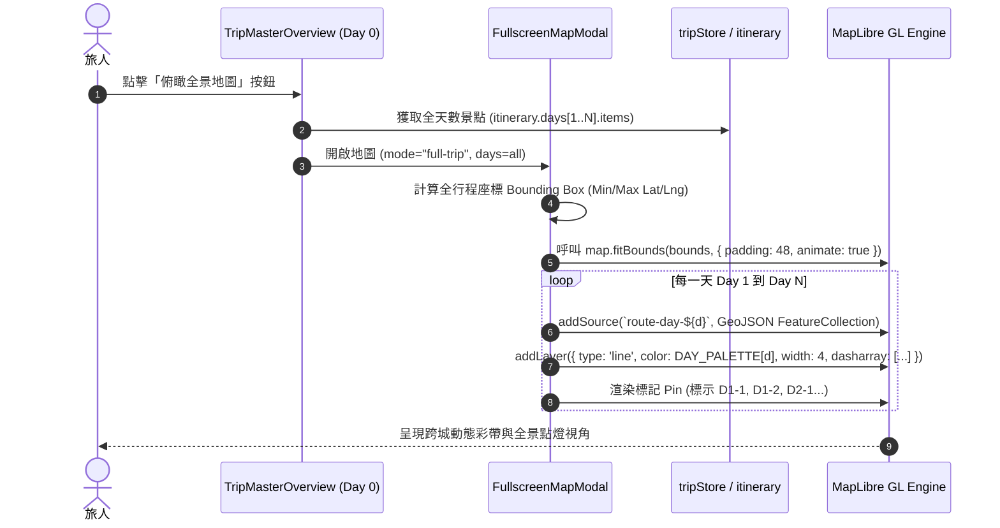
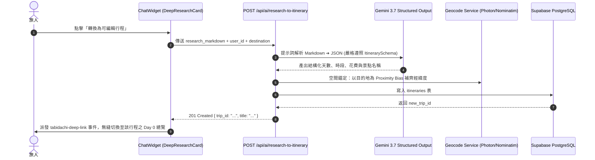
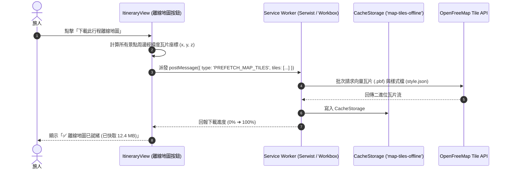
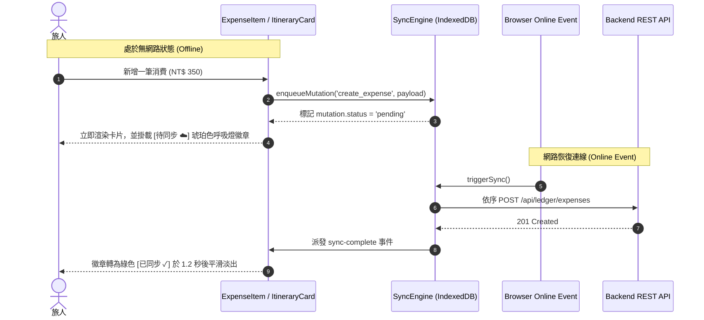
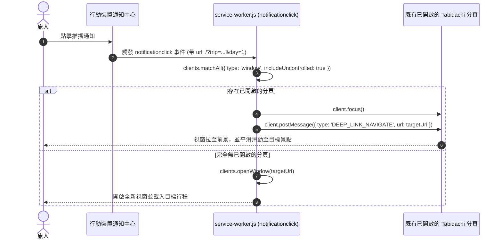
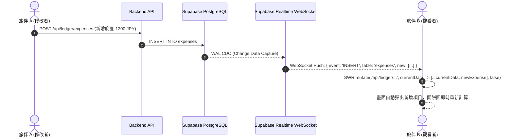

# 🏛️ Tabidachi 未達成架構演進方向規格全景 (Architecture Evolution Backlog Spec)

> **版本**: 1.0.0  
> **建立日期**: 2026-09-14  
> **關聯來源**: `docs/journals/*.md` (2026-08-10 ~ 2026-09-14) ✕ `.agents/memory.md`  
> **標準規範**: `idea-to-spec` 架構主規格架構

---

## 📋 總覽：未達成架構演進矩陣 (Evolution Roadmap Matrix)

| 序號 | 架構演進主題 | 核心領域 | 難度 / 影響度 | 價值維度 |
|:---:|:---|:---|:---:|:---|
| **E1** | **全景多天軌跡地圖疊加 (Full-Trip Multi-Day Route Mesh)** | 前端地圖 / 空間渲染 | 中 / 極高 | 旅人於 Day 0 一秒俯瞰跨城/跨日完整地理動線 |
| **E2** | **深度研究成果結構化直通匯入 (Deep Research ➔ Visual Pipeline)** | AI 智慧體 / 資料轉換 | 高 / 極高 | 打通 System 2 深度思考報告與可編輯行程的最後一哩路 |
| **E3** | **向量地圖瓦片離線預載 (Offline Map Tiles & Local-First Guard)** | PWA / 離線韌性 | 高 / 高 | 徹底消滅海外漫遊無網路環境下的地圖灰格白屏 |
| **E4** | **離線突變樂觀 UI 狀態提示 (Optimistic UI Pending Sync Badges)** | 狀態機 / 互動體驗 | 低 / 中 | 提供離線寫入時的心理安全感，明確指示待同步狀態 |
| **E5** | **Service Worker 點擊智慧聚焦 (Smart Tab Focus on Push Click)** | Web Push / PWA 生命週期 | 低 / 中 | 點擊推播時聚焦既有視窗，徹底杜絕無效分頁暴增 |
| **E6** | **Supabase Realtime 跨裝置協同推播 (Cross-Device Realtime Sync)** | 分散式即時通訊 | 高 / 極高 | 多人旅伴協同編輯行程與分帳帳本的零延遲對齊 |

---

## 🗺️ E1: 全景多天軌跡地圖疊加 (Full-Trip Multi-Day Route Mesh)

### 1. Problem Statement & Core Value
- **使用者痛點**：目前行程視圖在 Day 1 到 Day N 僅能檢視單日路線；進入 Day 0（Trip Master Overview）時，地圖僅顯示靜態或預設視角，無法一眼看透整趟旅行在地理空間上的縱深（如「台北 ➔ 九份 ➔ 礁溪」的完整移動軌跡）。
- **成功指標**：在 Day 0 點擊「全景地圖」，地圖自動以不同彩帶（Day 1 綠、Day 2 藍、Day 3 橘...）疊加所有天數的折線，並依據所有天數的經緯度自動計算 Bounding Box 進行 `fitBounds`。

### 2. User Journey & Core Flow


### 3. Architecture & Data Model
- **前端狀態擴充 (`tripStore.ts`)**：
  ```typescript
  interface MapViewState {
    activeDayRoute: number | 'all'; // 'all' 代表 Day 0 全景疊加模式
    highlightedDay?: number;        // 當滑鼠 hover 特定天數時高亮該天軌跡
  }
  ```
- **空間資料管道**：
  在 `frontend/lib/geo-utils.ts` 建立 `buildMultiDayFeatureCollection(itinerary: Itinerary)`，將各天活動轉化為 FeatureCollection，並注入屬性 `{ day: number, sequence: number, isInterCity: boolean }`。

### 4. Edge Cases & Boundary Conditions
- **跨海/超長距離飛航**：若相鄰兩景點距離 > 500km（例如搭國內線或新幹線），自動切換為虛線（`dasharray: [2, 4]`）並啟用大圓航線（Great Circle Line）演算法避免直線穿模。
- **單日無座標景點**：座標為 `(0, 0)` 或 `null` 的項目自動濾除，不參與 Bounds 計算。

### 5. Acceptance Criteria
- [ ] **AC-E1-1**: 在 Day 0 總覽點擊全景地圖，地圖能自動涵蓋整趟行程的所有景點座標。
- [ ] **AC-E1-2**: 不同天數的軌跡線條需呈現高對比且和諧之色系，並支援點擊特定天數高亮其餘天數半透明淡出。

---

## 🧠 E2: 深度研究成果結構化直通匯入 (Deep Research ➔ Visual Pipeline)

### 1. Problem Statement & Core Value
- **使用者痛點**：AI 隨行旅伴（System 2 深度研究）輸出極高價值的 7 天客製化研究方案，但旅人必須手動一條一條複製貼上到行程編輯器中，流程嚴重割裂。
- **成功指標**：深度研究卡片底部新增「🌟 一鍵轉換為視覺行程」按鈕，點擊後 3 秒內自動完成座標解析、結構化轉譯並直接跳轉至行程頁面。

### 2. User Journey & Core Flow


### 3. Architecture & Data Model
- **後端新增端點 (`backend/routers/ai.py`)**：
  - `POST /api/ai/research-to-itinerary`
  - **Request Body**：
    ```python
    class ResearchImportRequest(BaseModel):
        markdown_content: str
        destination: str
        start_date: Optional[str] = None
        user_id: str
    ```
  - **Response Body**：`TripSchema` 完整實體。

### 4. Edge Cases & Boundary Conditions
- **Markdown 格式不規範**：若使用者給出的文字缺少明確 Day 1/Day 2 標籤，AI 提示詞啟用語意時間推導，依景點密度自動切分合理天數（每天 3~4 個景點）。
- **重複建立防護**：連續點擊觸發防抖（Debounce 1.5s），並於卡片上記錄 `converted_trip_id`，若已轉換則按鈕變為「查看已生成的行程」。

### 5. Acceptance Criteria
- [ ] **AC-E2-1**: 任何由 System 2 產出的研究報告，均能完整解析出包含地點、時段、備忘與估計花費之標準行程。
- [ ] **AC-E2-2**: 轉換成功後自動觸發 SWR 快取更新並跳轉至該行程，零白屏、零 404。

---

## 📦 E3: 向量地圖瓦片離線預載 (Offline Map Tiles & Local-First Guard)

### 1. Problem Statement & Core Value
- **使用者痛點**：旅人在出國前往往已排好行程，但抵達目的地若無漫遊網路或在地下鐵/山區，打開地圖會出現灰色破圖。
- **成功指標**：旅人在出發前可於行程總覽點擊「下載離線地圖」，系統自動抓取行程周邊半徑 15km、Zoom Level 10~15 之向量瓦片（OpenFreeMap PBF）存入 CacheStorage 或 IndexedDB。

### 2. User Journey & Core Flow


### 3. Architecture & Data Model
- **瓦片計算演算法 (`frontend/lib/tile-math.ts`)**：
  ```typescript
  // 經緯度轉 Slippy Map 瓦片座標 (X, Y, Z)
  export function lonLatToTile(lon: number, lat: number, zoom: number): [number, number];
  export function getBoundingTiles(bounds: BBox, minZoom: number, maxZoom: number): string[];
  ```
- **Service Worker 策略 (`frontend/lib/sw-tile-strategy.ts`)**：
  在 Serwist 中針對 `tiles.openfreemap.org` 註冊 `CacheFirst` 策略，優先由 `map-tiles-offline` 響應。

### 4. Edge Cases & Boundary Conditions
- **儲存配額防護 (Quota Exceeded)**：限制單次下載上限為 50MB，若裝置可用空間不足（`navigator.storage.estimate()`）則提早警示並僅快取 Zoom 11~13 之核心幹道瓦片。
- **行程刪除連動清理**：當行程被刪除時，自動清除關聯之離線瓦片快取，防止手機儲存空間膨脹。

### 5. Acceptance Criteria
- [ ] **AC-E3-1**: 在 Chrome / Safari 開啟「飛航模式」下，進入曾下載過離線地圖的行程，地圖可正常縮放平移且不出現灰色破圖。

---

## ⚡ E4: 離線突變樂觀 UI 狀態提示 (Optimistic UI Pending Sync Badges)

### 1. Problem Statement & Core Value
- **使用者痛點**：離線時新增/修改費用或景點，雖然 IndexedDB `SyncQueue` 會暫存，但畫面上看起來與已同步到雲端的資料完全相同，使用者無法確認這筆資料「究竟有沒有存上雲端」。
- **成功指標**：卡片右上角或時間旁出現微小的「待同步 ☁️」跳動微光徽章；連上網路同步成功後，瞬間變為綠色打勾並優雅淡出。

### 2. User Journey & Core Flow


### 3. Architecture & Data Model
- **前端 Schema 擴充 (`frontend/lib/schemas.ts`)**：
  ```typescript
  export interface OptimisticMetadata {
    _syncStatus?: 'synced' | 'pending' | 'failed';
    _tempId?: string;
  }
  ```
- **UI 元件 (`frontend/components/ui/sync-status-badge.tsx`)**：
  封裝微型狀態指示器，支援 `pending`（琥珀色微光）、`failed`（紅色重試按鈕）與 `synced`（瞬態打勾）。

### 4. Edge Cases & Boundary Conditions
- **連線重送失敗（4xx 業務錯誤）**：若伺服器拒絕該請求，狀態轉為 `failed`，點擊徽章可開啟錯誤原因並允許使用者修改後重試，絕不丟失離線輸入的資料。

### 5. Acceptance Criteria
- [ ] **AC-E4-1**: 離線建立的項目百分之百帶有待同步視覺標記。
- [ ] **AC-E4-2**: 網路恢復後自動消除標記，無須重新整理頁面。

---

## 🔔 E5: Service Worker 點擊智慧聚焦既有分頁 (Smart Tab Focus on Push Click)

### 1. Problem Statement & Core Value
- **使用者痛點**：目前每次點擊推播通知，Service Worker 都無腦調用 `clients.openWindow()`，導致使用者手機瀏覽器開啟數十個重複的 Tabidachi 分頁，佔用記憶體且打亂返回歷史。
- **成功指標**：若瀏覽器已有 Tabidachi 視窗，點擊推播直接切換至該視窗並更新路由，不產生任何新分頁。

### 2. User Journey & Core Flow


### 3. Architecture & Data Model
- **修改檔案**：`frontend/public/sw.js` 或 Serwist 設定檔。
- **核心實作邏輯**：
  ```javascript
  self.addEventListener('notificationclick', (event) => {
    event.notification.close();
    const targetUrl = event.notification.data?.url || '/';
    
    event.waitUntil(
      clients.matchAll({ type: 'window', includeUncontrolled: true }).then((windowClients) => {
        for (const client of windowClients) {
          if ('focus' in client) {
            client.focus();
            client.postMessage({ type: 'TABIDACHI_PUSH_NAVIGATE', url: targetUrl });
            return;
          }
        }
        if (clients.openWindow) {
          return clients.openWindow(targetUrl);
        }
      })
    );
  });
  ```

### 4. Edge Cases & Boundary Conditions
- **分頁處於背景待機狀態**：若分頁被 OS 凍結，`postMessage` 需配合 `visibilitychange` 事件再次核驗以防訊息遺失。

### 5. Acceptance Criteria
- [ ] **AC-E5-1**: 在分頁已開啟的情況下點擊通知，分頁數量保持為 1，並成功導向目標行程。

---

## 🔄 E6: Supabase Realtime 跨裝置即時協同推播 (Cross-Device Realtime Sync)

### 1. Problem Statement & Core Value
- **使用者痛點**：雙人自由行時，旅伴 A 在其手機上記帳或勾選行程，旅伴 B 的手機無法即時感知，必須手動下拉重新整理。
- **成功指標**：利用 Supabase Realtime（Postgres Changes），當任一成員變更行程或分帳時，所有協同成員的畫面在 300ms 內自動無感局部刷新。

### 2. User Journey & Core Flow


### 3. Architecture & Data Model
- **前端 Hook (`frontend/lib/hooks/useTripRealtime.ts`)**：
  ```typescript
  export function useTripRealtime(tripId: string | null) {
    useEffect(() => {
      if (!tripId) return;
      const channel = supabase
        .channel(`trip-${tripId}`)
        .on('postgres_changes', { event: '*', schema: 'public', table: 'itineraries', filter: `id=eq.${tripId}` }, (payload) => {
          mutate([`/api/trips/${tripId}`, userId]);
        })
        .subscribe();
      return () => { supabase.removeChannel(channel); };
    }, [tripId]);
  }
  ```

### 4. Edge Cases & Boundary Conditions
- **自己觸發的變更回音（Echo Prevention）**：在 Payload 中附帶 `client_mutation_id`，發起客戶端收到自己派發的廣播時忽略，避免雙重覆蓋或游標跳動。

### 5. Acceptance Criteria
- [ ] **AC-E6-1**: 兩台實機同時開啟同個行程，一端修改景點名稱或費用，另一端於 1 秒內無重新整理自動更新。

---

## 🎯 建議落地路徑與排程 (Recommended Phasing)

```text
Phase 1 (立即可見性最高 - 建議優先實作)
  ├── E1: 全景多天軌跡地圖疊加 (Full-Trip Route Mesh) ➔ 完善 Day 0 旗艦級體驗
  └── E5: Service Worker 點擊智慧聚焦 (Smart Tab Focus) ➔ 消除推播新分頁擾民缺陷

Phase 2 (智慧體閉環與離線韌性)
  ├── E2: 深度研究成果直通匯入 (Deep Research ➔ Visual Pipeline)
  └── E4: 離線突變樂觀 UI 狀態提示 (Optimistic UI Badges)

Phase 3 (旗艦極限性能與協同)
  ├── E3: 向量地圖瓦片離線預載 (Offline Map Tiles)
  └── E6: Supabase Realtime 跨裝置即時同步 (Cross-Device Realtime)
```
