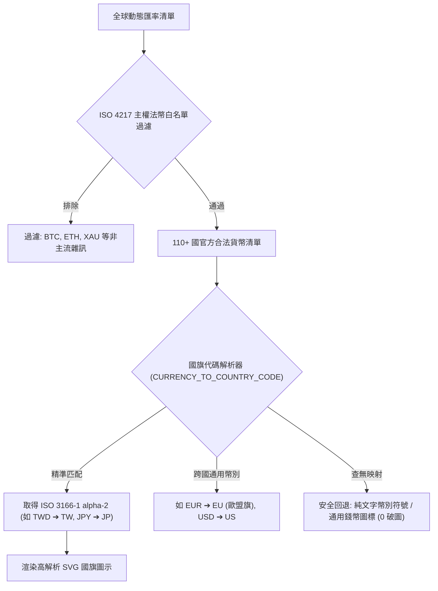

# 💱 全球 110+ 國主權法定貨幣白名單與國旗防護規格書
# (ISO 4217 Sovereign Fiat Standard & Flag Fallback Spec)

> **版本**: 1.0.0  
> **建立日期**: 2026-09-20  
> **狀態**: ✅ Production Live & Fully Implemented  
> **關聯檔案**:
> - 前端：`frontend/lib/currency.ts`, `frontend/components/views/ledger/ExpenseDialog.tsx`, `frontend/components/views/ledger/CurrencySelector.tsx`
> - 測試：`frontend/__tests__/currency.test.ts`

---

## 1. Problem Statement & Core Value (問題陳述與核心價值)

### 1.1 使用者痛點 (User Problems)
1. **外部 CDN 國旗大量 404 破圖**：舊系統使用外部 Flag CDN，因 ISO 4217 幣別代碼（如 EUR 歐元、XAU 黃金）無法直接對應 ISO 3166-1 國旗代碼，造成控制台海量 404 報錯與介面破損圖標。
2. **非主流加密貨幣雜訊**：通用匯率庫混入 BTC、ETH 等非主流幣種，干擾出國自由行使用者的記帳體驗。
3. **選取流程繁瑣**：在手機上選擇貨幣後，選單未自動關閉，使用者需手動點擊外部空白區域，缺乏原生手感。

### 1.2 核心指標 (Success Metrics)
- **0 國旗破圖與 404 報警**：建立完整 ISO 4217 ➔ ISO 3166-1 alpha-2 靜態映射，並內建本地 SVG 多層安全回退。
- **純粹官方主權法幣**：嚴格收斂至 110+ 官方主流主權貨幣，全域切斷加密貨幣與非標準項目。
- **操作即時自動縮合與觸覺反饋**：點擊幣別瞬間自動縮合收起，並同步觸發原生觸覺微震動 (`haptic.selection()`)。

---

## 2. Architecture & Data Model (資料結構與防衛模型)

### 2.1 貨幣白名單與國旗映射拓撲

---

## 3. Implementation Guardrails (實作規範)

1. **`CURRENCY_TO_COUNTRY_CODE` 確定性映射**：
   - 包含全球主流及新興旅遊國（如泰銖 THB ➔ TH、韓元 KRW ➔ KR、日圓 JPY ➔ JP、越南盾 VND ➔ VN、瑞士法郎 CHF ➔ CH 等）。
2. **SVG 國旗安全回退標籤**：
   - 圖片元件掛載 `onError` 事件，遇網路異常自動切換為本地預設幣別徽章，杜絕空白與小破圖。
3. **選擇器互動收闔規範**：
   - `onSelectCurrency(currency)` 執行時同步調用 `setIsOpen(false)` 與 `haptic.tap()`。
