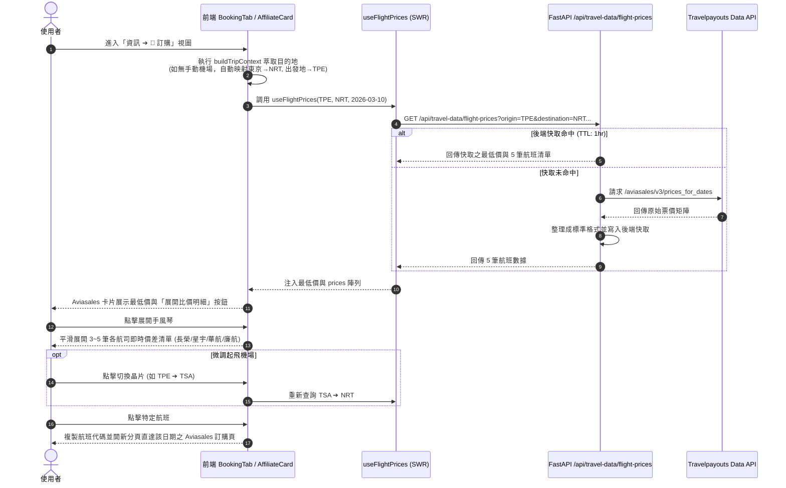

# 🛫 機票即時比價手風琴與智慧機場推測工程規格書
# (Flight Price Comparison Accordion & Smart Airport Inference Spec)

> **版本**: 1.0.0  
> **建立日期**: 2026-09-20  
> **狀態**: 📝 規格審議中 (Awaiting Approval)  
> **關聯視圖**: `frontend/components/views/info/BookingTab.tsx`, `AffiliateCard.tsx`, `SmartRecommendation.tsx`

---

## 1. Problem Statement & Core Value (問題陳述與核心價值)

### 1.1 使用者痛點 (User Problem)
1. **查價門檻過高 (High Cognitive Friction)**: 現有系統雖然串接了 Travelpayouts Data API，但**嚴格要求使用者必須先在「✈️ 航班資訊」手動輸入 3 碼 IATA 機場代碼**（如 TPE / NRT）；若使用者僅建立了「東京 5 日遊」行程而尚未填寫機票，訂購中心在 UI 上呈現 0 價格，查價功能形同虛設。
2. **單一數字缺乏資訊密度 (Low Information Density)**: 即使有價格，UI 也僅顯示單一數字（如 `💰 TWD 12,345+`），使用者無法得知這是廉航還是傳統航空、是直飛還是轉機，更無法得知其他航空公司的價差。
3. **導購跳轉脫節 (Generic Redirects)**: 點擊卡片僅開啟 Aviasales 通用搜尋頁，無法鎖定特定滿意的航班進行精準比價。

### 1.2 核心價值與成功指標 (Success Metric)
- **零門檻自動查價**: 根據行程標題與目的地自動推測機場（如「東京」自動推測 `NRT`，出發地預設 `TPE`），行程一建立即可自動在「訂購」頁籤看到即時票價。
- **高密度手風琴比價 (Accordion UI)**: 點擊卡片流暢展開 3~5 班不同航空之即時票價、航空公司中文名稱、直飛/轉機次數與價差排名。
- **直達跳轉與代碼複製**: 點擊單筆直達該日期帶參搜尋頁，並支援單鍵複製航班代碼，提升轉化率與實用性。

---

## 2. User Journey & Core Flow (使用者旅程與操作流程)



---

## 3. Architecture & Data Model (架構與資料模型)

### 3.1 城市 ➔ 機場智慧對照與航司字典庫 (`frontend/lib/airport-mapping.ts`)
建立輕量、強壯的本地對照庫，無外部 API 依賴：
- **常見目的地主要機場對照表**:
  - `東京 / tokyo`: 主力 `NRT` (成田), 次要 `HND` (羽田)
  - `大阪 / osaka / 京都 / 關西`: 主力 `KIX` (關西)
  - `沖繩 / okinawa`: `OKA` (那霸)
  - `北海道 / 札幌 / hokkaido`: `CTS` (新千歲)
  - `福岡 / fukuoka`: `FUK` (福岡)
  - `名古屋 / nagoya`: `NGO` (中部)
  - `首爾 / seoul`: 主力 `ICN` (仁川), 次要 `GMP` (金浦)
  - `釜山 / busan`: `PUS` (金海)
  - `曼谷 / bangkok`: 主力 `BKK` (蘇凡納布), 次要 `DMK` (廊曼)
  - `新加坡 / singapore`: `SIN` (樟宜)
  - `香港 / hong kong`: `HKG`
  - `巴黎 / paris`: `CDG`
  - `倫敦 / london`: `LHR`
- **出發地樞紐選單**:
  - `TPE`: 桃園國際機場 (預設)
  - `TSA`: 台北松山機場
  - `KHH`: 高雄小港機場
  - `HKG`: 香港國際機場
- **IATA 航空公司中文名稱轉譯庫**:
  - `BR`: 長榮航空 (EVA Air)
  - `CI`: 中華航空 (China Airlines)
  - `JX`: 星宇航空 (STARLUX Airlines)
  - `IT`: 台灣虎航 (Tigerair Taiwan)
  - `MM`: 樂桃航空 (Peach)
  - `GK`: 捷星日本 (Jetstar Japan)
  - `JL`: 日本航空 (JAL)
  - `NH`: 全日空 (ANA)
  - `TR`: 酷航 (Scoot)
  - `CX`: 國泰航空 (Cathay Pacific)
  - `VJ`: 越捷航空 (VietJet)
  - `7C`: 濟州航空 (Jeju Air)

### 3.2 SWR Hook 與 Context 升級
- **`buildTripContext` (affiliate-utils.ts)**:
  - 若 `flightCtx.arrivalAirport` 存在，維持最高優先級；
  - 若不存在，調用 `resolveAirportFromDestination(destination)` 自動推測出 `arrivalAirport`；
  - 若 `flightCtx.departureAirport` 不存在，預設推測為 `TPE`。
- **`useFlightPrices` (hooks.ts)**:
  - 確保返回包含完整 `prices` 陣列（價格、航空公司、轉機次數、起飛時間），並由前端裝飾 `airlineName` 與 `isDirect` 輔助屬性。

### 3.3 UI 組件層級重構 (`AffiliateCard.tsx`)
- 當 `platform.id === 'aviasales'` 且有 `prices.length > 0` 時：
  - 卡片右上方或主體下方新增「展開比價 (N 班)」互動按鈕與指示圖示。
  - 展開區域使用 Framer Motion 驅動高度平滑變形（`AnimatePresence` + `motion.div`）。
  - 清單項目卡：
    - 航空公司名稱與代碼徽章（如 `星宇航空 · JX800`）。
    - 轉機標籤（`直飛 ⚡` 綠色膠囊、`1 轉 🔄` 灰色膠囊）。
    - 出發時間格式化（如 `08:30 出發`）。
    - 價格對比（最低者標註 `最低價 👑`，次低者顯示 `+NT$800` 價差）。
    - 快速操作：[📋 複製代碼] 與 [跳轉預訂 ↗]。
  - 頂部包含起飛機場切換 Chip（`[TPE] [TSA] [KHH]`），點擊即無刷新重算。

---

## 4. Edge Cases & Boundary Conditions (邊界條件與異常處理)

| 異常情境 | 系統行為與防禦機制 |
| :--- | :--- |
| **完全斷網 / 離線模式** | SWR 靜默跳過，卡片不顯示載入中動畫，僅維持原本靜態 Aviasales 平台介紹與通用跳轉按鈕，零報錯干擾。 |
| **無效或無航線之邊陲城市** | 機場對照庫找不到映射（回傳 `null`）時，不發送 API 請求，維持預設卡片樣式。 |
| **Travelpayouts API 報錯或限速 (429/502)** | 後端具備 1 小時記憶體快取；若失敗回傳空陣列，前端退回「點擊前往 Aviasales 自行搜尋」。 |
| **多目的地/環島行程** | 萃取第一主力城市（如「東京京都 7 日遊」取「東京」作為抵達機場預設值），避免關鍵字解析失敗。 |
| **手動航班覆寫** | 使用者若在「航班資訊」頁籤填寫特定機場（如去程搭高雄 KHH ➔ 沖繩 OKA），系統嚴格以手動設定為第一優先，不進行覆蓋。 |

---

## 5. Acceptance Criteria (驗收標準清單)

```markdown
- [ ] AC-1: 未在航班資訊填寫代碼的情境下，建立「東京」行程，進入訂購中心時 Aviasales 卡片能自動偵測 NRT 並觸發即時查價。
- [ ] AC-2: Aviasales 卡片成功取得價格後，出現「展開比價明細」按鈕，點擊能平滑展開最多 5 筆航班對比清單。
- [ ] AC-3: 展開清單正確將航空公司代碼轉譯為易讀中文名稱（如 JX ➔ 星宇航空、BR ➔ 長榮航空），並標記直飛或轉機。
- [ ] AC-4: 支援起飛地切換晶片（TPE / TSA / KHH），切換後能無刷新重新獲取該航線的最低即時報價。
- [ ] AC-5: 點擊單筆航班項目能複製航班代碼並在新分頁開啟該日期的 Aviasales 帶參比價頁面。
- [ ] AC-6: 既有 191 個前端測試與 43 個後端測試全數通過，TypeScript 靜態檢查 0 錯誤。
```
