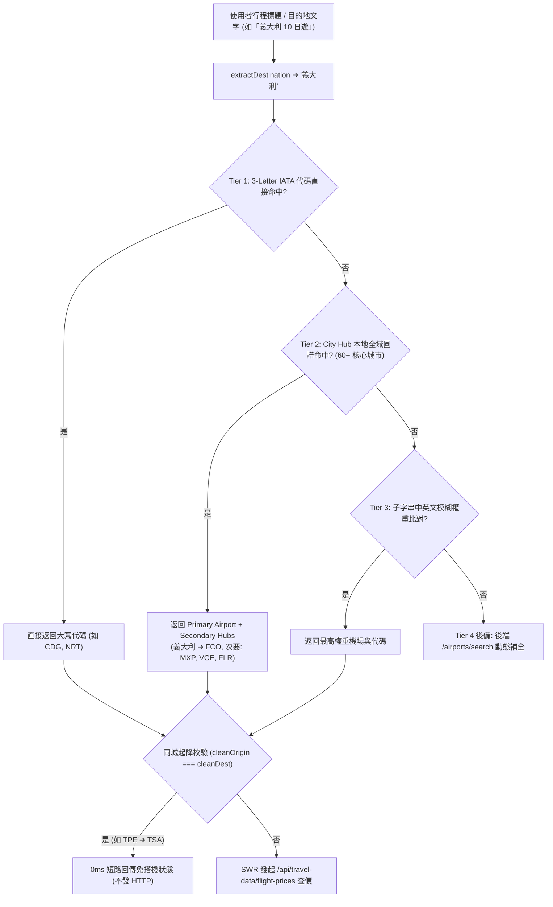

# 🛫 全球航班即時比價、3-Tier 機場解析與互動手風琴規格書
# (Flight Pricing, 3-Tier Airport Resolution & Interactive Accordion Spec)

> **版本**: 3.0.0 (Master Spec)  
> **建立日期**: 2026-09-20  
> **狀態**: ✅ Production Live & Fully Implemented  
> **整合自**: `flight-price-comparison-accordion-spec.md` (v1.0) ✕ `global-flight-search-hybrid-spec.md` (v2.0)  
> **關聯檔案**:
> - 前端：`frontend/lib/airport-mapping.ts`, `frontend/lib/hooks.ts`, `frontend/components/views/info/AffiliateCard.tsx`, `frontend/components/views/info/SmartRecommendation.tsx`
> - 後端：`backend/routers/travel_data.py`
> - 測試：`frontend/__tests__/airport-mapping.test.ts`, `frontend/__tests__/affiliate-url.test.ts`

---

## 1. Problem Statement & Core Value (問題陳述與核心價值)

### 1.1 使用者痛點 (User Problems)
1. **輸入門檻過高**：過往系統要求使用者手動鍵入 3 碼 IATA 代碼（如 `TPE` / `NRT`）；若僅建立「義大利 10 日遊」或「東京賞櫻」，未填寫機票代碼時訂購頁面呈現空白。
2. **歐美長程與都會群覆蓋不足**：使用者前往義大利、美國、英國等多機場國家時，缺乏熱門樞紐（如羅馬 FCO、米蘭 MXP、威尼斯 VCE、倫敦 LHR/LGW、紐約 JFK/EWR）之自動推導與快速切換能力。
3. **資訊密度薄弱與跳轉斷裂**：僅展示單一最低價數字，無航司、直飛/轉機、價差對比；點擊跳轉甚至曾誤入俄語介面或遺失日期參數。
4. **無效查詢引發伺服器異常**：境內同城移動（如台北境內行程 TPE ➔ TSA）若向後端與外部 API 查詢，會觸發 15 秒超時與 502 Bad Gateway。

### 1.2 成功指標 (Success Metrics)
- **零門檻自動推導**：全球 190+ 國家與熱門名城 100% 自動推導主要門戶機場（台灣旅客預設推薦 `TPE` / `TSA` 出發）。
- **3-Tier 機場解析成功率 > 98%**：原生 IATA ➔ 城市樞紐（60+ 城市）➔ 子字串模糊搜尋。
- **高密度手風琴即時比價**：卡片點擊展開前 5 班直飛/最低價航班，包含航司中文、航班號、起飛日期、價差標註與一鍵複製。
- **國際版標準 Deep Link 100% 帶參直達**：採用 Aviasales 英文官方規範 `https://www.aviasales.com/search/{DEP}{DDMM}{ARR}{TRAVELERS}?marker=...&locale=en&currency=TWD`。
- **同城起降 0ms 短路防禦**：前後端雙向攔截同城查詢，0ms 記憶體回傳免搭機狀態，0 次無效外部 API 消耗。

---

## 2. Architecture & Data Model (系統架構與資料模型)

### 2.1 三層混合式機場解析拓撲 (3-Tier Resolution Topology)



### 2.2 Aviasales 國際版標準 Deep Link 規格
- **官方標準規格**：
  ```
  https://www.aviasales.com/search/{DEP_IATA}{DEPDDMM}{ARR_IATA}{RETDDMM}{TRAVELERS}?marker={MARKER}&locale=en&currency=TWD
  ```
  - 單程範例：台北飛羅馬 (2026-10-15, 1人) ➔ `https://www.aviasales.com/search/TPE1510FCO1?marker=724189&locale=en&currency=TWD`
  - 雙程範例：台北飛羅馬 (去: 10/15, 回: 10/25, 1人) ➔ `https://www.aviasales.com/search/TPE1510FCO25101?marker=724189&locale=en&currency=TWD`

---

## 3. Detailed Component & Implementation (組件實作與端點設計)

### 3.1 前端圖譜模組 (`frontend/lib/airport-mapping.ts`)
- **`AIRPORT_MAP`**: 190+ 全球國家首要門戶對照表。
- **`MULTI_AIRPORT_CITIES`**: 都會區多機場映射表（東京 TYO ➔ HND/NRT；倫敦 LON ➔ LHR/LGW；紐約 NYC ➔ JFK/EWR/LGA 等）。
- **`TAIWAN_ORIGINS`**: 台灣出發地快速切換群組（`TPE` 桃園、`TSA` 松山、`KHH` 小港、`HKG` 香港）。
- **`getDestinationHubs(dest)`**: 動態取得主機場與次要機場推薦陣列。

### 3.2 後端快取代理端點 (`backend/routers/travel_data.py`)
- **`GET /api/travel-data/flight-prices`**:
  - 參數：`origin`, `destination`, `departure_at`, `currency='twd'`。
  - 防衛：`if origin == destination` 立即回傳 `price: 0, lowest_price: None`。
  - 快取：記憶體快取 `_price_cache`，TTL 3600 秒（1 小時），相同航線 100% 讀取冪等。
  - 超時：`httpx.AsyncClient(timeout=10.0)` 硬逾時防護。
- **`GET /api/travel-data/airport-search`**:
  - 全球機場與城市動態模糊搜尋端點，為自訂搜尋框提供即時建議。

### 3.3 互動手風琴 UI (`AffiliateCard.tsx`)
- **卡片頂部**：顯示 `💰 TWD 19,481+` 最低票價標籤與 `比價明細 (2班) ∨` 折疊切換按鈕。
- **展開面板**：
  1. 出發機場晶片組（TPE / TSA / KHH / HKG）。
  2. 目的機場晶片組（如羅馬 FCO / 米蘭 MXP / 威尼斯 VCE / 佛羅倫斯 FLR / 🔍 自訂）。
  3. 航班比價清單：航司名稱、直飛徽章、起飛日期、TWD 價格、最低價皇冠標籤、複製代碼按鈕與預訂直達按鈕。

---

## 4. Verification & Regression Defense (驗證與防回歸)

- **單元測試套件**：
  - `airport-mapping.test.ts` (12 tests): Tier 1~3 解析、多機場都市處理、中文名稱轉換。
  - `affiliate-url.test.ts` (21 tests): Deep Link 參數構建、marker 帶入、12GoAsia 官方直連。
  - `trip-switch-affiliate.test.ts` (4 tests): 切換行程時手風琴狀態重置。
- **質量底線**：TypeScript 0 錯誤、ESLint 0 錯誤、Vitest 228 筆測試 100% 通過。
