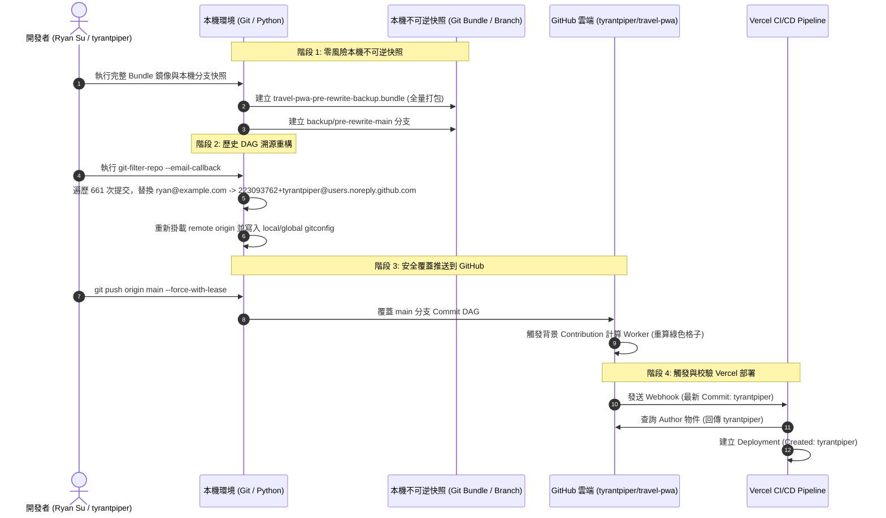

# Git 身份校正與歷史提交溯源重構規格書 (Git Identity & History Reconciliation Spec)

> **版本**: 1.0.0  
> **領域**: 版本控制、DevOps、CI/CD 與身分驗證架構  
> **關聯**: GitHub 帳號關聯、Vercel 部署管道、貢獻熱力圖追回  

---

## 1. Problem Statement & Core Value (問題陳述與核心價值)

### 1.1 使用者痛點 (User Problem)
- **虛假身分冒領 (False Identity Mapping)**：本機專案 `.git/config` 誤設佔位信箱 `ryan@example.com`，導致 Commit 物件之 Author Email 指向公共/他人信箱。GitHub 內部資料庫將該信箱判定歸屬於第三方使用者 `ryan-winkler`。
- **Vercel 部署身分錯位 (Vercel Created Attribution Error)**：Vercel 藉由 Webhook 讀取 Commit 元資料時，向 GitHub API 查詢 Author 物件，直接將部署作者 (`Created`) 判定並展示為 `ryan-winkler` 及其頭像。
- **GitHub 貢獻熱力圖被截流 (Lost Contribution Metrics)**：過去 661 次提交中，大量 Commits 的綠色格子貢獻點數全數計入 `ryan-winkler` 帳號，未正確歸屬於專案擁有者 `tyrantpiper`。

### 1.2 核心價值與成功指標 (Success Metrics)
1. **身份 100% 正確歸屬**：歷史 661 次提交中所有包含 `ryan@example.com` 之 Commit Author/Committer Email，全數溯源替換為 GitHub 官方 ID 隱私信箱 `223093762+tyrantpiper@users.noreply.github.com`，Author Name 統一維持 `Ryan Su`。
2. **綠色格子完全回溯復原**：GitHub 動態重新計算後，所有歷史 Commit 依照原始時間戳全數歸回 `tyrantpiper` 之個人主頁貢獻熱力圖。
3. **Vercel 即刻正常化**：最新與後續所有部署之 `Created` 欄位直接顯示 `tyrantpiper`。
4. **全域與本機配置固化**：本機專案與全域 `~/.gitconfig` 固化正確設定，杜絕未來任何污染。

---

## 2. User Journey & Core Flow (使用者旅程與操作流程)



---

## 3. Architecture & Data Model (架構與資料模型)

### 3.1 Git Commit 物件模型變更 (DAG Modification)

Git Commit 是一組有向無環圖 (DAG) 之 SHA 節點。本重構嚴格遵循「**只置換 Email、保留其餘所有屬性**」之原則：

```
[原始 Commit]
tree:      <Tree SHA 保持不變>
parent:    <Parent SHA>
author:    Ryan Su <ryan@example.com> 1758509791 +0800
committer: Ryan Su <ryan@example.com> 1758509791 +0800
message:   <原始提交訊息 100% 保持不變>
                 │
                 ▼ (git-filter-repo email-callback)
[重構後 Commit]
tree:      <Tree SHA 保持不變>
parent:    <重構後 Parent SHA>
author:    Ryan Su <223093762+tyrantpiper@users.noreply.github.com> 1758509791 +0800
committer: Ryan Su <223093762+tyrantpiper@users.noreply.github.com> 1758509791 +0800
message:   <原始提交訊息 100% 保持不變>
```

### 3.2 Git Config 階層固化規格

| 層級 (Scope) | 檔案位置 (Path) | 設定鍵值 (Key) | 目標值 (Value) |
| :--- | :--- | :--- | :--- |
| **Local** | `travel-pwa/.git/config` | `user.name` | `Ryan Su` |
| **Local** | `travel-pwa/.git/config` | `user.email` | `223093762+tyrantpiper@users.noreply.github.com` |
| **Global** | `~/.gitconfig` | `user.name` | `Ryan Su` |
| **Global** | `~/.gitconfig` | `user.email` | `223093762+tyrantpiper@users.noreply.github.com` |

---

## 4. Edge Cases & Boundary Conditions (邊界條件與異常防禦)

| 異常情境 (Edge Case) | 潛在崩潰/降級現象 | 規格標準防禦策略 (Defense Invariance) |
| :--- | :--- | :--- |
| **1. 誤操作導致代碼遺失** | 重寫過程中意外中斷或資料損壞。 | **不可逆多重快照防禦**：在重構前生成完整自包含的 `travel-pwa-pre-rewrite-backup.bundle` 與本機 `backup/pre-rewrite-main` 分支。即便 `.git` 毀損亦可在 3 秒內無損復原。 |
| **2. git-filter-repo 移除遠端 Origin** | `git-filter-repo` 預設自動清除 `origin` remote，導致無法 push。 | 在重構完成後立即由腳本自動補回 `git remote add origin https://github.com/tyrantpiper/travel-pwa.git` 並重新綁定 tracking branch。 |
| **3. GitHub 分支保護拒絕 Force Push** | 若 GitHub 儲存庫對 `main` 開啟了 Branch Protection (Require pull requests / Include administrators)，`git push --force-with-lease` 可能被拒絕。 | 監聽 push 回應代碼。若被拒絕，提示使用者至 GitHub 儲存庫 `Settings -> Branches -> Edit rule -> Allow force pushes` 短暫打勾放行。 |
| **4. 並行推送衝突 (Race Condition)** | 在重寫期間遠端有其他人推送新 Commit。 | 嚴格禁止使用 `--force`，必須強制使用 `--force-with-lease`。若 lease 不符則立即阻斷並報警。 |
| **5. 綠色格子延遲顯示** | GitHub 背景 Worker 重新計算熱力圖需數分鐘排程，使用者誤以為無效。 | 驗證步驟中優先透過 GitHub REST API 檢驗 Commit 的 `author.login === "tyrantpiper"`，提供客觀 API 證據，並說明熱力圖背景非同步特性。 |

---

## 5. Acceptance Criteria (驗收標準清單)

```markdown
- [ ] AC-1 (本機備份保險): Given 執行歷史重寫前, When 建立備份, Then 成功生成 travel-pwa-pre-rewrite-backup.bundle 且本機 backup/pre-rewrite-main 分支指向原始 HEAD。
- [ ] AC-2 (歷史 Email 澈底替換): Given git-filter-repo 完成, When 執行 git log --format="%ae" | Sort-Object -Unique, Then 結果中絕對不再出現 ryan@example.com，僅包含 223093762+tyrantpiper@users.noreply.github.com (及歷史 dependabot)。
- [ ] AC-3 (Commit 元資料完整性): Given 歷史 Commit 重寫, When 抽驗 Commit 訊息、檔案樹與原始時間戳, Then 除了 Email 與派生的 Commit SHA 以外，所有原始開發內容與提交時間 100% 完整保留。
- [ ] AC-4 (本機與全域配置固化): Given 執行 git config --list, When 檢視專案與全域環境, Then user.name 均為 "Ryan Su"，user.email 均為 "223093762+tyrantpiper@users.noreply.github.com"。
- [ ] AC-5 (遠端安全覆蓋): Given main 分支重構完畢, When 執行 git push origin main --force-with-lease, Then 遠端 GitHub main 分支成功更新且零報錯。
- [ ] AC-6 (GitHub API 權威驗證): Given 推送完成, When 透過 GitHub API 查詢最新 Commit 的 author 物件, Then login 為 "tyrantpiper"，avatar_url 屬於 tyrantpiper，且 ryan-winkler 關聯徹底消滅。
```
