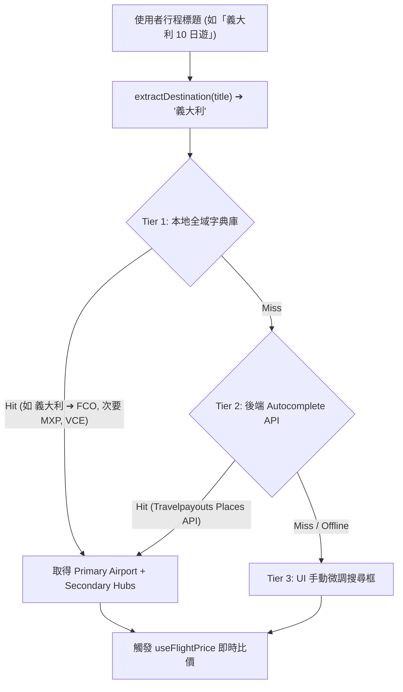

# 規格書：全球航線混合式智慧解析與機票比價導購 (Global Flight Search Spec)

> **版本**: 2.0.0  
> **模組**: `frontend/lib/airport-mapping.ts`, `frontend/lib/affiliate-config.ts`, `frontend/components/views/info/AffiliateCard.tsx`, `backend/routers/travel_data.py`  
> **日期**: 2026-09-20  

---

## 1. Problem Statement & Core Value (問題陳述與核心價值)

- **使用者痛點**:
  1. **非亞洲航點覆蓋率不足**: 使用者建立「義大利」或歐美長程行程時，由於本地字典缺乏「義大利」、「米蘭」、「威尼斯」等國名與歐洲城市，導致查價完全無法觸發，回傳無結果。
  2. **Aviasales 跳轉失效與俄語介面**: 原有 `search.aviasales.com` 網域會被重定向至俄羅斯站 (`aviasales.ru`)，且深層參數被剝除，無法直達該航班日期之英文比價結果頁。
  3. **多機場大國/城市缺乏彈性**: 義大利、美國、日本等多機場國家，旅人需要能在多座主要國際機場之間自由切換比價。

- **成功指標**:
  - 全球 190+ 國家名與主要名城 100% 能在輸入後 0 秒推導出主要國際門戶機場。
  - 義大利行程能自動帶入 `FCO` (羅馬) 並提供 `MXP` (米蘭)、`VCE` (威尼斯) 快速切換晶片。
  - 點擊預訂跳轉 100% 直達 `www.aviasales.com/search/` 英文/繁中國際版，並自動帶入起迄機場、出發日期與人數。

---

## 2. Architecture & Data Model (架構與資料模型)

### 2.1 三層混合式解析架構 (Hybrid 3-Tier Resolution)



### 2.2 Aviasales 國際版標準 Deep Link 格式規範
- **舊格式 (造成俄文與跳轉失效)**:
  `https://search.aviasales.com/flights/?origin_iata=...` (已被 CIS 伺服器廢棄)
- **新格式 (官方英文國際版標準)**:
  ```
  https://www.aviasales.com/search/{DEP_IATA}{DEPDDMM}{ARR_IATA}{RETDDMM || ''}{TRAVELERS}?marker={MARKER}&locale=en&currency=TWD
  ```
  - 例：台北飛羅馬 (2026-10-15, 1 人) ➔ `https://www.aviasales.com/search/TPE1510FCO1?marker=...&locale=en&currency=TWD`

---

## 3. Detailed Component Plan (詳細實作規劃)

1. **`frontend/lib/airport-mapping.ts`**:
   - 擴充全球 190+ 國家主門戶機場對照表（支援中英文及常見簡寫）。
   - 擴增歐洲熱門名城字典（羅馬 FCO、米蘭 MXP、威尼斯 VCE、佛羅倫斯 FLR、巴黎 CDG、倫敦 LHR、蘇黎世 ZRH、巴塞隆納 BCN、馬德里 MAD、法蘭克福 FRA 等）。
   - 導出 `getDestinationHubs(dest)`：回傳主力機場與熱門次要機場陣列。
2. **`frontend/lib/affiliate-config.ts`**:
   - 重構 `aviasales.buildUrl`，採用 `www.aviasales.com/search/` 國際版深層連結規範，支援 `DDMM` 日期格式化與 `locale=en`。
3. **`backend/routers/travel_data.py`**:
   - 新增 `/api/travel-data/airport-search?query=...` 端點，作為 Tier 2 動態補位。
4. **`frontend/components/views/info/AffiliateCard.tsx`**:
   - 支援目的地機場次要樞紐切換 Chip（例如目的地為義大利時，顯示 `[羅馬 FCO] [米蘭 MXP] [威尼斯 VCE]`）。
   - 支援「手動更換抵達機場」搜尋/輸入框。
   - 提供「同步至行程」按鈕。

---

## 4. Acceptance Criteria (驗收標準)
- [ ] AC-1: 行程為「義大利」時，Aviasales 自動推測 `FCO` 並成功獲取報價。
- [ ] AC-2: 提供 `MXP` 與 `VCE` 切換晶片，點擊可即時切換至米蘭或威尼斯比價。
- [ ] AC-3: 點擊預訂跳轉開啟的是 `www.aviasales.com/search/` 英文國際版搜尋結果頁，且日期與航點完全吻合。
- [ ] AC-4: 全端測試維持 100% 綠燈，TypeScript 0 錯誤。
