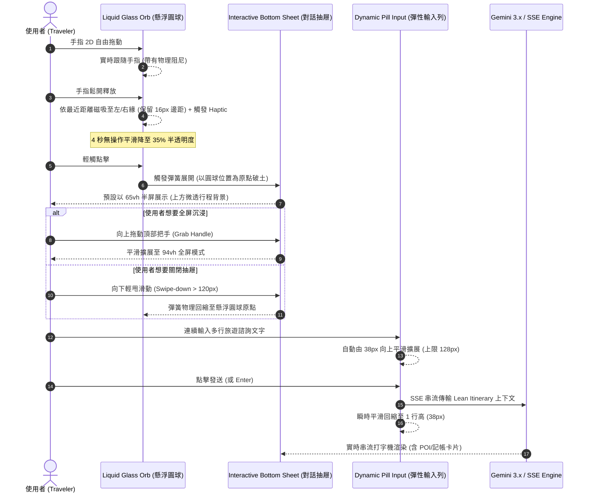

# 📱 iOS 26 Liquid Glass 智慧旅行伴侶 (Chat Assistant) 規格規範書

> **文件狀態**: Draft for Approval  
> **關聯專案**: Tabidachi PWA (`frontend/components/chat-widget.tsx`)  
> **核心目標**: 將原版「傳統客服藍紫懸浮球」全面重塑為「iOS 26 Liquid Glass (液態玻璃) 渾然天成智慧旅行伴侶」，具備 AssistiveTouch 2D 物理磁吸、多段式底抽 (Interactive Bottom Sheet)、自適應彈性多行輸入列與全域深色模式適配。

---

## 1. 問題陳述與核心價值 (Problem Statement & Core Value)

### 1.1 現狀痛點剖析 (Current UX/UI Friction)
1. **呆板客服視覺 (Outdated Customer Service Aesthetic)**:
   - 現有浮動圓球硬編碼實色漸層 (`from-blue-600 to-indigo-600`) 與 `<MessageCircle />` 圖標，散發濃烈傳統客服工單小工具感，完全脫鉤於 Tabidachi 的全域主題系統 (`useTheme`)。
2. **單維度機械拖曳 (Rigid Dragging Mechanics)**:
   - 僅支援沿螢幕右邊緣上下滑動，缺乏真實的 2D 自由度、慣性滑動與自然彈簧吸附 (Spring Physics)，無觸覺反饋 (Haptic Feedback)。
3. **剛硬全屏彈窗 (Harsh Fullscreen Overlay)**:
   - 點開對話時以剛硬的黑底遮罩強制遮蔽全畫面，無 iOS 標誌性的 Bottom Sheet 下拉把手與滑動收起手勢。
4. **單行輸入體驗障礙 (Single-Line Input Bottleneck)**:
   - 現行代碼使用單行 `<Input />` (`<input type="text" />`)，使用者輸入長篇旅遊問題或複製貼上行程資料時文字被迫水平擠壓，無法自動隨文字增長擴展高度。
5. **深色模式白屏刺眼 (Dark Mode Fracture)**:
   - 聊天視窗多處硬編碼 `bg-white` 與 `bg-slate-50`，在夜間深色主題下點擊聊天圓球會產生劇烈白屏反差。

### 1.2 成功指標 (Success Metrics)
- **視覺整合度 (Visual Coherence)**: 100% 融入 Tabidachi 底欄的 `backdrop-blur-2xl` 液態玻璃與動態主題色彩系統。
- **操作流暢度 (Fluid Physics)**: 60fps 彈簧吸附與下拉關閉，手勢可隨時中斷與重定向 (Interruptible & Redirectable)。
- **輸入人體工學 (Input Ergonomics)**: 輸入列支援 1 行至 5 行（38px ~ 128px）平滑自動擴展，送出後瞬時平滑回縮。
- **零功能回歸 (Zero Regression)**: 完整保留 404 自癒切換、POI 預覽卡片、記帳卡片、Antigravity 深度研究任務與一鍵匯入行程功能。

---

## 2. 使用者旅程與操作流程 (User Journey & Core Flow)



---

## 3. 架構與資料模型 (Architecture & Component Decomposition)

### 3.1 元件層級解耦設計 (Modular Architecture)
為避免單一檔案過度臃腫（目前 `chat-widget.tsx` 達 1063 行），我們將架構進行模組化解耦：

```
frontend/components/chat/
├── LiquidGlassOrb.tsx        # 浮動光學圓球 (AssistiveTouch 2D 磁吸 + 主題呼吸流光 + 閒置半透明)
├── ChatBottomSheet.tsx       # iOS 26 Liquid Glass 抽屜 (65vh/94vh Snap Points + 下拉收起手勢)
├── ChatInputBar.tsx          # iOS 膠囊輸入列 (Auto-growing Textarea + IME 防護 + 圖片上傳 + 發送按鈕)
└── ChatWidget.tsx            # 核心控制器 (整合歷史紀錄、TripContext、SSE 串流與一鍵匯入)
```

### 3.2 狀態模型 (State Management)

| 狀態名稱 | 型別 | 預設值 | 說明 |
| :--- | :--- | :---: | :--- |
| `orbPosition` | `{ x: number, y: number, side: 'left' \| 'right' }` | `{ x: 16, y: 100, side: 'right' }` | 浮動球物理座標與吸附邊緣，持久化於 `localStorage` |
| `isIdleDimmed` | `boolean` | `false` | 4 秒閒置自動半透明指示器 |
| `sheetDetent` | `'half' \| 'full' \| 'closed'` | `'closed'` | 抽屜展開狀態 (65vh / 94vh / 關閉) |
| `inputHeight` | `number` | `38` | 輸入框即時計算高度 (38px ~ 128px) |
| `isComposing` | `boolean` | `false` | 中文/日文輸入法組字防誤觸標記 |

---

## 4. 邊界條件與極致細節 (Edge Cases & Boundary Conditions)

### 4.1 避讓底欄與 iOS 安全區域 (Safe Area Collision Avoidance)
- 浮動圓球垂直 Y 軸範圍嚴格鎖定在安全邊界內：
  - `minY = 96px + env(safe-area-inset-bottom)`（避開底部 `BottomNav` 膠囊與 Home Bar）。
  - `maxY = window.innerHeight - 72px - env(safe-area-inset-top)`（避開頂部 Dynamic Island 與狀態列）。

### 4.2 中文/日文 IME 組字保護 (IME Composition Guard)
- 在 Textarea 上監聽 `onCompositionStart` 與 `onCompositionEnd`。
- 當使用者在選字時按下 Enter，強制阻斷送出動作，待選字確定後才允許 Enter 發送。

### 4.3 鍵盤彈起時的視口適配 (Virtual Keyboard Accommodation)
- 在行動端開啟虛擬鍵盤時，輸入列需動態貼齊視覺視口底部（Visual Viewport API 補丁），防止輸入欄被鍵盤遮蔽。

### 4.4 主題連動與深色模式光學調校 (Theme-Adaptive Optical Tuning)
- 浮動球流光色彩取用 `useTheme()` 之 `currentTheme.primary`，若主題為預設則採 Apple Intelligence 流光（藍/紫/粉/金）。
- 面板全面替換為 `dark:bg-slate-900/90 dark:border-white/10 dark:text-slate-100`，徹底告別白屏刺眼。

---

## 5. 驗收標準清單 (Acceptance Criteria)

- [ ] **AC-1 (圓球視覺與主題)**: 浮動圓球具備液態毛玻璃質感，外圈環繞隨專案主題色微動的柔和光暈，圖標採用靈動的 `Sparkles` 星芒。
- [ ] **AC-2 (AssistiveTouch 2D 磁吸)**: 支援全螢幕 2D 拖曳，放手時以自然彈簧物理磁吸至最近的左/右邊緣，吸附瞬間觸發微弱 Haptic 震動。
- [ ] **AC-3 (4秒光學沉浸)**: 4 秒無操作平滑淡化至 35% 透明度，觸摸時立即還原 100%。
- [ ] **AC-4 (iOS 26 抽屜雙檔位)**: 點擊圓球預設以 65vh 半屏展開（上方透出微透遮罩），向上拖曳頂部把手可擴展至 94vh 全屏模式。
- [ ] **AC-5 (下滑收起手勢)**: 在抽屜頂部或把手向下滑動超過 120px，抽屜即以自然彈性收縮回圓球原點。
- [ ] **AC-6 (動態自適應多行輸入)**: 輸入列初始高度為 38px，隨著輸入文字增多平滑自動增高，最高上限 128px (約 5 行)，超過後啟用內部平滑滾動；送出後平滑回縮至 38px。
- [ ] **AC-7 (IME 與換行防護)**: 中文輸入法組字期間 Enter 不發送；Desktop 上 `Shift+Enter` 換行，`Enter` 發送；Mobile 上換行正常換行，發送按鈕正常送出。
- [ ] **AC-8 (全域深色模式適配)**: 抽屜內部底色、訊息氣泡、POI 卡片、輸入框全面支援 `dark:` 類別，夜間模式無任何白屏閃爍。
