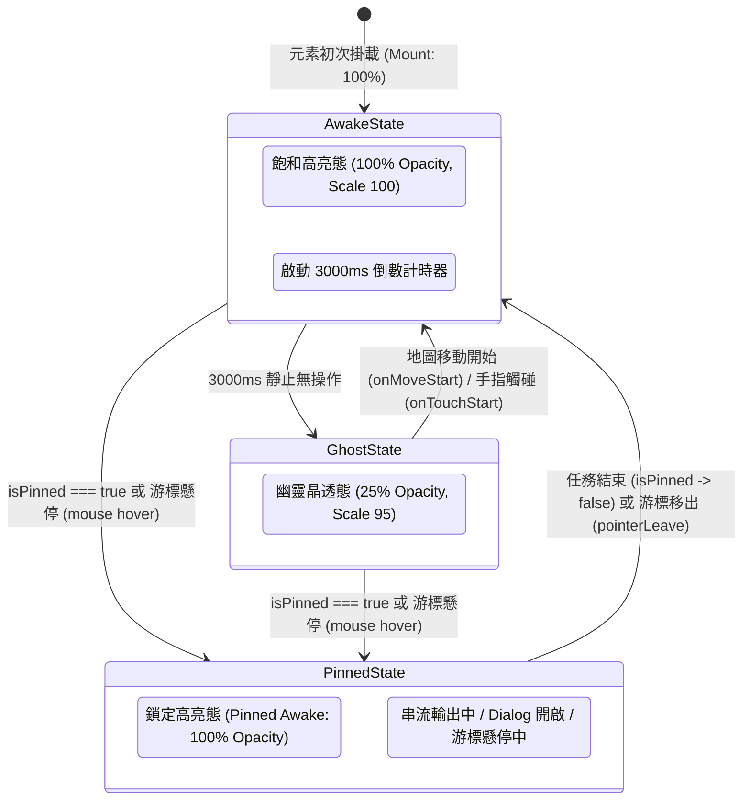
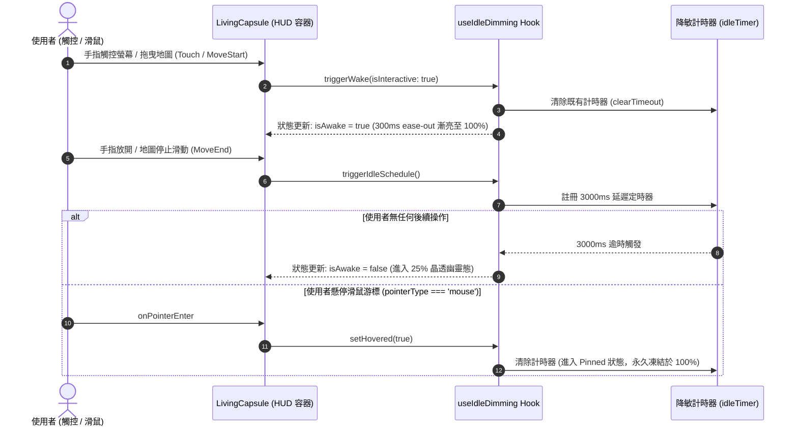

# 🌊 全站呼吸生命感 UI 與幽靈降敏工程規格書 (Living Motion & Idle Dimming Specification)

> **版本**：1.0.0  
> **狀態**：APPROVED (Ready for Implementation)  
> **作者**：Ryan Su (@architect)  
> **對齊系統**：Tabidachi Design System, React 19, Tailwind CSS v4, MapLibre WebGL, Framer Motion  
> **追蹤議題**：#LivingMotionHUD

---

## 1. Problem Statement & Core Value (問題陳述與核心價值)

### 1.1 使用者痛點 (User Problem)
在現代全螢幕旅遊 PWA（如 Tabidachi）中，懸浮控制項目（如右上角地圖控制項、右下角 Ryan AI 隨行助理、左上角 AI 狀態按鈕）承載著極高頻的核心互動。然而：
1. **空間遮擋衝突 (Spatial Collision)**：常駐且 100% 不透明的按鈕會嚴重遮擋東北方與東南方的地圖景點（POI）、3D 航線弧線與重要時間軸標記。
2. **粗暴隱藏的反模式 (The "Hide-on-Drag" Flaw)**：若在使用者操作時將按鈕完全隱藏（`display: none` 或 `opacity-0`），使用者會瞬間失去控制感（Affordance），且容易因邊界閃爍產生認知負擔。
3. **行動端偽類黏滯陷阱 (Sticky Hover Dilemma)**：行動裝置觸控點擊後，CSS `:hover` 會被 WebKit/Blink 強制鎖定在元素上，導致按鈕無法自動退回半透明態。
4. **零散實現的技術債 (Architectural Inconsistency)**：各元件各自使用 `setTimeout` 或局部 `useState` 實作淡出邏輯，導致計時不同步、清理遺漏引發記憶體洩漏，且缺乏全域統一的物理參數。

### 1.2 核心價值與成功指標 (Success Metrics)
- **視覺沉浸度與發現性兼顧**：靜止 3 秒自動進入 25% 幽靈晶透態，保留輪廓存在感；任何手勢互動或懸停瞬間以 300ms 點亮至 100% 飽和態。
- **100% 觸控安全 (Touch-Safe)**：徹底杜絕 iOS Safari / Android Chrome 的 `:hover` 黏滯，桌面與手機各自以最佳狀態機響應。
- **0ms 主執行緒渲染負擔**：強制宣告 GPU 獨立合成層（`transform-gpu will-change-transform`），過渡動畫全程由合成執行緒（Compositor Thread）處理，杜絕引發 60fps WebGL Canvas 的重排（Reflow）。
- **無障礙原生支援 (a11y First)**：在 `prefers-reduced-motion: reduce` 環境下自動關閉縮放與過渡動效，優雅降級為舒適靜態視覺。

---

## 2. User Journey & Core Flow (使用者旅程與狀態時序)

### 2.1 雙階物理狀態機拓撲 (Two-Tier State Machine)



### 2.2 多事件手勢喚醒與競爭排程時序 (Sequence Flow)



---

## 3. Architecture & Data Model (架構與資料模型)

本規格採用 **「三位一體分層架構 (Hook + Primitive + Tokens)」**，將手勢邏輯、容器樣式與 CSS 合成層完全解耦。

```
[Layer 3: 業務組件]    MapControlCapsule    ChatWidget (Ryan AI)    AIStatusButton
                              │                     │                     │
[Layer 2: 容器元件]           └──────────────┬──────┴─────────────────────┘
                                             ▼
                                     <LivingCapsule />
                                             │
[Layer 1: 核心邏輯與樣式]      ┌──────────────┴──────────────┐
                               ▼                             ▼
                      useIdleDimming()            Tailwind v4 Design Tokens
                    (離散狀態機與計時排程)          (.living-capsule-*)
```

### 3.1 核心 Headless Hook：`useIdleDimming`

```typescript
export interface UseIdleDimmingOptions {
    /** 無操作進入幽靈態之緩衝時長 (預設: 3000ms) */
    timeoutMs?: number
    /** 是否初次掛載時即為幽靈態 (預設: false) */
    initialDimmed?: boolean
    /** 強制鎖定於高亮態 (例如 Ryan AI 正在串流思考、或彈窗已打開) */
    isPinned?: boolean
    /** 是否停用動態降敏 (例如無障礙 prefers-reduced-motion) */
    disabled?: boolean
    /** 狀態變更回呼 */
    onStateChange?: (isAwake: boolean) => void
}

export interface UseIdleDimmingReturn {
    /** 當前是否處於高亮態 (派生自 !isIdle || isHovered || isPinned || isMoving) */
    isAwake: boolean
    /** 手動喚醒 (可指定是否立即重新計時) */
    wake: () => void
    /** 立即強制進入幽靈態 */
    dim: () => void
    /** 手勢與指針事件綁定屬性集合 (直接 Spread 至 DOM) */
    interactiveProps: {
        onTouchStart: () => void
        onPointerEnter: (e: React.PointerEvent) => void
        onPointerLeave: () => void
    }
}
```

### 3.2 共用容器組件：`<LivingCapsule />`

```tsx
interface LivingCapsuleProps extends React.HTMLAttributes<HTMLDivElement> {
    /** 懸浮控制項內容 */
    children: React.ReactNode
    /** 降敏延遲毫秒數 */
    timeoutMs?: number
    /** 鎖定高亮旗標 (非同步任務/彈窗) */
    isPinned?: boolean
    /** 幽靈態透明度百分比 (預設: 25) */
    ghostOpacity?: 10 | 25 | 40
    /** 是否在喚醒時附加微縮放 (scale-95 -> scale-100) */
    withScale?: boolean
}
```

### 3.3 Tailwind CSS v4 設計權杖 (Design Tokens)

在 `frontend/app/globals.css` 註冊專屬的硬體合成樣式類：

```css
@layer utilities {
    /* 🌊 呼吸生命感容器基礎：鎖定 GPU 合成層，0ms Reflow 開銷 */
    .living-capsule-base {
        transform: translateZ(0);
        will-change: opacity, transform;
        transition-property: opacity, transform, box-shadow;
        transition-duration: 300ms;
        transition-timing-function: cubic-bezier(0.16, 1, 0.3, 1);
    }

    /* 🌕 高亮飽和態 */
    .living-capsule-awake {
        opacity: 1;
        transform: scale(1);
    }

    /* 🌑 幽靈晶透態 (25%) */
    .living-capsule-ghost {
        opacity: 0.25;
        transform: scale(0.95);
    }

    /* 🛡️ 無障礙防線：偏好減少動態時強制關閉位移與縮放 */
    @media (prefers-reduced-motion: reduce) {
        .living-capsule-base {
            transition: none !important;
            transform: none !important;
        }
        .living-capsule-ghost {
            opacity: 0.5; /* 提高無障礙辨識對比度 */
            transform: none !important;
        }
    }
}
```

---

## 4. Edge Cases & Boundary Conditions (邊界條件與異常防禦)

| 異常情境 (Edge Case) | 潛在崩潰/降級現象 | 規格標準防禦策略 (Defense Invariance) |
| :--- | :--- | :--- |
| **1. 行動端 Sticky Hover 黏滯** | 使用者在手機觸碰按鈕後，CSS `:hover` 偽類持續生效，膠囊永遠無法回到 25% 幽靈態。 | 指針事件中嚴格判定 `if (e.pointerType === 'mouse')`。觸控螢幕（touch / pen）一律忽視 hover 續命，完全由 `onTouchStart` 與定時器接管。 |
| **2. 高頻地圖拖曳渲染風暴** | 監聽地圖 `onMove`（每秒 60~120 幀），導致 React 頻繁 Re-render，WebGL 掉幀卡頓。 | 嚴禁綁定 `onMove`。一律使用離散事件：`onMoveStart` 喚醒，`onMoveEnd` 重置 3000ms 計時。拖曳過程中 React Re-render 次數為 0。 |
| **3. 非同步任務進行中被淡化** | Ryan AI 正在輸出串流回應或連線中，膠囊若被淡化會嚴重削弱使用者對系統狀態的信心。 | 實裝 `isPinned` 守衛。當 `isStreaming || isThinking || dialogOpen` 為真時，狀態機直接 short-circuit，強制凍結於 100% 高亮。 |
| **4. 組件卸載時未決計時器** | 使用者切換分頁或頁面卸載，未清除的計時器引發記憶體洩漏與 `setState on unmounted`。 | `useEffect` 返回清理閉包，強制調用 `clearTimeout(timerRef.current)`。 |
| **5. 系統閒置進入背景 (Page Hidden)** | 手機切換 App 或螢幕鎖定，計時器在背景排程可能導致喚醒時序錯亂。 | 監聽 `document.visibilitychange`，頁面隱藏時暫停定時器，返回前景時自適應刷新狀態。 |

---

## 5. 全站套用涵蓋清單 (Scope of Adoption)

本規格嚴格約束僅作用於 **全站懸浮 HUD 控制層 (Floating Overlays)**，保持底層主佈局與導航列穩定：

1. **地圖控制膠囊 ([`MapControlCapsule.tsx`](file:///d:/Project/Tabidachi/travel-pwa/frontend/components/MapControlCapsule.tsx))**：
   - 3D 地球儀、GPS 定位、羅盤歸零組合鍵。
2. **Ryan AI 隨行助理懸浮球 ([`chat-widget.tsx`](file:///d:/Project/Tabidachi/travel-pwa/frontend/components/chat-widget.tsx))**：
   - 右下角常駐懸浮頭像，串流生成時鎖定高亮，靜態時以 25% 呼吸晶透融入右下角。
3. **左上角全域 AI 狀態按鈕 ([`ai-status-button.tsx`](file:///d:/Project/Tabidachi/travel-pwa/frontend/components/ai/ai-status-button.tsx))**：
   - API Key 狀態與模型配額指示器，靜態時幽靈化，點擊喚起設定 Dialog。
4. **3D 航線巡航 HUD 膠囊 ([`TourHUDCapsule.tsx`](file:///d:/Project/Tabidachi/travel-pwa/frontend/components/TourHUDCapsule.tsx))**：
   - 航線播放/暫停/跳轉控制器。

---

## 6. Acceptance Criteria (驗收標準清單)

```markdown
- [ ] AC-1 (標準降敏): Given 懸浮控制項處於靜止狀態, When 無任何手勢與游標互動滿 3000ms, Then 容器平滑以 300ms ease-out 過渡至 25% 不透明度與 scale(0.95)。
- [ ] AC-2 (離散喚醒): Given 控制項處於 25% 幽靈態, When 使用者在底圖觸控滑動 (onMoveStart) 或手指觸碰到膠囊 (onTouchStart), Then 容器立即瞬間過渡至 100% 飽和高亮態。
- [ ] AC-3 (Touch-Safe 防黏滯): Given 使用者在手機觸控螢幕點擊膠囊, When 手指移開螢幕滿 3000ms, Then 容器必須正常退回 25% 幽靈態，不得因 CSS :hover 偽類而卡死在 100%。
- [ ] AC-4 (Pinned 鎖定防禦): Given Ryan AI 正在串流輸出或相關對話框開啟 (isPinned === true), When 經過超過 3000ms, Then 容器嚴格保持 100% 高亮，絕對不可降敏。
- [ ] AC-5 (無障礙適配): Given 系統開啟 prefers-reduced-motion, When 觸發降敏或喚醒, Then 不產生任何 scale 縮放變形與過渡動畫，幽靈態維持於無障礙友善的 50% 對比度。
- [ ] AC-6 (單元測試覆蓋): Given Vitest 環境, When 執行 FakeTimers 測試, Then 包含定時器倒數、手勢中斷、isPinned 覆寫與組件卸載清理之測試案例 100% 通過。
```
