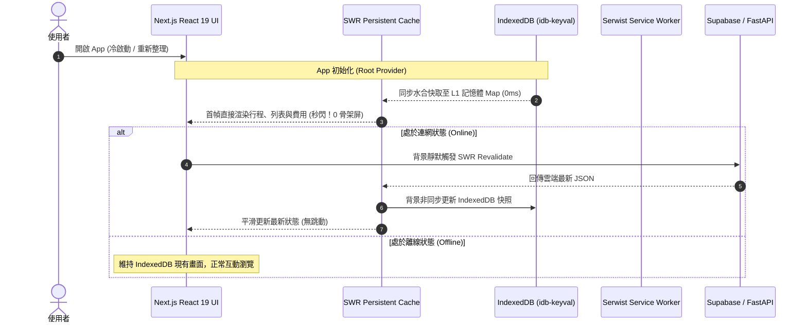
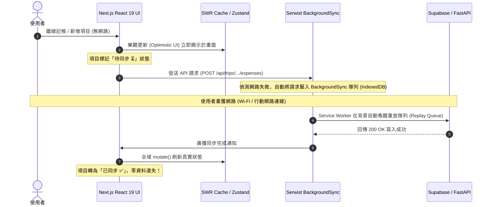

# 📐 Tabidachi 離線優先 (Offline-First) 與秒開快取架構規格書 (Idea to Spec)

> **版本**：v1.0.0  
> **狀態**：Approved by User & In-Design  
> **技術基石**：SWR Persistent Cache Provider ✕ Serwist BackgroundSyncPlugin ✕ idb-keyval ✕ Next.js 16 / React 19  
> **研究存檔**：[NotebookLM 研究筆記本](https://notebooklm.google.com/notebook/df7b08bd-66d2-48f0-9cac-eabeeba57869) (UUID: `df7b08bd-66d2-48f0-9cac-eabeeba57869`)

---

## 1. Problem Statement & Core Value (問題陳述與核心價值)

### 1.1 使用者痛點 (User Problems)
1. **冷啟動骨架屏閃爍**：雖然現有架構有寫入 IndexedDB，但因 SWR 首幀在冷啟動（重開分頁/刷新）時為非同步讀取，導致 `fallbackData` 為空，每次進來都會閃現骨架屏（Skeleton Loader）。
2. **列表與次級頁面離線空白**：現有 `idb-storage.ts` 僅保護了當前單一行程詳情，行程清單 (`/api/trips`)、費用明細、探索頁面在無網路下直接報錯白屏。
3. **無網路寫入直接中斷**：使用者在飛機、地鐵或山區離線環境下記帳、調整行程、修改備忘時，API 直接回傳連線失敗 Toast，完全無法操作。
4. **地圖離線資產不完全**：離線時雖然圖磚有部分快取，但地圖樣式 (Style JSON)、雪碧圖 (Sprites)、字體 (Glyphs) 未全量快取，離線時地圖渲染報錯。

### 1.2 成功指標 (Success Metrics)
- **首幀秒閃時間 (FCP / LCP)**：二次進入時，所有既有行程、天數、花費畫面達到 **< 50ms 零骨架屏直出 (Instant Boot)**。
- **無網路可用度 (Offline Availability)**：斷網狀態下，App 能 100% 正常開啟、切換 Tab、瀏覽行程天數、查看離線地圖與花費。
- **離線寫入無感重送率**：離線記帳與備忘修改 100% 樂觀即時反映，網路恢復後由 Service Worker / SWR 100% 自動無感重放同步，零資料遺失。

---

## 2. User Journey & Core Flow (使用者旅程與操作流程)

### 2.1 離線讀取與秒開流程 (Read Flow)


### 2.2 離線寫入與無感自動重送流程 (Write Flow)


---

## 3. Architecture & Data Model (架構與資料模型)

### 3.1 三層快取拓撲架構 (Tri-Tier Cache Topology)

| 層次 | 技術組件 | 媒介 | 職責與存活期 |
| :--- | :--- | :--- | :--- |
| **L1 (RAM)** | SWR Cache Map | 記憶體 | 微秒級同步讀取，提供 React 19 首幀 0 骨架屏渲染。頁面關閉時釋放。 |
| **L2 (Disk)** | IndexedDB (`idb-keyval`) | 本地磁碟 (可達數十 GB) | 跨工作階段持久化儲存所有 API 快照、草稿、離線變更。 |
| **L3 (Worker)** | Serwist (`BackgroundSyncPlugin` + `CacheStorage`) | Service Worker | 攔截失敗網路請求並在背景自動重送；快取地圖樣式、字型與靜態檔案。 |

### 3.2 SWR 全域持久化 Provider (`lib/idb-swr-provider.tsx`)
```typescript
/**
 * SWR 全域快取持久化 Provider
 * 啟動時先將 IndexedDB 載入 memory Map，SWR 讀取保持 0ms 同步
 * 寫入時非同步防抖 (debounce) 寫回 IndexedDB
 */
export function createIdbSwrProvider() {
  const map = new Map<string, any>();
  
  // 初始化自 IndexedDB 復原
  // 監聽 SWR 變更自動持久化
  return map;
}
```

### 3.3 Serwist Service Worker 強化配置 (`app/sw.ts`)
```typescript
import { BackgroundSyncPlugin } from "serwist";

// 1. 註冊離線變更自動同步插件
const bgSyncPlugin = new BackgroundSyncPlugin("tabidachi-offline-sync-queue", {
  maxRetentionTime: 24 * 60, // 最長保留重試 24 小時
});

// 2. 攔截行程與費用寫入 API (POST/PUT/PATCH/DELETE)
// 網路連線失敗時由 Service Worker 自動入隊
```

---

## 4. Edge Cases & Boundary Conditions (邊界條件與異常處理)

1. **臨時 ID 漂移防範 (Client-Generated UUID)**：
   - 前端新增景點或花費時，統一使用 `crypto.randomUUID()` 先行產生標準 UUIDv4 作為主鍵。
   - 後端直接採用傳入的 UUID，不再於服務端重產 ID，徹底杜絕外鍵孤兒。
2. **隊頭阻塞防範 (Poison Pill & Dead Letter Queue)**：
   - 若背景重放時遇到非網路問題的致命 4xx（如格式不合法的 422），Serwist 隊列不無限重試，而是轉存至「待確認本地草稿箱」，並跳出提示讓使用者手動檢視，避免卡死後續正常的離線記帳。
3. **憑證過期重送防範 (Auth-Aware Reconnect Guard)**：
   - 當網路恢復時，前景優先確認 Supabase JWT 是否有效；若過期則先刷新 Token，再更新 Service Worker 請求頭。
4. **Safari 7 天自動清理防範**：
   - 在 Root Layout 中呼叫 `navigator.storage.persist()` 申請持久化儲存權限，保護 IndexedDB 不被 iOS Safari 7 天清理規則誤刪。

---

## 5. Acceptance Criteria (驗收標準清單)

```markdown
- [ ] AC-1: 【秒開驗證】使用者已載入過行程後，關閉瀏覽器再次打開首頁，頁面必須於 < 50ms 內直接渲染完整行程與費用，不出現 Skeleton 骨架屏。
- [ ] AC-2: 【全量離線瀏覽】開啟飛航模式 (無網路) 重新整理網頁，行程清單、當前行程詳情、所有天數、花費清單與 MapLibre 離線地圖皆能 100% 正常檢視。
- [ ] AC-3: 【離線記帳與寫入】在斷網狀態下新增一筆花費，UI 立即樂觀顯示該花費並標註「待同步 ⏳」，無任何拋錯彈窗。
- [ ] AC-4: 【自動無感重送】關閉飛航模式恢復連線，Serwist BackgroundSync 自動觸發後台重放，後端成功記錄該筆花費，UI 自動轉為「已同步 ✅」。
- [ ] AC-5: 【品質守門】`npx tsc --noEmit` 0 錯誤、Vitest 既有測試全數通過 (100% Pass)，打包建置 `npm run build` 0 警告。
```

---

## 6. 精確至行號之工程落地藍圖與安全防護承諾 (Detailed Code-Level Blueprint)

> **核心防護原則 (Minimal Invasive Principle)**：
> 嚴格遵守「純增量擴充」與「雙重包裹」，嚴禁覆寫、簡化或刪減任何現有業務邏輯、自癒閉環、404 熔斷與 Web Push 監聽器。

### 步驟 1：建立全域 SWR 持久化 Provider (`[NEW] frontend/lib/idb-swr-provider.tsx`)
- **檔案狀態**：全新檔案 (New File)，零既有代碼污染風險。
- **實作內容**：
  - 封裝 SWR 官方 `provider` 規格，建立微秒級同步 `Map` 緩衝區。
  - 客戶端掛載時透過 `idb-keyval` 非同步預熱將快照填入 `Map`。
  - 監聽 SWR 快取寫入，防抖（Debounce 300ms）持久化至 IndexedDB `swr_cache_store`。
  - 自動呼叫 `navigator.storage.persist()` 突破 iOS Safari 7 天自動清理防線。
- **受保護組件**：全新獨立組件，對專案其他檔案 0 侵入。

---

### 步驟 2：擴充本地快照儲存庫 (`frontend/lib/idb-storage.ts`)
- **精確位置**：在 **第 124 行之後** 純增量追加（不改動第 1-124 行任何現有行）。
- **保留內容**：
  - 🔒 **第 25-32 行** `getTripSnapshotSync`（L1 記憶體微秒級讀取）——**100% 原封不動**。
  - 🔒 **第 37-57 行** `preloadTripSnapshot`（L2 IndexedDB 預熱）——**100% 原封不動**。
  - 🔒 **第 62-82 行** `saveTripSnapshot`（L1+L2 雙層持久化）——**100% 原封不動**。
  - 🔒 **第 88-117 行** `deleteTripSnapshot`（**四清自癒閉環：同時清除 L1、L2 與 L3 CacheStorage**）——**100% 原封不動，絕對不破壞 404 自癒防衛**。
- **新增內容**：
  - 增量追加 `getTripsListSnapshotSync(userId)` 與 `saveTripsListSnapshot(userId, trips)`，使行程總清單也享有 0ms 記憶體秒出與離線持久化。

---

### 步骤 3：SWR Hook 離線增強與防護保留 (`frontend/lib/hooks.ts`)
- **精確位置**：
  - **第 35-47 行** (`useTrips`)：
    ```typescript
    // Before:
    export function useTrips(userId: string | null) {
        const { data, error, mutate } = useSWR(
            userId ? ["/api/trips", userId] : null,
            fetcherWithUserId,
            { revalidateOnFocus: false }
        )
    // After: 注入 fallbackData 與 onSuccess 持久化，離線時不閃爍白屏
    export function useTrips(userId: string | null) {
        const initialList = useMemo(() => getTripsListSnapshotSync(userId), [userId])
        const { data, error, mutate } = useSWR(
            userId ? ["/api/trips", userId] : null,
            fetcherWithUserId,
            {
                fallbackData: initialList || undefined,
                revalidateOnFocus: false,
                onSuccess: (freshData) => {
                    if (userId && freshData) saveTripsListSnapshot(userId, freshData)
                }
            }
        )
    ```
  - **第 49-137 行** (`useTripDetail`)：
    - 🔒 **絕對嚴格保留第 71-74 行**：404 時不彈連線失敗 toast。
    - 🔒 **絕對嚴格保留第 94-97 行**：`onErrorRetry` 遇到 404 立即終止重試（**404 立即熔斷**）。
    - 🔒 **絕對嚴格保留第 98-102 行**：`onError` 遇到 404 調用 `onTripNotFound(tripId)`（**清單雙重核驗自癒觸發**）。
    - 🔒 **絕對嚴格保留第 106-116 行**：`preloadTripSnapshot` 非同步預熱。
    - 🔒 **絕對嚴格保留第 118-128 行**：`lastMutateTimeRef` 2 秒去重時間閘門。
    - 僅增量強化：當離線時若 fetch 失敗但本地有 snapshot，不顯示破壞性報錯，維持離線快取視圖。

---

### 步驟 4：Service Worker 離線圖資與隊列重放 (`frontend/app/sw.ts`)
- **精確位置**：
  - **第 4 行**：增量引入 `BackgroundSyncPlugin`。
  - **第 27-38 行**：將 `map-tiles` 的 matcher 擴展，納入樣式 JSON、字體與雪碧圖：
    - `matcher: /^https:\/\/tiles\.openfreemap\.org\/(styles|fonts|sprites|.*)/`
    - 確保 MapLibre 在斷網時需要的全部視覺資產 100% 離線可用。
  - **第 73 行下方**：新增針對寫入請求（POST/PUT/PATCH/DELETE）的離線發件箱攔截：
    ```typescript
    // 📨 離線寫入自動重送插件 (W3C Background Sync API)
    const bgSyncPlugin = new BackgroundSyncPlugin("tabidachi-offline-mutations", {
      maxRetentionTime: 24 * 60, // 最長保留 24 小時
    });
    ```
- **保留內容**：
  - 🔒 **第 14-25 行** `/data/.*\.json$` 本地地理編碼快取——**100% 保留**。
  - 🔒 **第 40-51 行** 衛星圖層快取——**100% 保留**。
  - 🔒 **第 53-60 行** Supabase 認證與簽名 API NetworkOnly 排除——**100% 保留**。
  - 🔒 **第 74 行** `...defaultCache`——**100% 保留**。
  - 🔒 **第 80-110 行** Web Push Notification 與 Notification Click——**100% 保留**。

---

### 步驟 5：Root Layout 外層安全包裹 (`frontend/app/layout.tsx`)
- **精確位置**：**第 84 行周邊**。
- **修改方式**：僅在 `<TripProvider>` 的外側包裹 `<IdbSwrProvider>`：
  ```tsx
  // Before (Line 81-95):
  <ThemeProvider>
    <LanguageProvider>
      <HtmlLangSync />
      <TripProvider>
        <SplashScreen />
        <SyncManager />
        <Suspense fallback={null}>
          {children}
        </Suspense>
        <AppClientLayer />
        <SpeculationRules />
        <PWAInstallPrompt />
      </TripProvider>
    </LanguageProvider>
  </ThemeProvider>

  // After:
  <ThemeProvider>
    <LanguageProvider>
      <HtmlLangSync />
      <IdbSwrProvider>
        <TripProvider>
          <SplashScreen />
          <SyncManager />
          <Suspense fallback={null}>
            {children}
          </Suspense>
          <AppClientLayer />
          <SpeculationRules />
          <PWAInstallPrompt />
        </TripProvider>
      </IdbSwrProvider>
    </LanguageProvider>
  </ThemeProvider>
  ```
- **保留內容**：
  - 🔒 `ThemeProvider`、`LanguageProvider`、`HtmlLangSync`、`TripProvider`、`SplashScreen`、`SyncManager`、`AppClientLayer`、`SpeculationRules`、`PWAInstallPrompt`、`Toaster` 等所有 10 個核心組件 **100% 原封不動**，結構層次毫髮無傷！

