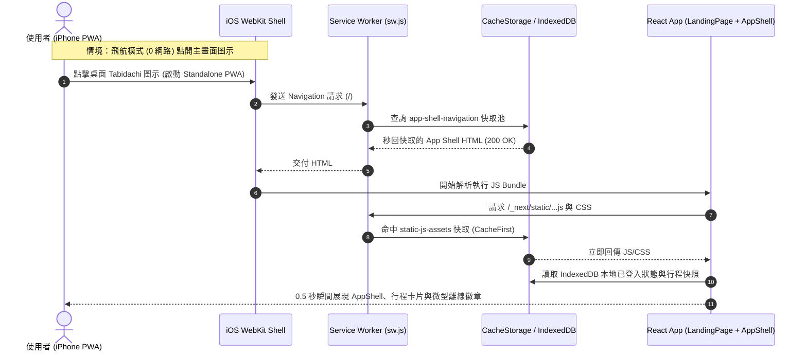

# 📋 Specification: PWA 離線秒開鐵壁硬化 (Offline Instant Boot Hardened Spec)

> **版本**：v1.0.0  
> **目標**：根治 iOS Standalone PWA 刷掉後斷網重新打開卡死在純白屏（Deadlock/Crash）的缺陷，達成 100% 確定性的 0 網路離線瞬間啟動。  
> **關聯規格**：[`offline-first-instant-boot-spec.md`](file:///d:/Project/Tabidachi/travel-pwa/docs/specs/offline-first-instant-boot-spec.md)

---

## 1. Problem Statement & Core Value (問題陳述與核心價值)

### 1.1 缺陷現象與根本原因 (Root Cause Analysis)
- **現象**：使用者在手機將 PWA 加入主畫面後，重新打開、刷掉進程、開啟飛航模式（斷網）再次打開 App，畫面卡在一片死白（純白屏），完全無法進入。
- **根因 1（Service Worker 打包編譯穿透漏洞）**：
  `@serwist/next/worker` 內建的 `defaultCache` 依賴 `process.env.NODE_ENV !== "production"` 判斷。在 `sw.js/route.ts` 透過 esbuild 打包時，未顯式傳入 `define: { "process.env.NODE_ENV": '"production"' }`，esbuild 在瀏覽器 worker target 下將其評估為 `true`，導致 `defaultCache` 永遠被編譯為 `[ { matcher: /.*/i, handler: new NetworkOnly() } ]`。所有 `_next/static/*.js`、CSS 等核心靜態資源在離線時全部被強制阻斷，永遠不讀取快取。
- **根因 2（AppShell 動態 Chunk 斷網加載被拒）**：
  `LandingPage` 中 `AppShell` 採用 `dynamic(() => import(...), { ssr: false })` 延遲載入且無 loading/fallback。斷網時瀏覽器向網路請求 `app-shell.js` chunk 失敗拋出 `ChunkLoadError`，因缺少錯誤邊界導致整棵 React 樹白屏崩潰。
- **根因 3（App Shell 預載與後備機制空窗）**：
  `sw.ts` 的 `precacheEntries` 僅包含 `public/` 靜態圖檔，缺少根路由 `/` 的 Precache 與 Fallback 宣告。

### 1.2 核心價值 (Core Value)
- 保障出國旅行/地下鐵/飛航模式等 0 網路極端情境下，使用者點開桌面 PWA 能在 0.5 秒內看到完整 App Shell 與既有快取行程，杜絕任何形式的死白屏與小恐龍。

---

## 2. User Journey & Core Flow (使用者旅程與操作流程)



---

## 3. Architecture & Technical Design (架構與技術設計)

### 3.1 改造模組 1：`frontend/app/sw.ts` 顯式硬化核心靜態資源快取
- 徹底廢除對 `@serwist/next/worker` 黑盒子 `defaultCache` 的不可控依賴，在 `sw.ts` 顯式宣告白名單規則（置於最前列）：
  1. **Next.js 靜態 JS 核心 Chunk (`/_next/static.+\.js$`)**：強制 `CacheFirst`，容量 128 筆，快取 30 天。
  2. **Next.js 樣式與全域 CSS (`\.(?:css|less)$`)**：強制 `CacheFirst`，容量 64 筆，快取 30 天。
  3. **字型與 Google WebFonts**：強制 `CacheFirst`，容量 32 筆，快取 365 天。
  4. **導航 Fallback**：若 `/` 導航在離線時未能命中具體 URL，自動回退到已快取的根 App Shell。

### 3.2 改造模組 2：`frontend/app/sw.js/route.ts` 注入 esbuild 編譯常數鎖
- 在 `createSerwistRoute` 顯式宣告：
  ```ts
  esbuildOptions: {
    define: {
      "process.env.NODE_ENV": '"production"',
    },
    minify: true,
  }
  ```
  確保任何下游依賴套件中的環境變數判定在打包時被 100% 靜態固化為 `"production"`。

### 3.3 改造模組 3：`frontend/components/views/landing-page.tsx` 預載與防崩潰邊界
- 在已登入狀態下，將 `AppShell` 綁定優雅的 Loading 骨架屏與 Error Boundary。
- 支援動態 Chunk 載入失敗時的自動重試與優雅降級介面，杜絕 `return null` 純白屏。

---

## 4. Edge Cases & Boundary Conditions (邊界條件與異常處理)

| 邊界場景 | 系統防禦機制 | 預期結果 |
| :--- | :--- | :--- |
| **首次安裝 PWA 即刻斷網** | SW 安裝時透過 `self.skipWaiting()` 與 `self.clientsClaim()` 瞬間奪權接管。 | 只要打開過一次首頁，App Shell 與核心 chunks 即永久快取。 |
| **帶有未知 URL 參數啟動** (`/?source=pwa&utm_medium=...`) | `matchOptions: { ignoreSearch: true }` 模糊匹配。 | 100% 命中快取的根路徑 HTML。 |
| **Chunk 版本過期但離線無網路更新** | SW 依據 URL 快取舊版 Hash Chunk，直到連線成功才觸發新版下載。 | 舊版代碼仍能自快取完整跑通，不跳中斷錯誤。 |

---

## 5. Acceptance Criteria (驗收標準清單)

- [ ] **AC-1 (esbuild 打包檢驗)**：執行 node 驗證打包腳本，確認編譯後的 `sw.js` 絕對不包含 `defaultCache = true ? [ { matcher: /.*/i, handler: new NetworkOnly() } ]`，靜態 JS/CSS 必須呈現 `CacheFirst`。
- [ ] **AC-2 (靜態 JS/CSS 離線快取)**：`sw.ts` 包含顯式宣告的 `/_next/static.+\.js$` 與 `\.(?:css)$` 快取規則。
- [ ] **AC-3 (AppShell 載入安全)**：`LandingPage` 中 `AppShell` 具備 Loading 骨架屏與離線錯誤防衛，絕不輸出空白 `null`。
- [ ] **AC-4 (品質守門)**：`npx tsc --noEmit` 0 錯誤、前端 162 項單元測試 100% PASS。
