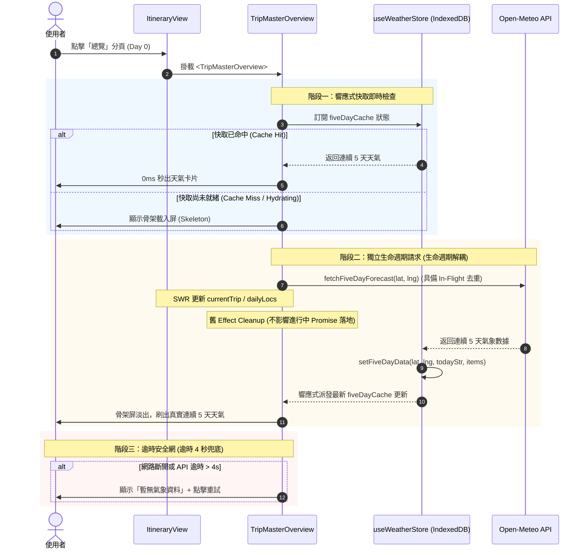

# 總覽天氣首次進入顯示修復規格書 (Overview Weather Cold-Start Spec)

> **規格狀態**: Draft (待確認)  
> **建立日期**: 2026-09-15  
> **關聯檔案**:
> - `frontend/components/itinerary/TripMasterOverview.tsx`
> - `frontend/components/itinerary/DailyWeatherStrip.tsx`
> - `frontend/lib/stores/weatherStore.ts`
> - `frontend/lib/weather-api.ts`

---

## 1. Problem Statement & Core Value (問題陳述與核心價值)

### 1.1 使用者痛點 (User Problem)
使用者進入旅程並點進「總覽 (ALL, Day 0)」時，每日卡片上的天氣預報區塊永久卡在「灰色閃爍骨架屏 (Skeleton Loading)」，無法載入天氣。當使用者切換至其他天數（如 Day 1）再切回總覽時，天氣資料才正常刷出。

### 1.2 根因定位 (Root Cause Analysis)
1. **SWR 初始化階段的 Race Condition 與 Cleanup 誤殺**:
   - 首次進入行程時，SWR 在背景對 `currentTrip` 進行 revalidation，`itinerary-view.tsx` 會在短時間內觸發 `setDailyLocs(normalizedLocs)`。
   - `TripMasterOverview` 的 `dayLocations` 與 `uniqueClusters` 因依賴父層物件 reference，導致短時間內連續生成新的 Map 實例。
   - `useEffect` 觸發前一個實例的 cleanup 函數，執行 `isMounted = false`。
   - Open-Meteo 網路請求（通常需 500ms ~ 1500ms）在 `isMounted = false` 後回傳，被 `if (!isMounted || !items) return` 提前阻斷，既未寫入全域 `weatherStore`，亦未更新局部 `fiveDayMap`。
2. **Zustand 非同步 IndexedDB 存儲未被響應式訂閱**:
   - `weatherStore` 使用非同步 `idbStorage` 持久化 `fiveDayCache`。
   - `TripMasterOverview` 僅取出靜態方法 `const getFiveDayData = useWeatherStore((s) => s.getFiveDayData)`，未對 `fiveDayCache` 狀態本身進行 selector 訂閱。
   - 當 IndexedDB rehydration 在背景完成時，組件無法感知快取已就緒，無法自動觸發重新渲染。
3. **骨架屏無逾時退避機制**:
   - `DailyWeatherStrip` 只要 `!forecastItems` 便無限期顯示 `animate-pulse` 灰色骨架塊，缺乏 4 秒逾時保護與離線降級。

### 1.3 核心價值 (Success Metric)
- **零冷啟動卡死**: 首次進入總覽時，有快取則 0ms 瞬間顯示；無快取則在 1~2 秒內平滑從骨架屏過渡為真實連續 5 天微氣候預報。
- **零需要切換頁面救活**: 不再需要使用者手動切換至其他天數再切回。
- **離線與異常容錯**: 遇網路中斷或超過 4 秒無回應時，優雅降級為「暫無氣象資料」與點擊重試，連網後自動恢復。

---

## 2. User Journey & Core Flow (使用者旅程與狀態時序)



---

## 3. Architecture & Data Model (架構與資料模型)

### 3.1 `useWeatherStore` (增強全域狀態機)
在 `frontend/lib/stores/weatherStore.ts`：
1. 確保 `fiveDayCache` 能被正確響應式訂閱。
2. 匯出專用 Hook `useFiveDayForecast(lat, lng, todayStr)`，封裝快取讀取與非同步抓取邏輯。
3. 加入全域 In-Flight Promise Map，防止同座標多處組件同時發起重複請求。

```typescript
// 結構示意
export interface Daily5DayCacheEntry {
    data: DailyForecastItem[]
    timestamp: number
}
```

### 3.2 `TripMasterOverview.tsx` (總覽組件重構)
1. **依賴指紋化 (Fingerprinting)**:
   - 使用座標指紋 `clusterKeyFingerprint = Array.from(uniqueClusters.keys()).sort().join("|")` 作為 Effect 依賴，阻絕因物件 reference 變更引發的無效 Cleanup。
2. **響應式快取綁定**:
   - 直接綁定 `fiveDayCache`：
     ```typescript
     const fiveDayCache = useWeatherStore((s) => s.fiveDayCache)
     ```
   - 移除原先脆弱的局部 `fiveDayMap` useState，直接由 `fiveDayCache` 派生當前群組的氣象資料。
3. **Promise 落地生命週期保護**:
   - API 回傳後，直接寫入全域 `setFiveDayData`，不依賴 `isMounted` 閉包判斷，徹底終結請求被誤殺的漏洞。

### 3.3 `DailyWeatherStrip.tsx` (視覺與逾時降級)
1. 加入 `timeout` 與 `isError` 狀態守衛。
2. 若超過 4 秒無資料且非離線快取狀態，平滑呈現容錯標籤：
   - 顯示：`暫無氣象資料 · 點擊重試 🔄`
   - 點擊後重新觸發該地點的查詢。

---

## 4. Edge Cases & Boundary Conditions (邊界條件與極限處理)

| 邊際情況 (Edge Case) | 潛在風險 | 應對與防禦機制 |
| :--- | :--- | :--- |
| **SWR 背景資料延遲更新** | `currentTrip` 物件 reference 變化導致 Effect 中斷 | 採用座標字串指紋比較，Promise 寫入直接進全域 Store，永不被丟棄 |
| **IndexedDB 首次非同步 Hydrate 延遲** | 首次讀取回傳 `null`，之後不觸發更新 | `TripMasterOverview` 響應式訂閱 `fiveDayCache`，Hydrate 完成自動更新 |
| **完全離線 / 飛航模式進入總覽** | 無法呼叫 Open-Meteo API | 讀取 IndexedDB 本機持久化快取；若無快取則在 4 秒後提示離線微氣候標籤 |
| **Open-Meteo API 429 限流 / 逾時** | 骨架屏無限期閃爍卡死 | 4 秒計時器逾時自動終止骨架狀態，轉為優雅降級標籤並允許手動重試 |
| **多天屬於相同地點 (如東京 5 日遊)** | 重複發起 5 次相同座標的天氣查詢 | `uniqueClusters` 聚類去重（1.1km 網格）+ In-flight Promise Map 全域去重 |

---

## 5. Acceptance Criteria (驗收標準清單)

- [ ] **AC-1 (首次冷啟動正常顯示)**: 使用者首次進入旅程並點擊「總覽」，在 2 秒內正常載入顯示連續 5 天天氣預報，骨架屏順暢淡出，不再卡死。
- [ ] **AC-2 (零切換依賴)**: 使用者無需切換至其他天數（如 Day 1）再切回，總覽天氣即可自主載入完成。
- [ ] **AC-3 (快取秒開)**: 再次進入總覽時，直接自 IndexedDB/Zustand 還原連續 5 天天氣，0ms 無閃爍呈現。
- [ ] **AC-4 (逾時優雅降級)**: 在極端弱網或 API 異常情況下，4 秒後自動結束骨架屏，顯示「暫無氣象資料」與重試按鈕，無 Console 報錯。
- [ ] **AC-5 (靜態與單元驗證)**: TypeScript 與 ESLint 0 錯誤，既有 161 項前端測試與後端 43 項測試 100% PASS。
