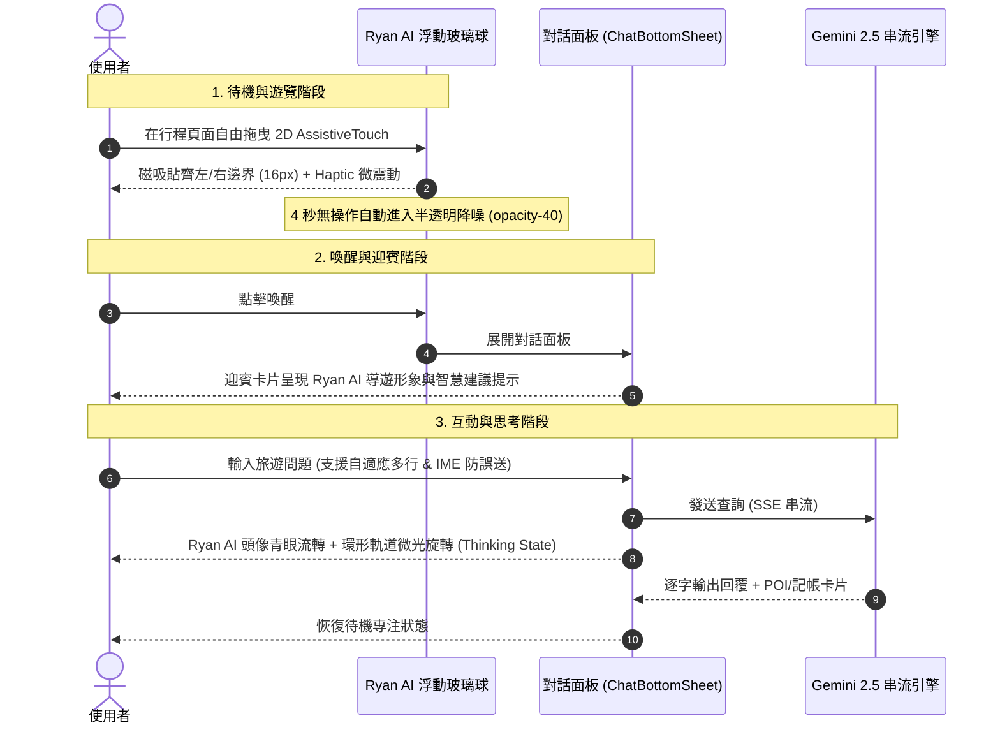

# Ryan AI 虛擬導遊 IP 視覺與互動規格說明書 (Mini Design Doc)

> **版本**: 1.0.0  
> **狀態**: 待審核 (Under Review)  
> **發起指令**: `/Idea to Spec` ✕ `/grill-me` ✕ `/ui-optimize`  
> **核心概念**: 3D 瓷白機體 ✕ 石板藍關節 ✕ 螢光青眼瞳／環形軌道 ✕ 液態毛玻璃 (Liquid Glass)

---

## 1. Problem Statement & Core Value (問題陳述與核心價值)

### 1.1 使用者痛點 (User Problem)
- **視覺抽象感強烈**：目前的 AI 懸浮球與對話介面僅使用抽象向量圖標（`<Sparkles>`、`<Bot>`），缺乏情感連結與具體的「個人隨行導遊」實體意象。
- **品牌辨識度不足**：作為個人全端專案與旅程助手，缺乏獨創、高度契合 Tabidachi 的 IP 形象（Persona）。
- **狀態反饋單一**：AI 思考或深度研究時，僅有平鋪文字進度條，缺少引人入勝的伴隨式生動互動。

### 1.2 核心價值 (Core Value)
- **具象化「Ryan AI 導遊」**：將高科技 3D 機器人造型轉化為專屬隨行旅伴「Ryan AI」，提升產品高質感與情感黏著度。
- **極致輕量與無感離線**：採輕量化透明 WebP (< 30KB) 與純 CSS/SVG 複合架構，不拖慢 Next.js 首頁載入，在無網路時依然 100% 離線快取立即可見。
- **無縫繼承現有手勢與邊界系統**：保留剛建構完畢的 2D AssistiveTouch 自由拖曳、磁吸貼齊 (16px)、微震動 (Haptic) 與 4 秒自動降噪。

---

## 2. User Journey & Core Flow (使用者旅程與操作流程)



---

## 3. Architecture & Visual Asset System (架構與資產系統)

### 3.1 視覺語言規格 (Design Tokens)
* **主要材質**：高光釉面瓷白 (`#FFFFFF` with Ceramic Gloss)、啞光深石板藍 (`#1E293B` / `bg-slate-800`)。
* **發光強調色**：科幻螢光青 (`#06B6D4` / `#22D3EE`, Cyan Glow)、高對比深邃夜空黑面罩 (`#0B0F19`)。
* **光暈動態**：`drop-shadow-[0_0_12px_rgba(6,182,212,0.45)]`。

### 3.2 資產配置 (Asset Distribution)
1. **Orb Micro-Avatar (`/images/ryan-bot-avatar.webp`)**：
   - 尺寸：`64x64px`，透明背景 WebP，體積 < 15KB。
   - 用途：浮動按鈕內部核心圖標、聊天訊息氣泡旁 `<Bot />` 替換。
2. **Greeting Hero Illustration (`/images/ryan-bot-hero.webp`)**：
   - 尺寸：`240x240px`，透明背景 WebP，體積 < 35KB。
   - 用途：聊天面板首頁未有對話或打招呼時的迎賓卡片（Greeting Banner）。
3. **PWA 離線快取**：
   - 掛載至 `public/icons/` 與 Serwist Service Worker 靜態快取池，保證離線狀態毫秒級即時讀取。

### 3.3 狀態矩陣 (State Matrix)

| 狀態 | 浮動按鈕 (Orb) | 對話面板 (Sheet) | 動畫 / 反饋 |
| :--- | :--- | :--- | :--- |
| **Idle (待機)** | 瓷白頭像 + 柔和白青微光邊框 | 顯示迎賓引導與歷史訊息 | 4 秒自動淡化至 `opacity-40` |
| **Hover / Drag (操作)** | 尺寸放大至 110%，光暈加深 | - | 影子擴散，阻斷點擊衝突 |
| **Thinking (思考)** | 環形青色微光旋轉 | 氣泡旁頭像青眼光暈呼吸 | 旋轉脈衝動態 (`animate-spin-slow` / `pulse`) |
| **Open (面板展開)** | 平滑旋轉為液態玻璃關閉鈕 (`X`) | 全螢幕毛玻璃居中鋪展 | 200ms 彈簧過渡 |

---

## 4. Edge Cases & Boundary Conditions (邊界條件與防護)

1. **圖片資源載入失敗 (Image Fallback)**：
   - 若 WebP 圖檔尚未加載或被阻擋，以優雅的 `<Sparkles />` 幾何圖標作為 Fallback，絕不出現破圖方塊。
2. **低電量 / 省電模式 (prefers-reduced-motion)**：
   - 自動停用環形軌道旋轉動畫，維持靜態光暈，節省 GPU 電量。
3. **深淺色模式無縫切換 (Dark Mode Seamlessness)**：
   - 白天模式：瓷白本體在淺色液態玻璃中產生高質感金屬反光。
   - 深色模式：瓷白機體產生夜間青光螢光外擴，在 `dark:bg-slate-900` 面板中清晰醒目。
4. **現有 12 項業務邏輯防線 (Zero Regression Rule)**：
   - 所有變更純粹限於 Avatar 視覺層、Greeting 卡片層與 CSS Animation 樣式類別，**嚴禁碰觸 SSE、SWR 快取、行程切換雙清與 Function Call 邏輯**。

---

## 5. Acceptance Criteria (驗收標準清單)

```markdown
- [ ] AC-1 (Orb Visual): 浮動按鈕內展示精緻 3D 瓷白青光 Ryan AI 頭像，取代原先純 Sparkles，並保留液態金屬玻璃外框。
- [ ] AC-2 (AssistiveTouch Interaction): 拖曳手勢、2D 雙向邊界吸附 (16px)、Haptic 震動反饋與 4 秒閒置降噪功能 100% 正常運作無回歸。
- [ ] AC-3 (Greeting Card): 在聊天對話視窗展開且處於打招呼狀態時，展示親切的 Ryan AI 導遊迎賓徽章與引導語。
- [ ] AC-4 (Thinking Animation): 當 Gemini 正在進行 SSE 串流生成或 Deep Research 時，頭像具備青色呼吸/旋轉微光反饋。
- [ ] AC-5 (Offline & PWA): 斷網離線環境下，頭像資產透過 Service Worker / 靜態快取瞬間渲染，無任何破圖。
- [ ] AC-6 (Code Quality Gate): `npx tsc --noEmit`、`npm run lint`、`npm test`、`npm run build` 全數 0 錯誤通過。
```
