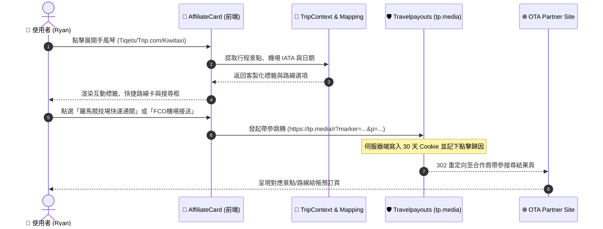

# Universal Affiliate Interactive Accordion Specification (三軌專屬手風琴互動架構)

> **版本**: 1.0.0  
> **關聯平台**: Trip.com、Tiqets、WeGoTrip、Kiwitaxi、Welcome Pickups、12Go Asia  
> **狀態**: Ready for Review / Implementation  

---

## 1. Problem Statement & Core Value (問題陳述與核心價值)

### 1.1 使用者痛點 (User Problem)
- 原先各分潤平台卡片（除 Aviasales、Klook、KKday 外）僅具備靜態單一跳轉連結，缺乏互動性與上下文感知。
- 旅客在查看特定行程（如「義大利 10 日遊」或「東京 5 日遊」）時：
  1. **門票導覽需求 (Tiqets / WeGoTrip)**：無法直觀瀏覽該國家或城市的免排隊門票（如羅馬競技場、梵蒂岡博物館）與在地語音導覽，需跳轉至外站後重新手動搜尋。
  2. **機場接送需求 (Kiwitaxi / Welcome Pickups)**：無法一鍵針對「抵達機場（如 FCO）⇄ 市中心/飯店」進行直達查價與接駁預約。
  3. **亞洲跨城交通 (12Go Asia)**：非亞洲行程（如義大利）無端顯示亞洲票券卡片產生雜訊；亞洲行程則缺少「曼谷⇄清邁」、「東京⇄京都」等熱門路線預填。
  4. **綜合預訂龍頭 (Trip.com)**：僅導流至通用飯店列表，未善用其強大的跨城高鐵/火車（歐洲 Trenitalia/SNCF 或亞洲高鐵）與景點特惠通道。

### 1.2 核心價值與成功指標 (Success Metrics)
- **零冷啟動阻力**：所有手風琴自動載入當前行程的景點（Itinerary-derived）與城市上下文（City-derived）。
- **點擊率 (CTR) 與分潤轉換率提升**：提供具體景點門票與接駁路線之直達按鈕（Deep Link），減少外站跳出率。
- **100% 合規追蹤**：全數遵循 Travelpayouts 官方重定向鏈（`tp.media/r`），免疫 AdBlock 並確保 30 天 Cookie 歸因。

---

## 2. User Journey & Core Flow (使用者旅程與操作流程)

### 2.1 使用者操作旅程 (Step-by-Step Flow)
1. **進入實用資訊頁面**：使用者切換至「實用資訊 (Info)」之「預訂服務 (BookingTab)」。
2. **地理區域過濾 (12Go Asia)**：
   - 系統依據行程 `countryCode` 判斷：若為亞洲國家（JP, TH, VN, MY, ID, PH, TW, KR 等），展示 12Go Asia；若為非亞洲國家（如 IT, FR, US 等），自動乾淨隱藏。
3. **展開專屬手風琴 (Accordion)**：
   - **門票導覽軌 (Tiqets / WeGoTrip)**：
     - 點擊卡片本體跳轉主頁；點擊右側折疊箭頭展開景點門票/語音導覽手風琴。
     - 顯示「行程景點標籤」、「熱門博物館門票/導覽清單」、「+ 自訂搜尋框」。
     - 支援一鍵複製關鍵字與帶參直達預訂按鈕。
   - **交通接送軌 (Kiwitaxi / Welcome Pickups)**：
     - 展開後顯示「抵達機場 ➔ 市中心飯店」與「市中心 ➔ 機場」雙向快捷卡。
     - 標示專車服務特色（舉牌迎接、免費等待 60 分鐘、一口價透明收費）。
     - 提供一鍵帶參預訂跳轉。
   - **綜合預訂軌 (Trip.com)**：
     - 展開後切換「精選飯店住宿 (自動預填 Check-in/Check-out 日期)」與「歐亞跨城火車票 (歐洲國鐵/亞洲高鐵)」快捷通道。

### 2.2 互動循序圖 (Mermaid Flow)



---

## 3. Architecture & Data Model (架構與資料模型)

### 3.1 平台分類與 Program ID 映射表

| 平台 ID | 類別 | Travelpayouts Program ID | 官方轉址標準 | 特化互動模式 |
| :--- | :--- | :--- | :--- | :--- |
| `tiqets` | activity | `2074` (Legacy) / `tp.media` | 帶參搜尋 `q={destination}+{activity}` | 景點門票手風琴 (含行程景點、標籤篩選、自訂搜尋) |
| `wegotrip` | activity | `4487` | `tp.media/r?p=4487&u=https://wegotrip.com/search/?q=...` | 語音導覽與自助遊手風琴 |
| `kiwitaxi` | transport | `647` | `https://c1.travelpayouts.com/click?...` | 機場接送專車手風琴 (起點機場 ➔ 終點市區) |
| `welcome-pickups` | transport | `8919` | `tp.media/r?p=8919&u=https://www.welcomepickups.com/...` | 當地舉牌專車接駁手風琴 |
| `12go` | transport | `1024` / Direct | `https://12go.asia/?marker=...` | 亞洲跨城火車/巴士/渡輪路線手風琴 (依亞洲區域動態顯示) |
| `trip` | hotel/ota | `3778` / Alliance ID | Direct Alliance ID 或 Legacy c121 | 飯店住宿 + 跨城火車票雙核心快捷手風琴 |

### 3.2 城市/機場與接送路線生成器 ([`frontend/lib/activity-mapping.ts`](file:///d:/Project/Tabidachi/travel-pwa/frontend/lib/activity-mapping.ts))
擴充預設接駁與火車路線模型：
```typescript
export interface TransportRouteItem {
  name: string
  origin: string
  destination: string
  type: 'airport_transfer' | 'intercity_train' | 'ferry'
  estimatedDuration?: string
  description?: { en: string; zh: string }
}
```

### 3.3 元件擴展與渲染解耦 ([`frontend/components/views/info/AffiliateCard.tsx`](file:///d:/Project/Tabidachi/travel-pwa/frontend/components/views/info/AffiliateCard.tsx))
將手風琴渲染拆分為四個清晰無狀態之子模組：
1. `renderFlightPriceAccordion()` (現有 Aviasales)
2. `renderActivityAccordion()` (擴充支援 Klook, KKday, Tiqets, WeGoTrip)
3. `renderTransportAccordion()` (新增支援 Kiwitaxi, Welcome Pickups, 12Go Asia)
4. `renderTripComAccordion()` (新增支援 Trip.com 飯店/火車票雙卡)

---

## 4. Edge Cases & Boundary Conditions (邊界條件與異常處理)

1. **地理區域邊界 (12Go Asia)**：
   - 非亞洲國家（如 IT, ES, FR, US）：`AFFILIATE_PLATFORMS` 或 `AffiliateCard` 根據 `tripContext.countryCode` 進行地理過濾，避免在歐洲行程突兀推薦亞洲巴士。
   - 若為空行程（無 `destination`）：顯示亞洲樞紐跨城交通（泰國、日本、越南）。
2. **無行程景點之兜底 (Tiqets / WeGoTrip)**：
   - 使用者行程內未標記具體景點時，自動退回 `DESTINATION_POPULAR_ACTIVITIES` 之國家精選門票（如義大利：羅馬競技場、米蘭大教堂、龐貝古城）。
3. **接送地址與機場代碼缺失 (Kiwitaxi / Welcome Pickups)**：
   - 若 `arrivalAirport` 無法解析，以目的地城市名為出發起點，安全回退至平台之城市通用專車頁面。
4. **日期格式與衝突 (Trip.com)**：
   - 若 `checkoutDate <= checkinDate`，自動重設 `checkoutDate` 為 `checkinDate + 1 天`，防禦飯店預訂引擎 400 報錯。

---

## 5. Acceptance Criteria (驗收標準清單)

- [ ] **AC-1 (活動門票擴充)**：Tiqets 與 WeGoTrip 均能展開手風琴，展示行程萃取之景點標籤與熱門門票，點擊直達按鈕經由 Travelpayouts 安全跳轉並預填關鍵字。
- [ ] **AC-2 (接送專車手風琴)**：Kiwitaxi 與 Welcome Pickups 展開後顯示「機場 ➔ 市區接送」專屬路線卡片與服務特點，直達跳轉帶有機場/城市參數。
- [ ] **AC-3 (12Go Asia 智慧區域隱藏)**：當前為義大利行程時，12Go Asia 自動隱藏；切換為日本/泰國行程時，12Go Asia 正常顯示並展開跨城火車/巴士路線。
- [ ] **AC-4 (Trip.com 雙核心手風琴)**：Trip.com 展開後提供「飯店住宿 (含日期)」與「跨城火車票」切換卡，可精準直達對應服務。
- [ ] **AC-5 (品質守門)**：`tsc --noEmit` 0 錯誤、`npm run lint` 0 錯誤，全端 Vitest 測試套件 100% 通過。
