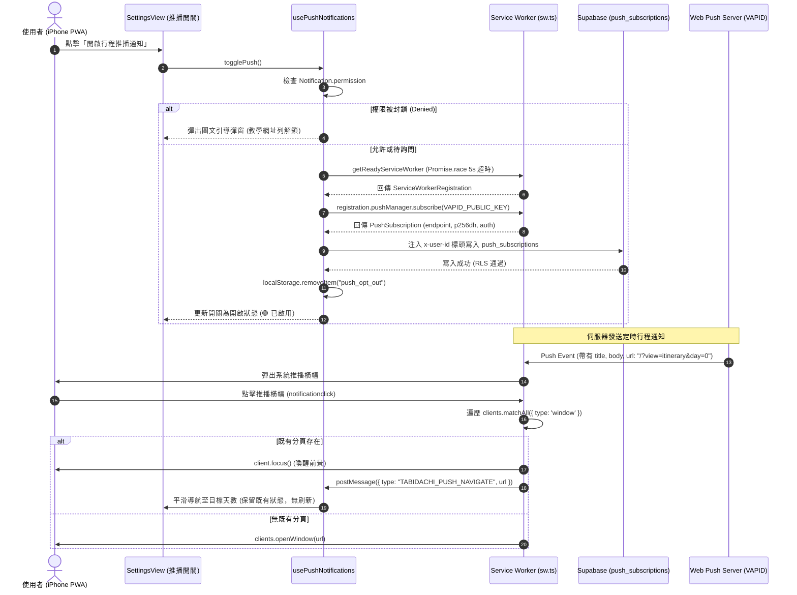

# 🔔 全端 Web Push 推播通知與 PWA 生命週期規格書
# (Web Push Notification & PWA Lifecycle Architecture Spec)

> **版本**: 1.0.0  
> **建立日期**: 2026-09-20  
> **狀態**: ✅ Production Live & Fully Implemented  
> **關聯檔案**:
> - 前端：`frontend/lib/hooks/usePushNotifications.ts`, `frontend/app/sw.ts`, `frontend/components/views/settings-view.tsx`, `frontend/lib/deep-link-router.ts`
> - 後端/資料庫：Supabase `push_subscriptions` Table, RLS Policies, Webhook Notification Workers
> - 測試：`frontend/__tests__/push-notifications.test.ts`

---

## 1. Problem Statement & Core Value (問題陳述與核心價值)

### 1.1 使用者痛點 (User Problems)
1. **重要行程無提醒**：自由行旅人常遺失登機時刻、集合時間或退房警告，缺乏系統級的背景推播提醒。
2. **iOS Safari PWA 訂閱死鎖**：iOS Safari Standalone 模式下，若 `navigator.serviceWorker.ready` 遇到未就緒情況，原生 Promise 永不 resolve，造成按鈕無限轉圈死鎖。
3. **推播點擊引發分頁暴增**：點擊推播通知時，傳統 Service Worker 以 `client.navigate()` 強制重開新視窗，摧毀使用者原有滾動進度與表單輸入狀態。
4. **匿名使用者 RLS 授權衝突**：Tabidachi 支援無密碼/匿名遊客模式，Supabase 啟用 RLS 後匿名寫入訂閱資料表遭 403 阻擋。

### 1.2 核心指標 (Success Metrics)
- **100% 免疫死鎖**：`getReadyServiceWorker` 內建 5 秒硬逾時與動態註冊回退機制，UI 狀態保證由 `finally` 釋放。
- **無刷新喚醒與定向路由 (Smart Focus & Zero-Reload Routing)**：點擊推播時優先喚醒現存 Client（`client.focus()`），並透過 `TABIDACHI_PUSH_NAVIGATE` 內部廣播，由 `useDeepLinkRouter` 實現無感平滑換頁。
- **自適應退出意圖守衛**：透過 `localStorage.setItem("push_opt_out", "true")`，徹底根治重新整理時瀏覽器底層實體訂閱與應用層偏好不同步的流氓自動重開問題。

---

## 2. Architecture & Data Flow (架構設計與時序圖)

---

## 3. Implementation Guardrails (核心實作與防衛原則)

1. **`getReadyServiceWorker` 超時熔斷**：
   - 封裝 `Promise.race([navigator.serviceWorker.ready, timeoutPromise(5000)])`。
   - 若逾時或未註冊，自動觸發主動註冊流程，失敗安全回退並由 `finally { setIsLoading(false) }` 解除按鈕轉圈。
2. **Supabase 匿名 RLS 穿透規範**：
   - 不竄改全域 Client，在 `createClient` 透過自訂 Fetch Wrapper 動態注入 `x-user-id` 標頭，實現合規的認證傳遞。
3. **顯式退出意圖 (Explicit Opt-out State)**：
   - 使用者主動退訂時，寫入 `localStorage.setItem("push_opt_out", "true")`。
   - 應用啟動重新水合時，若偵測到 opt-out 標記，強制保持關閉，不再自動重新綁定。
