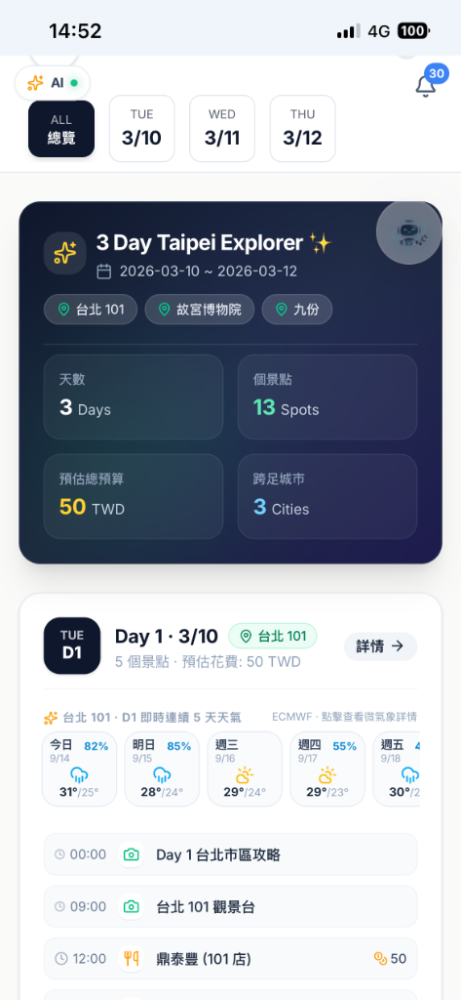
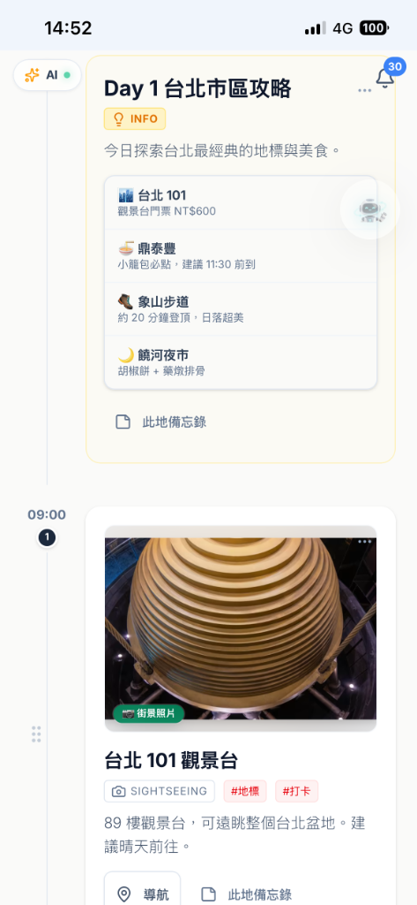
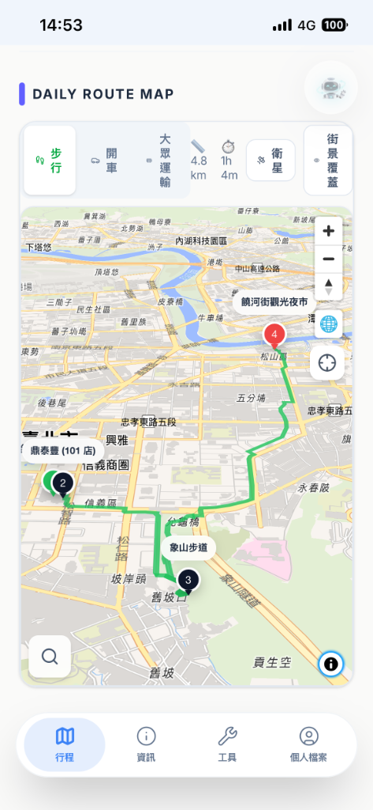
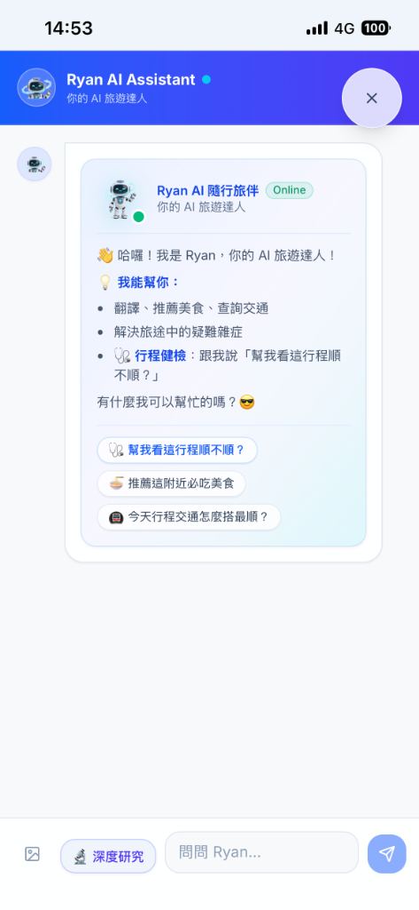
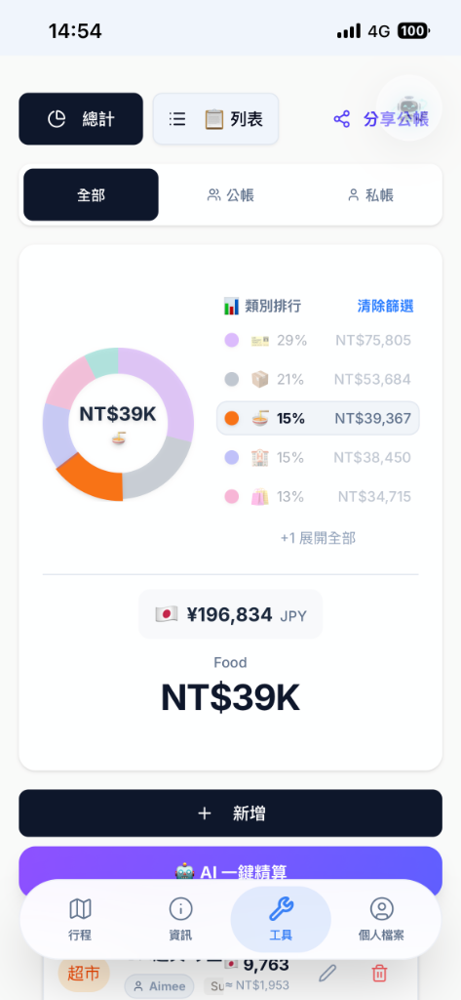
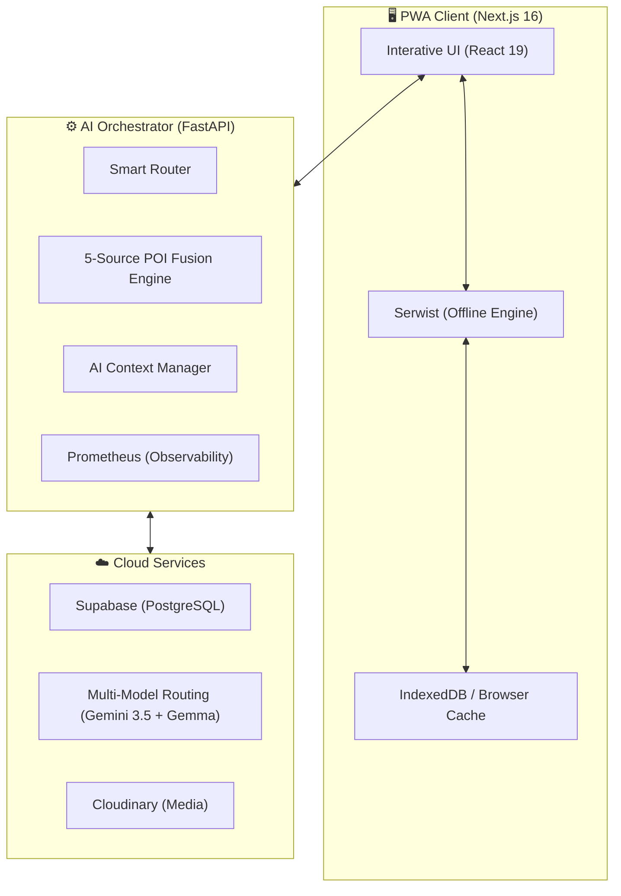

<p align="center">
  
  
  
  
  
</p>

<h1 align="center">Tabidachi 旅立ち</h1>

<p align="center">
  <strong>Next-Generation Generative AI Travel Orchestrator</strong><br/>
  <strong>新一代生成式 AI 旅遊編排助手</strong>
</p>

<p align="center">
  <i>"Beyond Planning. Intelligent Journey Orchestration."</i><br/>
  <i>「超越規劃，開啟智慧旅程編排新境界。」</i>
</p>

<p align="center">
  
  
  
  
  
  
  
</p>

<p align="center">
  <a href="https://travel-pwa-five.vercel.app/">🌐 Live Demo</a> •
  <a href="#-getting-started--快速開始">🚀 Getting Started</a> •
  <a href="#-features--功能特色">✨ Features</a> •
  <a href="#-tech-stack--技術棧">🏗️ Tech Stack</a>
</p>

---

| 🚀 創新亮點 | 💡 技術實作 | 🏆 評審價值 |
| :--- | :--- | :--- |
| **Generative Intelligence** | Gemini 3.5 Flash + Gemma Multi-tier Routing | **超越 Chatbot**：將 LLM 轉化為能精準提取資料的輔助 Agent。 |
| **Technical Resilience** | Offline-First PWA (Serwist Offline Engine) | **剛需場景**：出國無網路時，地圖與行程依然 100% 可用。 |
| **Privacy First (BYOK)** | Bring Your Own Key Architecture | **數據主權**：金鑰僅存本地，完全排除隱私洩漏與伺服器成本。 |
| **Modern Stack** | React 19 + Next.js 16 + Turbopack | **技術領先**：運用最新的 React Compiler 與 View Transitions。 |

---

## ✨ Features / 功能特色

### 🤖 AI Travel Assistant / AI 旅遊助手
- **Neural-Link Extraction Pipeline** — 100% 格式對齊的精準資料提取，Agentic 能力的核心 / 結構化抽取引擎
- **Multi-tier AI Routing** — Gemini 3.5 Flash 高速主力 + Gemma 4/3 多層級救援路由 / 多模型動態切換
- **Hyper-Contextual Injection** — 即時機票報價與 Sliding Window Context 脈絡注入 / 滑動視窗上下文管理
- **Itinerary Health Check** — AI reviews your daily plan and suggests improvements / AI 行程健檢
- **Smart POI Recommendations** — Function Calling to add places directly to itinerary / 智能景點推薦，一鍵加入行程
- **Memory Engine** — Auto-summarizes long conversations to maintain context / 記憶壓縮引擎
- **BYOK (Bring Your Own Key)** — Your API key, your privacy / 自帶金鑰，隱私至上

### 🗺️ Interactive Maps / 互動地圖
- **MapLibre GL** with 3D buildings, satellite view, and Chinese labels / 3D 建築、衛星圖、中文標籤
- **Mapillary Street View Integration** — 無縫同步的地圖與街景互動 / 整合式街景探索
- **Multi-mode Routing** — Walking, driving, transit with real distance & duration / 步行、開車、大眾運輸路線
- **L1 Local Instant Search** — Offline-capable MiniSearch for stations & landmarks / 本地即時搜尋（離線可用）
- **L2 5-Source POI Fusion Engine** — OSM, OpenTripMap, WikiVoyage, Wikipedia, Wikidata 聚合 / 五源 POI 聚合引擎
- **Global Language Matrix** — CJK (中日韓) 語系變體擴充與 10x 地理感知搜尋 / 多語系智慧地名擴充
- **Fullscreen Map** with cross-platform long-press and red-pin precision / 全螢幕地圖與長按選址互動

### 📅 Trip & Booking Management / 行程與訂房管理
- **Affiliate Booking Center** — 內建 21+ 旅遊平台 (Agoda 等) 註冊與智慧推薦 / 全域導購中心
- **Drag & Drop Reorder** — Powered by dnd-kit / 拖拉排序
- **Multi-segment Flight Tracking** — 支援多航段與獨立去回程新增 / 智能航班管理
- **Multi-trip Switcher** — Manage multiple trips with real-time collaboration / 多行程切換 + 即時協作
- **Weather Panel** — OpenMeteo hourly forecast with WBGT risk / 天氣面板（逐小時預報）
- **Daily Checklist** — Pack lists, tickets, and notes per day / 每日清單
- **Daily AI Tips** — Curated travel guides per destination / 每日旅遊指南
- **ISR Public Sharing** — Share itineraries via link (no login required) / 公開分享（免登入）

### 💰 Expense Tracker / 記帳工具
- **9 Currencies** — JPY, USD, EUR, KRW, TWD, and more / 9 種幣別
- **Real-time Exchange Rates** — Auto-convert to your home currency / 即時匯率換算
- **Category Analytics** — Pie charts and daily/total views / 分類統計圖表
- **Receipt Photo Upload** — Cloudinary integration / 收據照片上傳
- **Shared & Private Ledgers** — Split expenses with travel buddies / 公帳私帳分離

### 🔐 Privacy & Security / 隱私安全
- **BYOK Model** — AI keys stored locally, never on server / 金鑰僅存本地
- **GDPR Compliance** — Data export & deletion via API / GDPR 資料匯出/刪除
- **Anonymous Recovery Keys** — No email or phone required / 匿名恢復金鑰
- **Rate Limiting** — SlowAPI protection / 速率限制保護

### 📱 PWA & UX
- **Installable PWA** — Works on iOS, Android, and Desktop / 可安裝到主畫面
- **Real-time Push Notifications** — 實時推播、系統公告與 Duolingo 風格廣播 / PWA 推播引擎
- **Serwist Offline Engine** — 強大的 Service Worker 離線快取策略 / 離線支援
- **Integrated Navigation Hub** — 懸浮藥丸式 (Floating pill) 底部導覽列與雙擊刷新 / 整合式導航中樞
- **Dark Mode** — System-aware theme switching / 深色模式
- **Bilingual** — Traditional Chinese & English / 繁體中文 + 英文
- **Haptic Feedback** — Native-like touch responses / 全系統觸覺回饋
- **PDF Export** — Generate printable itinerary PDFs / PDF 匯出

### 🛡️ Architecture & DevOps / 架構與維運
- **Autonomous Agent Ecosystem** — `.agent` L0-L3 工作流與多角色 (@dev, @qa) 自動化治理 / 代理人生態系
- **Enterprise-grade Security** — Anti-SSRF、ReDoS 防護與嚴格 CORS 策略 / 企業級安全加固
- **Observability** — Prometheus Metrics 與 Supabase 連線池深度健康檢查 / 系統可觀測性監控

---

## 🏗️ Tech Stack / 技術棧

### Frontend

| Technology | Version | Purpose |
|-----------|---------|---------|
| Next.js | 16.0 | Framework (App Router, ISR, Turbopack) |
| React | 19.2 | UI with React Compiler |
| TypeScript | 5.9 | Type safety |
| MapLibre GL | 5.15 | Maps (3D, satellite, routing) |
| Zustand | 5.0 | State management |
| SWR | 2.3 | Data fetching & caching |
| Framer Motion | 12.x | Animations |
| dnd-kit | 6.3 | Drag and drop |
| Tailwind CSS | 4.1 | Styling |
| Radix UI | Latest | Accessible components |

### Backend

| Technology | Version | Purpose |
|-----------|---------|---------|
| FastAPI | Latest | REST API framework |
| Supabase | Latest | PostgreSQL database + Realtime |
| Gemini 3.5 & Gemma | Latest | Multi-model routing, POI enrichment, itinerary review |
| Prometheus Client | Latest | System observability and metrics |
| HTTPX | Latest | Async HTTP client (with Anti-SSRF) |
| SlowAPI | 0.1.9+ | Rate limiting |
| RapidFuzz | 3.6+ | Fuzzy string matching |

### Infrastructure

| Service | Purpose |
|---------|---------|
| Vercel | Frontend hosting (Edge, ISR) |
| Google Cloud Run | Backend hosting (Docker) |
| Supabase | Database + Auth + Realtime |
| Cloudinary | Image hosting (receipts, avatars) |

---

## 📐 Technical Architecture / 系統架構圖



---

## 🚀 Getting Started / 快速開始

### Prerequisites / 前置需求

- **Node.js** 18+
- **Python** 3.11+
- **Supabase** account (free tier works / 免費方案即可)
- **Gemini API Key** ([Get one free / 免費取得](https://aistudio.google.com/apikey))

### Backend Setup / 後端設定

```bash
# 1. Navigate to backend / 進入後端目錄
cd backend

# 2. Create virtual environment / 建立虛擬環境
python -m venv .venv
.venv\Scripts\activate    # Windows
# source .venv/bin/activate  # macOS/Linux

# 3. Install dependencies / 安裝依賴
pip install -r requirements.txt

# 4. Configure environment / 設定環境變數
cp .env.example .env
# Edit .env with your values (see table below)
# 編輯 .env 填入你的設定值（見下方表格）

# 5. Start server / 啟動伺服器
uvicorn main:app --reload --port 8000
```

### Frontend Setup / 前端設定

```bash
# 1. Navigate to frontend / 進入前端目錄
cd frontend

# 2. Install dependencies / 安裝依賴
npm install

# 3. Configure environment / 設定環境變數
cp .env.local.example .env.local
# Edit .env.local with your values
# 編輯 .env.local 填入你的設定值

# 4. Start dev server / 啟動開發伺服器
npm run dev
```

Open [http://localhost:3000](http://localhost:3000) 🎉

---

## 🔑 Environment Variables / 環境變數

### Backend `.env`

| Variable | Required | Description |
|----------|----------|-------------|
| `SUPABASE_URL` | ✅ | Supabase project URL |
| `SUPABASE_ANON_KEY` | ✅ | Supabase anonymous key |
| `ARCGIS_API_KEY` | Optional | ArcGIS geocoding (fallback to Nominatim) |
| `TP_API_TOKEN` | Optional | Travelpayouts affiliate booking integration |

### Frontend `.env.local`

| Variable | Required | Description |
|----------|----------|-------------|
| `NEXT_PUBLIC_API_URL` | ✅ | Backend API URL (e.g., `http://localhost:8000`) |
| `NEXT_PUBLIC_SUPABASE_URL` | ✅ | Supabase project URL |
| `NEXT_PUBLIC_SUPABASE_ANON_KEY` | ✅ | Supabase anonymous key |
| `NEXT_PUBLIC_CLOUDINARY_CLOUD_NAME` | Optional | Cloudinary cloud name (for image uploads) |

> [!NOTE]
> **Gemini API Key** is configured by each user in the app's Profile page (BYOK model).
> No server-side AI key is needed.
>
> **Gemini API Key** 由使用者在 App 的 Profile 頁面自行設定（BYOK 模式），伺服器端不需要 AI 金鑰。

---

## 🗄️ Database / 資料庫

This project uses **Supabase** (PostgreSQL) with 20+ migration files for schema management.

本專案使用 **Supabase** (PostgreSQL)，含 20+ 個 migration 檔管理資料庫結構。

```bash
# Apply migrations / 套用 migration
cd backend/migrations
# Run SQL files in order against your Supabase project
# 依序在 Supabase 專案中執行 SQL 檔案
```

---

## 🚢 Deployment / 部署

### Frontend → Vercel

```bash
# Connect your GitHub repo to Vercel
# Set environment variables in Vercel dashboard
# Automatic deployments on push to main
```

### Backend → Google Cloud Run

```bash
# Build and push Docker image / 建置並推送 Docker 映像
docker build -f Dockerfile.prod -t gcr.io/PROJECT_ID/tabidachi-backend .
docker push gcr.io/PROJECT_ID/tabidachi-backend

# Deploy / 部署
gcloud run deploy tabidachi-backend \
  --image gcr.io/PROJECT_ID/tabidachi-backend \
  --platform managed \
  --region us-central1 \
  --allow-unauthenticated
```

---

## 📱 PWA Installation / PWA 安裝

| Platform | How to Install |
|----------|---------------|
| **iOS Safari** | Tap Share → "Add to Home Screen" / 分享 → 加入主畫面 |
| **Android Chrome** | Tap "Install App" banner or Menu → "Install" / 點擊安裝橫幅 |
| **Desktop Chrome** | Click install icon in address bar / 點擊網址列安裝圖示 |

---

## 📄 License

This project is licensed under the [MIT License](LICENSE).

```
MIT License

Copyright (c) 2026 Ryan Su

Permission is hereby granted, free of charge, to any person obtaining a copy
of this software and associated documentation files (the "Software"), to deal
in the Software without restriction, including without limitation the rights
to use, copy, modify, merge, publish, distribute, sublicense, and/or sell
copies of the Software, and to permit persons to whom the Software is
furnished to do so, subject to the following conditions:

The above copyright notice and this permission notice shall be included in all
copies or substantial portions of the Software.

THE SOFTWARE IS PROVIDED "AS IS", WITHOUT WARRANTY OF ANY KIND, EXPRESS OR
IMPLIED, INCLUDING BUT NOT LIMITED TO THE WARRANTIES OF MERCHANTABILITY,
FITNESS FOR A PARTICULAR PURPOSE AND NONINFRINGEMENT. IN NO EVENT SHALL THE
AUTHORS OR COPYRIGHT HOLDERS BE LIABLE FOR ANY CLAIM, DAMAGES OR OTHER
LIABILITY, WHETHER IN AN ACTION OF CONTRACT, TORT OR OTHERWISE, ARISING FROM,
OUT OF OR IN CONNECTION WITH THE SOFTWARE OR THE USE OR OTHER DEALINGS IN THE
SOFTWARE.
```

---

<p align="center">
  Made with ❤️ by Ryan Su
</p>

---

## 🏆 Judging Guide / 評審導覽

如果您是競賽評審，我們建議您重點關注以下幾個最能展現技術深度與創意的模組：

1.  **AI 智慧排程與神經連結 (Itinerary Synthesis & Neural-Link)**：在 Chat 中輸入一個旅遊請求，觀察 SSE 串流生成的流暢感，以及背後精準的格式提取技術。
2.  **五源 POI 聚合引擎 (5-Source POI Fusion)**：嘗試在地圖上搜尋生僻地名，體驗 CJK 變體擴充與 10x 掃描深度的威力。
3.  **離線地圖實測 (Offline Resilience)**：嘗試關閉網路並操作地圖，您會發現已瀏覽過的圖資與行程依然能即時讀取。
4.  **多人共編 (Real-time Collaboration)**：觀察行程修改如何透過 Supabase Realtime 即時同步。
5.  **企業級可觀測性與安全 (Observability & Security)**：專案內建 L0-L3 Agent 治理架構、Prometheus 監控與 Anti-SSRF 防護，展現超越原型的技術成熟度。

---
